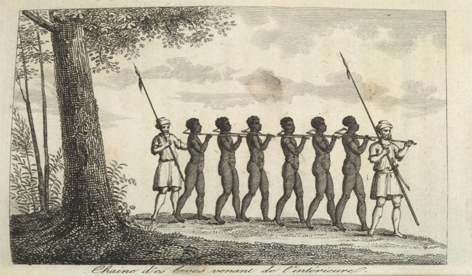

# Juneteenth

 

 

### "Historians are increasingly studying lynching outside of the American Southeast, but sociologists have been slow to follow. We introduce a new public data set that extends existing data on lynching victims to cover the contiguous United States from 1883 to 1941. These data confirm that lynching was a heterogeneous practice across the United States."

 

Cited by: Seguin, Charles and David Rigby. 2019. “National Crimes: A New National Data Set of 
Lynchings in the United States, 1883 to 1941.” Socius 5:2378023119841780.

 

This project try to reproduce the previous "National Crime: A New National Data Set of Lynchings in the United States, 1883 to 1941." studies.

