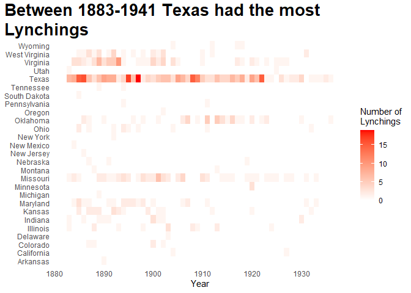
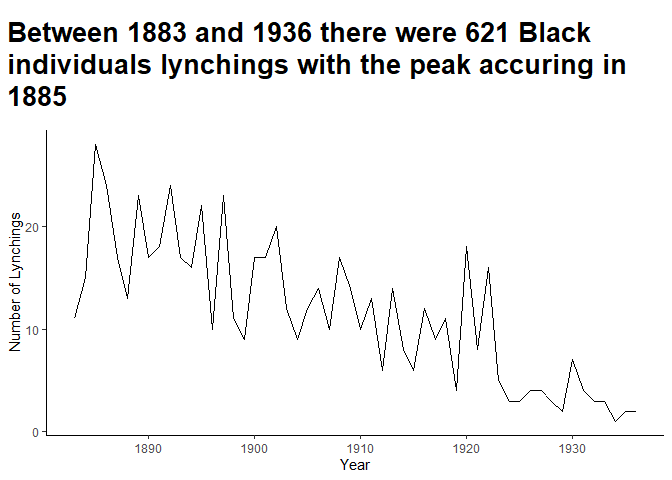

Juneteenth
================
Sandro Lelis
2023-02-27

## National Lynching, 1883-1941 (Codebook)

<br>

These data were collected by Charles Seguin and David Rigby. They
supplement existing lynching inventories to cover the contiguous United
States. Details are covered in Seguin and Rigby (2019). Please cite as
follows:<br>

Seguin, Charles and David Rigby. 2019. National Crimes: A New National
Data Set of Lynchings in the United States, 1883 to 1941. Socius
5:2378023119841780.

<br>

### About Juneteenth

<br>

<p>

Juneteenth is a federal holiday in the United States commemorating the
emancipation of enslaved African Americans. Deriving its name from
combining “June” and “nineteenth”, it is celebrated on the anniversary
of General Order No. 3, issued by Major General Gordon Granger on June
19, 1865, proclaiming freedom for slaves in Texas.\[7\] Originating in
Galveston, Juneteenth has since been observed annually in various parts
of the United States, often broadly celebrating African-American
culture. The day was first recognized as a federal holiday in 2021, when
President Joe Biden signed the Juneteenth National Independence Day Act
into law after the efforts of Lula Briggs Galloway, Opal Lee, and
others.

<p>

Early celebrations date to 1866, at first involving church-centered
community gatherings in Texas. They spread across the South and became
more commercialized in the 1920s and 1930s, often centering on a food
festival. Participants in the Great Migration brought these celebrations
to the rest of the country. During the Civil Rights Movement of the
1960s, these celebrations were eclipsed by the nonviolent determination
to achieve civil rights, but grew in popularity again in the 1970s with
a focus on African American freedom and African-American arts. Beginning
with Texas by proclamation in 1938, and by legislation in 1979, every
U.S. state and the District of Columbia has formally recognized the
holiday in some way. With its adoption in parts of Mexico, the holiday
has become an international holiday. Juneteenth is celebrated by the
Mascogos, descendants of Black Seminoles who escaped from slavery in
1852 and settled in Coahuila, Mexico.

<p>

Celebratory traditions often include public readings of the Emancipation
Proclamation, singing traditional songs such as “Swing Low, Sweet
Chariot” and “Lift Every Voice and Sing”, and the reading of works by
noted African-American writers, such as Ralph Ellison and Maya Angelou.
Juneteenth celebrations may also include rodeos, street fairs, cookouts,
family reunions, parties, historical reenactments, and Miss Juneteenth
contests. In 2021, Juneteenth became the first new federal holiday since
Martin Luther King Jr. Day was adopted in 1983.

<p>

Source: Wikipedia

<br> In this project we will look for some patterns shown in details on
this data, to have a realistic view on what this storytelling is about.
Notice that this dataset is populated by victims that was possible to be
confirmed with a valid document, this mean that not all victims are
included in this dataset.

<br>

### Loading Dataset

<br>

``` r
state_lookup <- tibble(abb = state.abb,
       name = state.name) # convert state names.

data2 <- read_delim("Data.csv", delim = ";", 
                   escape_double = FALSE, trim_ws = TRUE)
```

    ## Rows: 1328 Columns: 18
    ## ── Column specification ────────────────────────────────────────────────────────
    ## Delimiter: ";"
    ## chr (15): caseid, full_fips, state, state_fips, county, county_fips, city, v...
    ## dbl  (3): year, month, day
    ## 
    ## ℹ Use `spec()` to retrieve the full column specification for this data.
    ## ℹ Specify the column types or set `show_col_types = FALSE` to quiet this message.

<br>

``` r
DT::datatable(data2, width = '100%', options = list(scrollX = TRUE))
```

<div id="htmlwidget-8896945cc4e80cd7cda1" style="width:100%;height:auto;" class="datatables html-widget "></div>
<script type="application/json" data-for="htmlwidget-8896945cc4e80cd7cda1">{"x":{"filter":"none","vertical":false,"data":[["1","2","3","4","5","6","7","8","9","10","11","12","13","14","15","16","17","18","19","20","21","22","23","24","25","26","27","28","29","30","31","32","33","34","35","36","37","38","39","40","41","42","43","44","45","46","47","48","49","50","51","52","53","54","55","56","57","58","59","60","61","62","63","64","65","66","67","68","69","70","71","72","73","74","75","76","77","78","79","80","81","82","83","84","85","86","87","88","89","90","91","92","93","94","95","96","97","98","99","100","101","102","103","104","105","106","107","108","109","110","111","112","113","114","115","116","117","118","119","120","121","122","123","124","125","126","127","128","129","130","131","132","133","134","135","136","137","138","139","140","141","142","143","144","145","146","147","148","149","150","151","152","153","154","155","156","157","158","159","160","161","162","163","164","165","166","167","168","169","170","171","172","173","174","175","176","177","178","179","180","181","182","183","184","185","186","187","188","189","190","191","192","193","194","195","196","197","198","199","200","201","202","203","204","205","206","207","208","209","210","211","212","213","214","215","216","217","218","219","220","221","222","223","224","225","226","227","228","229","230","231","232","233","234","235","236","237","238","239","240","241","242","243","244","245","246","247","248","249","250","251","252","253","254","255","256","257","258","259","260","261","262","263","264","265","266","267","268","269","270","271","272","273","274","275","276","277","278","279","280","281","282","283","284","285","286","287","288","289","290","291","292","293","294","295","296","297","298","299","300","301","302","303","304","305","306","307","308","309","310","311","312","313","314","315","316","317","318","319","320","321","322","323","324","325","326","327","328","329","330","331","332","333","334","335","336","337","338","339","340","341","342","343","344","345","346","347","348","349","350","351","352","353","354","355","356","357","358","359","360","361","362","363","364","365","366","367","368","369","370","371","372","373","374","375","376","377","378","379","380","381","382","383","384","385","386","387","388","389","390","391","392","393","394","395","396","397","398","399","400","401","402","403","404","405","406","407","408","409","410","411","412","413","414","415","416","417","418","419","420","421","422","423","424","425","426","427","428","429","430","431","432","433","434","435","436","437","438","439","440","441","442","443","444","445","446","447","448","449","450","451","452","453","454","455","456","457","458","459","460","461","462","463","464","465","466","467","468","469","470","471","472","473","474","475","476","477","478","479","480","481","482","483","484","485","486","487","488","489","490","491","492","493","494","495","496","497","498","499","500","501","502","503","504","505","506","507","508","509","510","511","512","513","514","515","516","517","518","519","520","521","522","523","524","525","526","527","528","529","530","531","532","533","534","535","536","537","538","539","540","541","542","543","544","545","546","547","548","549","550","551","552","553","554","555","556","557","558","559","560","561","562","563","564","565","566","567","568","569","570","571","572","573","574","575","576","577","578","579","580","581","582","583","584","585","586","587","588","589","590","591","592","593","594","595","596","597","598","599","600","601","602","603","604","605","606","607","608","609","610","611","612","613","614","615","616","617","618","619","620","621","622","623","624","625","626","627","628","629","630","631","632","633","634","635","636","637","638","639","640","641","642","643","644","645","646","647","648","649","650","651","652","653","654","655","656","657","658","659","660","661","662","663","664","665","666","667","668","669","670","671","672","673","674","675","676","677","678","679","680","681","682","683","684","685","686","687","688","689","690","691","692","693","694","695","696","697","698","699","700","701","702","703","704","705","706","707","708","709","710","711","712","713","714","715","716","717","718","719","720","721","722","723","724","725","726","727","728","729","730","731","732","733","734","735","736","737","738","739","740","741","742","743","744","745","746","747","748","749","750","751","752","753","754","755","756","757","758","759","760","761","762","763","764","765","766","767","768","769","770","771","772","773","774","775","776","777","778","779","780","781","782","783","784","785","786","787","788","789","790","791","792","793","794","795","796","797","798","799","800","801","802","803","804","805","806","807","808","809","810","811","812","813","814","815","816","817","818","819","820","821","822","823","824","825","826","827","828","829","830","831","832","833","834","835","836","837","838","839","840","841","842","843","844","845","846","847","848","849","850","851","852","853","854","855","856","857","858","859","860","861","862","863","864","865","866","867","868","869","870","871","872","873","874","875","876","877","878","879","880","881","882","883","884","885","886","887","888","889","890","891","892","893","894","895","896","897","898","899","900","901","902","903","904","905","906","907","908","909","910","911","912","913","914","915","916","917","918","919","920","921","922","923","924","925","926","927","928","929","930","931","932","933","934","935","936","937","938","939","940","941","942","943","944","945","946","947","948","949","950","951","952","953","954","955","956","957","958","959","960","961","962","963","964","965","966","967","968","969","970","971","972","973","974","975","976","977","978","979","980","981","982","983","984","985","986","987","988","989","990","991","992","993","994","995","996","997","998","999","1000","1001","1002","1003","1004","1005","1006","1007","1008","1009","1010","1011","1012","1013","1014","1015","1016","1017","1018","1019","1020","1021","1022","1023","1024","1025","1026","1027","1028","1029","1030","1031","1032","1033","1034","1035","1036","1037","1038","1039","1040","1041","1042","1043","1044","1045","1046","1047","1048","1049","1050","1051","1052","1053","1054","1055","1056","1057","1058","1059","1060","1061","1062","1063","1064","1065","1066","1067","1068","1069","1070","1071","1072","1073","1074","1075","1076","1077","1078","1079","1080","1081","1082","1083","1084","1085","1086","1087","1088","1089","1090","1091","1092","1093","1094","1095","1096","1097","1098","1099","1100","1101","1102","1103","1104","1105","1106","1107","1108","1109","1110","1111","1112","1113","1114","1115","1116","1117","1118","1119","1120","1121","1122","1123","1124","1125","1126","1127","1128","1129","1130","1131","1132","1133","1134","1135","1136","1137","1138","1139","1140","1141","1142","1143","1144","1145","1146","1147","1148","1149","1150","1151","1152","1153","1154","1155","1156","1157","1158","1159","1160","1161","1162","1163","1164","1165","1166","1167","1168","1169","1170","1171","1172","1173","1174","1175","1176","1177","1178","1179","1180","1181","1182","1183","1184","1185","1186","1187","1188","1189","1190","1191","1192","1193","1194","1195","1196","1197","1198","1199","1200","1201","1202","1203","1204","1205","1206","1207","1208","1209","1210","1211","1212","1213","1214","1215","1216","1217","1218","1219","1220","1221","1222","1223","1224","1225","1226","1227","1228","1229","1230","1231","1232","1233","1234","1235","1236","1237","1238","1239","1240","1241","1242","1243","1244","1245","1246","1247","1248","1249","1250","1251","1252","1253","1254","1255","1256","1257","1258","1259","1260","1261","1262","1263","1264","1265","1266","1267","1268","1269","1270","1271","1272","1273","1274","1275","1276","1277","1278","1279","1280","1281","1282","1283","1284","1285","1286","1287","1288","1289","1290","1291","1292","1293","1294","1295","1296","1297","1298","1299","1300","1301","1302","1303","1304","1305","1306","1307","1308","1309","1310","1311","1312","1313","1314","1315","1316","1317","1318","1319","1320","1321","1322","1323","1324","1325","1326","1327","1328"],["6931","Pfiefer_AZ_8","Pfiefer_AZ_9","Pfiefer_AZ_11","Pfiefer_AZ_12","Pfiefer_AZ_13","Pfiefer_AZ_16","Pfiefer_AZ_15","Pfiefer_AZ_19","Pfiefer_AZ_17","Pfiefer_AZ_18","1155","1156","Pfiefer_AZ_20","1160","1159","1171","1174","1175","1176","1178","1179","1180","1181","1183","1182","1185","1186","1190","1191","1193","1194","1196","1199","1201","1203","1205","1207","1209","1212","1217","1215","1214","1213","1216","1224","1226","1229","1232","1230","1231","1235","1239","1241","1245","1251","1250","1249","1252","1254","1253","1255","Leonard_6","Leonard_8","Leonard_15","1258","1259","1177","1262","1261","1263","1264","Leonard_17","1284","1285","1286","Leonard_5","1187","Leonard_1","1287","Leonard_2","1288","1289","1290","1195","1294","Leonard_10","1297","1299","1309","1302","1311","1305","1308","1303","1314","1316","1319","1317","Leonard_3","1322","1324","1326","1328","Leonard_16","1330","1333","1332","1334","1336","2796","Pfiefer_New_IA_5","Pfiefer_New_IA_4","Pfiefer_New_IA_6","Pfiefer_New_IA_7","2688","2689","2690","2692","2691","2693","Pfiefer_New_IA_8","2694","2698","2700","7761","2701","Pfiefer_New_IA_9","2707","2709","2710","2712","2714","2713","2711","2733","2735","2736","2738","2740","2741","2742","2743","2744","2745","2747","2751","2757","2759","2761","2763","2765","2768","2772","2774","2776","2778","2780","2784","2782","2785","2786","2789","2791","2792","2794","2795","2798","2799","2800","2801","2805","2807","2808","2806","Pfiefer_New_IN_4","2811","2812","2809","2810","2814","2817","2818","2819","2820","2823","2827","2830","2833","2835","2836","2839","2840","2842","2846","2843","2847","2841","2851","2854","2855","2858","2859","2862","2863","2864","2918","2865","2922","2921","2923","2920","2924","2927","2928","2929","2930","Kansas_Rigby_Weaver_01","Kansas_Rigby_Weaver_02","2931","2932","2933","2935","2936","Campney_3","2874","2872","2871","2937","2939","2938","2940","2942","2941","2945","2949","Campney_6","2951","2953","2955","2957","2963","2961","2959","2966","2968","2970","2972","2976","2974","2978","2982","Campney_14","2984","2986","2987","New_TX_Emily_15","4097","4099","4100","4101","4102","4103","4104","4106","4108","7869","4110","4112","4114","4116","New_MD_1","4118","4119","4122","4124","4126","4130","4132","4134","4138","4140","4141","4145","4146","4147","4151","4149","4153","4154","4157","4156","4161","4158","4163","4164","New_Minnesota_2","4166","4167","4165","4169","4168","4170","4171","4172","4174","4173","4175","4179","4180","4181","4182","4183","4184","4185","4186","4188","4187","4189","4190","4198","4200","Frazier_3","4206","4208","Frazier_4","Frazier_6","Frazier_5","4210","4212","4213","4214","Frazier_7","4217","4219","4223","4225","4226","4236","4234","4238","4240","4242","4248","4252","4254","4259","4258","4262","4272","4270","4268","4274","4278","4280","4282","4284","4286","4288","4290","4294","4295","4298","New_MO_Rigby_1","4299","4300","4302","4304","4307","4308","4309","4311","4313","4314","4318","Frazier_8","4322","Capeci_1","4324","4320","4326","4328","4331","4330","4334","4335","4338","4344","4346","4349","Frazier_10","Frazier_11","4351","4352","4353","4355","4356","4357","4358","4359","4360","5275","5274","5278","5279","5282","5284","5280","5285","5281","5276","5287","5289","5288","5290","5294","5292","5291","5299","5296","5297","5298","5295","5305","5302","5303","5306","5304","5300","5301","5315","5313","5311","5312","5308","5309","5310","5314","5307","5325","5324","5326","5327","5331","5332","5333","5334","5336","5337","5338","5345","5347","5349","5350","5351","5358","5356","5357","5355","5369","5371","5372","5374","5376","5378","5380","5382","5384","Pfiefer_New_ND_1","Pfiefer_New_ND_2","6254","6255","5683","5536","5534","5535","5537","5539","5541","5544","5543","rigby_new_ne_1","Pfiefer_New_NE_1","5547","5560","5562","5563","5565","5567","5566","5568","5569","5570","5571","5572","5573","5574","5575","5577","5578","5579","5589","5592","5594","5596","5597","5598","5610","5616","5614","4142","5618","Pfiefer_New_NE_2","5621","5643","5644","Torrez_NM_34","Torrez_NM_35","Torrez_NM_31","Torrez_NM_32","5651","5650","Torrez_NM_28","1265","5654","5663","5664","Torrez_NM_6","Torrez_NM_19","7756","Torrez_NM_10","Torrez_NM_21","Torrez_NM_20","Torrez_NM_22","5688","5691","5692","Pfiefer_NV_1","5696","Pfiefer_NV_2","7763","5698","5700","Pfiefer_NV_4","5704","5706","5708","5710","5715","5718","5716","5719","5721","5722","5723","5725","5728","5732","5734","5736","5738","5740","5742","5744","5746","5748","2897","6813","6811","6812","2903","2908","2906","2902","2904","2905","2907","2910","2909","2867","2716","2911","2873","2876","2877","2875","2913","2878","2879","6944","5752","5753","5759","2881","5765","5764","5770","5768","5771","5772","5773","5769","5774","2882","5788","5790","5789","2883","2884","5796","5795","5794","5807","5804","5812","5810","5811","2886","2885","2887","5818","2888","2889","2890","5826","2891","5830","5829","2892","2893","5832","5833","2894","5834","5836","5840","5838","5841","5839","5846","5848","5852","5854","5860","5862","5864","5866","5868","5869","5870","5873","5875","5877","5879","5881","5883","5887","5889","5892","5891","5895","5897","5899","5900","5901","5902","5904","5906","5905","5907","5908","5935","5936","5940","5939","5938","5944","5946","5947","5951","5956","5960","6249","6253","6251","Pfiefer_New_SD_1","Pfiefer_New_SD_2","6256","6257","6258","6262","6263","6264","6267","6266","4196","7070","6731","6732","6733","6738","6737","TX_Rigby_new_1","6745","6746","6747","6749","6752","6753","6759","6760","6761","6756","6755","6757","6754","6762","6763","New_TX_Rigby_1","6765","6767","6766","6768","6770","6771","6775","6772","6774","6776","6778","6777","6781","6782","6783","6785","6786","6795","6790","6797","6792","6796","6810","6787","6788","6789","6815","6816","6820","6817","6818","6821","6822","6823","6824","6825","6827","6828","6829","6830","6834","6836","6837","6838","6840","6839","6841","6845","6842","6843","6844","6846","New_TX_Rigby_9","New_TX_Rigby_8","New_TX_Rigby_4","6848","6849","6847","6853","6850","6851","6852","6854","6855","6856","6867","6866","6870","6868","6864","6865","6875","6874","6869","6876","New_TX_Rigby_6","6873","6872","6871","New_TX_Rigby_7","6880","6883","6884","6882","New_Tx_Rigby_10","New_Tx_Rigby_11","New_Tx_Rigby_12","6896","6898","6903","6901","6905","6919","6921","6929","6930","6922","6935","6937","6940","6942","6949","6950","6952","6917","6964","6967","6971","6978","6979","6975","6968","6984","6986","6992","6991","6995","7001","7009","New_Tx_Rigby_13","7014","7018","7020","7017","7031","7024","7025","7028","7033","7035","7050","7052","7058","7056","7064","7066","7068","7075","7077","7079","7082","7084","7081","7091","7088","7090","7093","7096","7095","7094","7105","7102","7104","7115","7121","7116","7117","7126","7129","7131","7133","7134","7136","7137","7141","7140","7139","7144","7146","7147","7152","7151","7161","7165","7158","7163","7159","7157","7172","7173","7171","7179","7184","7187","7193","7194","7189","7198","7200","7202","7205","7207","7213","7212","7214","7215","7221","New_Tx_Rigby_14","7223","7225","7229","7228","7227","7234","7238","7243","7244","7253","7255","7258","7261","7263","7267","7268","7265","7271","7272","7275","7279","7281","7283","7285","7286","7288","7292","7297","7302","7304","7309","7306","7312","7316","7314","7318","7320","7325","New_Tx_Rigby_15","7322","7327","7331","7330","7333","7335","7337","7339","7341","7343","7353","7351","7355","7359","7358","7360","7363","7365","7357","7376","7378","7382","New_Tx_Rigby_16","7384","7385","7386","7391","7393","7390","7388","7396","7404","7402","7400","7399","7401","7403","7405","7408","7410","7412","7414","7417","7416","7421","7424","7425","7428","7430","7432","7434","7436","7438","7440","7442","7444","7445","7450","7452","7454","7457","7459","7461","7456","New_TX_Emily_10","New_TX_Emily_11","7463","7468","7471","7479","7478","7481","7482","7480","7475","7484","7486","7483","7485","7487","7488","7514","7513","7505","New_TX_Emily_13","7503","7472","7473","7474","7521","7520","7519","7540","7539","7538","New_Tx_Rigby_17","7606","7604","7611","7616","7614","7618","7622","7620","7626","7624","7628","7634","7637","7657","7663","7662","7664","7661","7659","7660","7666","7673","7678","New_Tx_Rigby_18","7679","7681","7683","7680","7682","7685","7684","7686","7687","7688","7690","New_Tx_Rigby_19","7692","7693","7695","7694","7696","New_Tx_Rigby_20","7702","7703","7705","7704","7706","7707","7698","7700","7699","7701","7709","7711","7710","7714","7716","7718","7719","New_TX_1_Skye","7720","7724","7723","7722","7727","7726","7725","7728","7729","7730","7731","7732","7733","7735","7734","7736","7737","7739","7740","7741","7742","7743","7744","7745","7746","7747","7751","7768","7769","7770","7771","7772","7774","7775","9014","9015","9016","9017","new_tolnaybeck_va_1","9018","9019","7783","7784","new_tolnaybeck_va_2","7786","9023","7788","9025","9028","7795","new_tolnaybeck_va_3","9029","7810","7813","7815","9033","9035","9032","9036","7822","7825","9038","9040","7831","9042","7834","7832","9045","7839","9047","9046","7836","9049","9050","9051","7847","9053","9054","9055","9056","7884","7885","7888","7889","9059","9060","9061","7898","9063","7902","7904","7907","9066","9067","9068","9069","9070","7921","7918","7923","9073","9074","9075","9076","7935","7937","7939","9078","9079","9080","7950","9081","9082","7952","9084","7954","9086","7996","7997","7998","7999","7985","7956","7958","7957","5942","8116","8118","8117","7969","7970","7974","7973","7981","7983","7986","7987","7988","7991","7993","8001","8002","8004","8006","8007","8009","8010","8011","8012","8014","8015","8016","8017","8019","9026","8024","8026","8029","8030","8031","8033","8036","8037","8039","8041","8045","8047","8050","8051","8053","8058","8059","8066","8067","8070","8074","8076","8079","8080","8081","8082","8083","8084","8085","8086","8087","8090","8095","8100","8097","8093","8092","8096","8099","8098","8091","8094","8101","8114","8122","8123","8128","8127","8151","8152","8134","8135","8133","8136","8138","8140","8142","8144","8147","8148","8149"],[1890,1883,1883,1883,1884,1884,1887,1887,1888,1888,1888,1892,1892,1892,1897,1897,1917,1883,1883,1883,1884,1884,1885,1885,1886,1886,1887,1887,1888,1889,1890,1890,1891,1892,1892,1892,1892,1892,1893,1894,1895,1895,1895,1895,1895,1895,1895,1901,1901,1901,1901,1901,1901,1904,1908,1920,1920,1920,1927,1933,1933,1935,1883,1883,1883,1883,1883,1883,1884,1884,1884,1884,1884,1886,1886,1886,1887,1887,1888,1888,1888,1888,1888,1888,1891,1891,1891,1893,1894,1895,1895,1895,1895,1895,1895,1896,1896,1896,1896,1898,1900,1900,1900,1902,1905,1906,1919,1919,1886,1903,1883,1883,1883,1883,1883,1885,1885,1885,1885,1885,1887,1887,1889,1893,1893,1893,1894,1895,1907,1883,1885,1885,1885,1885,1885,1893,1901,1904,1911,1883,1885,1885,1886,1888,1888,1891,1893,1895,1895,1896,1897,1898,1902,1903,1903,1903,1908,1908,1909,1909,1913,1913,1914,1915,1918,1924,1883,1883,1883,1884,1884,1886,1886,1886,1886,1886,1886,1886,1886,1886,1887,1887,1887,1889,1889,1889,1890,1891,1891,1893,1893,1894,1896,1897,1897,1897,1897,1897,1898,1900,1900,1900,1901,1902,1930,1930,1883,1883,1884,1884,1884,1884,1884,1885,1885,1885,1885,1886,1886,1886,1886,1886,1886,1887,1887,1888,1888,1888,1888,1888,1888,1888,1889,1889,1889,1892,1892,1892,1893,1893,1894,1894,1894,1894,1898,1899,1899,1899,1900,1900,1901,1902,1912,1916,1920,1932,1891,1884,1885,1885,1885,1886,1887,1889,1891,1892,1894,1894,1895,1895,1895,1896,1896,1897,1898,1898,1900,1906,1907,1907,1911,1931,1933,1883,1888,1889,1891,1891,1893,1902,1936,1936,1893,1893,1896,1896,1918,1920,1920,1920,1883,1883,1884,1884,1884,1885,1885,1885,1885,1885,1885,1885,1886,1886,1886,1886,1887,1887,1888,1889,1889,1889,1890,1890,1891,1891,1891,1891,1892,1892,1892,1892,1892,1892,1893,1893,1893,1894,1894,1894,1894,1895,1895,1896,1896,1896,1897,1897,1897,1898,1898,1898,1898,1899,1899,1899,1900,1900,1901,1901,1901,1901,1901,1901,1901,1902,1902,1902,1902,1902,1903,1903,1903,1903,1905,1905,1906,1906,1906,1906,1909,1910,1910,1910,1911,1911,1914,1915,1915,1916,1919,1919,1920,1921,1923,1924,1925,1927,1928,1931,1933,1883,1883,1883,1883,1883,1883,1883,1883,1883,1883,1883,1883,1883,1883,1884,1884,1884,1884,1884,1884,1884,1884,1884,1884,1884,1884,1884,1884,1884,1884,1884,1884,1884,1884,1884,1884,1884,1884,1884,1884,1884,1884,1885,1885,1885,1888,1888,1888,1888,1891,1891,1891,1891,1891,1892,1892,1892,1892,1901,1901,1903,1903,1903,1912,1913,1917,1920,1884,1885,1888,1888,1893,1897,1897,1897,1912,1913,1931,1883,1883,1883,1883,1884,1884,1884,1884,1884,1885,1885,1886,1886,1886,1887,1887,1887,1887,1888,1888,1888,1889,1889,1889,1889,1890,1890,1891,1895,1895,1895,1907,1911,1919,1886,1883,1883,1884,1884,1884,1884,1884,1884,1884,1884,1885,1889,1890,1892,1893,1893,1893,1893,1893,1893,1914,1926,1928,1883,1888,1891,1897,1897,1897,1903,1905,1892,1896,1916,1884,1885,1885,1885,1886,1887,1891,1892,1892,1894,1894,1895,1895,1897,1904,1910,1911,1932,1885,1885,1885,1885,1886,1886,1886,1886,1886,1886,1886,1886,1886,1887,1888,1888,1888,1888,1888,1888,1889,1889,1889,1890,1892,1893,1893,1894,1894,1894,1894,1894,1894,1894,1894,1894,1894,1894,1895,1895,1895,1895,1895,1895,1895,1895,1895,1895,1896,1896,1896,1896,1896,1896,1896,1898,1898,1898,1898,1901,1901,1901,1906,1906,1906,1907,1907,1907,1907,1909,1909,1909,1909,1909,1910,1911,1911,1911,1911,1911,1913,1913,1913,1913,1913,1914,1914,1914,1915,1915,1916,1916,1916,1916,1917,1918,1920,1920,1920,1922,1923,1923,1923,1930,1936,1885,1887,1890,1890,1890,1894,1902,1914,1884,1894,1911,1883,1883,1883,1885,1885,1890,1890,1891,1891,1891,1894,1895,1895,1889,1894,1883,1883,1883,1883,1883,1883,1883,1883,1883,1883,1883,1883,1883,1883,1883,1883,1883,1883,1883,1884,1884,1884,1884,1884,1884,1884,1884,1884,1884,1884,1884,1884,1884,1884,1885,1885,1885,1885,1885,1885,1885,1885,1885,1885,1885,1885,1885,1885,1885,1885,1885,1885,1885,1885,1885,1886,1886,1886,1886,1886,1886,1886,1886,1886,1886,1886,1886,1886,1886,1886,1886,1886,1886,1886,1886,1886,1886,1887,1887,1887,1887,1887,1887,1887,1887,1887,1887,1887,1887,1887,1887,1887,1887,1888,1888,1888,1888,1888,1888,1888,1888,1888,1888,1888,1888,1888,1889,1889,1889,1889,1889,1889,1889,1889,1890,1890,1890,1890,1890,1890,1890,1890,1890,1890,1890,1890,1890,1891,1891,1891,1891,1891,1891,1891,1891,1891,1891,1891,1891,1891,1892,1892,1892,1892,1892,1892,1892,1892,1892,1892,1893,1893,1894,1894,1894,1894,1894,1894,1894,1895,1895,1895,1895,1895,1895,1895,1895,1895,1895,1895,1895,1895,1895,1895,1895,1895,1895,1895,1895,1895,1895,1895,1896,1896,1896,1896,1896,1896,1896,1896,1896,1897,1897,1897,1897,1897,1897,1897,1897,1897,1897,1897,1897,1897,1897,1897,1897,1897,1897,1897,1897,1898,1898,1898,1899,1899,1899,1899,1899,1899,1899,1900,1900,1900,1900,1901,1901,1901,1901,1901,1901,1902,1902,1902,1902,1902,1902,1903,1903,1903,1903,1903,1903,1904,1904,1904,1905,1905,1905,1905,1905,1905,1905,1905,1905,1905,1906,1906,1906,1906,1906,1906,1906,1907,1907,1907,1907,1908,1908,1908,1908,1908,1908,1908,1908,1908,1908,1908,1908,1908,1908,1908,1909,1909,1909,1909,1909,1909,1909,1909,1909,1909,1909,1909,1909,1909,1909,1910,1910,1910,1910,1910,1910,1910,1911,1911,1911,1911,1911,1912,1912,1912,1913,1913,1913,1913,1913,1913,1914,1914,1914,1914,1914,1915,1915,1915,1915,1915,1915,1915,1915,1915,1915,1915,1915,1915,1915,1915,1915,1915,1915,1915,1915,1915,1915,1915,1915,1915,1915,1915,1915,1915,1915,1915,1916,1916,1916,1916,1916,1916,1916,1916,1916,1917,1917,1917,1917,1917,1918,1918,1918,1918,1918,1918,1918,1918,1918,1919,1919,1920,1920,1920,1920,1920,1920,1920,1920,1920,1920,1921,1921,1921,1921,1921,1921,1921,1922,1922,1922,1922,1922,1922,1922,1922,1922,1922,1922,1922,1922,1922,1922,1922,1923,1924,1926,1926,1926,1926,1926,1926,1926,1926,1927,1928,1928,1929,1929,1929,1930,1930,1930,1930,1932,1933,1934,1935,1935,1936,1883,1883,1884,1925,1883,1884,1884,1884,1884,1885,1885,1885,1885,1886,1886,1886,1887,1888,1888,1888,1889,1889,1889,1889,1889,1889,1889,1890,1890,1890,1891,1891,1891,1891,1891,1892,1892,1892,1892,1892,1892,1892,1892,1892,1893,1893,1893,1893,1893,1893,1893,1893,1893,1893,1893,1893,1894,1897,1897,1897,1897,1898,1898,1898,1899,1900,1900,1900,1900,1900,1900,1901,1901,1902,1902,1902,1902,1904,1904,1904,1905,1908,1909,1910,1917,1917,1918,1920,1920,1921,1923,1925,1926,1927,1883,1884,1884,1885,1889,1891,1891,1891,1891,1892,1892,1892,1894,1894,1895,1895,1898,1903,1884,1888,1889,1891,1894,1884,1884,1885,1886,1886,1887,1887,1887,1887,1887,1887,1888,1889,1889,1889,1889,1889,1891,1891,1892,1892,1892,1892,1892,1894,1896,1898,1900,1900,1901,1902,1902,1902,1903,1909,1910,1912,1920,1931,1931,1884,1886,1888,1888,1889,1889,1889,1889,1889,1889,1889,1889,1889,1889,1889,1889,1889,1889,1891,1892,1892,1892,1892,1892,1892,1898,1898,1898,1902,1903,1903,1903,1904,1912,1917,1918],[4,9,9,12,2,8,1,1,8,8,8,6,6,10,10,10,5,6,7,7,3,12,8,9,1,1,7,11,5,3,4,5,6,7,7,8,9,11,4,12,7,8,8,8,8,9,10,5,5,5,5,5,7,3,4,12,12,12,12,11,11,8,7,7,7,8,10,10,1,1,1,1,12,2,9,10,9,11,4,4,6,6,10,12,2,2,5,7,6,3,3,3,3,3,3,4,10,10,10,3,1,5,11,3,12,12,9,9,7,6,6,6,6,7,7,2,2,2,6,6,4,8,7,3,11,11,4,3,1,1,9,9,9,9,9,1,8,6,9,7,7,10,10,2,6,6,6,5,5,2,8,11,2,4,6,7,8,8,11,11,9,9,10,6,4,10,2,11,12,6,10,1,3,3,3,7,8,8,8,8,6,7,10,6,6,7,2,5,8,5,5,3,11,9,9,9,9,9,12,12,12,12,2,11,8,8,1,2,5,5,5,5,9,3,4,7,12,4,4,4,5,5,11,1,1,4,4,4,6,6,6,6,6,6,9,9,9,11,4,8,4,5,5,5,6,3,4,10,1,1,1,12,4,9,4,4,6,11,6,7,9,6,11,12,5,5,6,10,5,7,11,6,7,6,5,10,3,12,7,10,12,12,10,6,11,5,9,9,5,8,5,5,5,5,9,9,9,6,6,6,6,6,5,8,12,4,4,4,7,8,10,11,4,8,9,10,11,11,9,1,8,9,8,9,1,8,8,8,1,3,3,3,3,5,2,9,9,1,6,6,11,2,8,7,9,12,5,5,7,6,6,6,9,7,10,11,4,5,1,3,8,8,8,8,8,2,3,5,8,8,1,4,5,5,5,5,4,4,4,4,8,5,7,7,10,10,3,2,9,4,5,11,7,4,4,12,8,5,5,1,11,1,1,2,2,2,2,2,2,2,2,3,3,3,7,6,6,6,7,7,7,7,7,7,7,7,7,7,7,7,8,8,8,8,8,8,8,8,8,10,10,10,10,1,4,4,1,3,3,6,5,7,9,9,9,1,1,1,1,10,10,6,8,10,4,4,8,12,6,9,7,9,6,11,11,11,11,12,1,4,4,11,11,2,3,8,10,12,3,3,1,3,6,4,7,7,8,7,8,9,2,5,6,7,3,8,10,1,4,4,8,6,9,3,4,12,1,2,3,3,3,3,8,8,2,7,1,3,2,2,5,5,5,5,3,4,11,6,11,9,5,6,12,9,2,6,1,12,2,5,5,6,12,6,4,1,3,1,4,5,8,6,3,7,6,6,3,6,6,6,11,11,11,11,11,11,11,12,12,7,1,3,4,5,5,5,2,2,2,6,12,9,9,4,4,4,4,4,4,4,4,4,4,9,1,1,1,3,3,5,5,5,10,10,1,1,1,7,7,7,9,1,1,8,10,2,5,5,5,7,7,3,3,7,12,4,4,4,4,6,8,5,5,10,12,12,1,6,8,8,11,1,3,8,5,8,4,4,9,9,6,7,8,8,12,1,11,12,12,5,2,11,7,12,12,12,8,9,7,9,3,8,12,12,12,4,8,12,12,11,12,12,9,8,8,6,12,1,2,4,4,4,6,6,6,7,8,10,11,12,12,12,12,12,12,12,2,3,3,4,4,4,6,7,8,8,8,9,12,12,12,1,1,2,2,3,6,6,6,6,6,6,6,6,6,7,8,9,9,9,10,12,1,2,3,4,4,4,4,7,7,7,8,10,10,11,11,11,11,11,12,12,12,12,1,1,1,2,2,2,2,5,5,7,12,12,12,12,12,12,1,1,1,1,1,1,1,1,1,2,10,10,10,2,2,4,5,7,7,7,8,3,3,4,4,4,5,5,6,6,7,7,8,12,1,1,2,2,2,2,2,4,5,6,6,7,10,1,4,5,6,6,6,9,9,9,9,2,2,4,4,5,5,6,7,10,3,4,4,5,5,5,6,6,6,7,7,7,7,7,7,7,7,8,8,8,10,10,11,1,2,2,5,6,6,6,8,8,1,4,4,4,4,4,4,4,4,5,5,5,5,5,5,8,8,8,10,11,4,6,8,5,5,5,6,7,7,7,2,11,11,11,3,8,9,9,10,12,3,5,9,10,10,10,1,1,4,7,7,10,3,7,8,2,3,7,7,8,8,9,11,11,11,1,4,4,4,9,10,10,7,8,11,12,2,3,4,4,5,6,6,6,6,6,6,7,7,9,10,2,2,3,4,4,4,5,5,9,9,9,9,9,9,12,2,3,4,6,7,7,11,5,6,8,10,11,2,2,5,1,1,2,2,6,9,1,3,6,10,12,0,0,5,7,7,8,8,8,8,8,8,8,8,8,8,8,8,8,8,8,8,8,8,8,8,9,9,9,9,9,9,1,5,5,6,8,8,10,11,11,6,6,6,8,9,5,6,6,6,6,6,6,6,7,1,7,5,6,6,6,6,7,7,8,9,12,8,10,11,11,12,12,12,2,5,5,5,5,5,5,5,5,5,5,6,9,9,11,12,7,6,0,3,9,9,9,11,11,11,2,5,6,5,9,11,5,5,6,6,4,12,6,11,11,1,8,9,4,6,4,1,2,6,8,2,5,11,11,2,4,5,7,7,7,8,0,3,4,4,6,11,11,8,12,12,2,4,10,10,10,1,2,3,3,4,7,10,11,11,0,2,2,2,2,2,4,5,6,9,9,11,5,4,8,9,10,6,7,9,8,1,3,3,4,9,12,3,7,4,6,6,7,1,8,10,2,3,12,11,8,8,11,8,11,8,10,3,8,11,8,8,9,9,1,1,4,4,4,8,8,8,6,6,8,8,1,8,10,6,11,9,6,4,4,2,2,3,5,5,5,8,10,10,11,7,8,9,10,10,3,4,5,5,5,7,12,8,1,2,4,5,7,7,7,7,1,3,10,9,7,12,12,5,12,10,10,7,7,8,12,12,12,12,12,12,12,12,12,12,12,6,10,10,10,10,11,11,3,3,3,3,5,7,7,8,10,12,12],[22,3,3,1,22,30,19,19,11,11,11,22,22,1,28,28,6,17,11,11,20,9,12,18,23,23,11,26,5,17,29,12,15,24,24,20,30,11,7,12,27,26,26,26,26,23,1,31,31,31,31,31,9,12,23,10,10,10,21,26,26,3,0,0,0,11,0,26,19,19,28,28,0,14,21,9,0,31,0,4,0,14,5,4,22,22,27,26,2,12,12,12,12,12,12,15,14,14,14,3,26,22,6,25,0,27,13,13,25,22,3,8,8,15,24,4,4,4,4,4,3,14,1,22,21,21,30,6,9,2,22,22,22,22,22,5,4,3,9,6,26,0,13,14,27,29,3,25,25,12,19,7,26,26,6,23,15,16,11,11,12,12,12,10,4,8,20,17,24,24,10,17,9,9,9,29,17,19,7,7,1,6,21,12,12,20,8,22,22,14,15,6,16,15,15,15,15,15,24,16,16,17,26,20,7,7,26,8,1,1,1,1,14,14,30,6,8,20,20,20,12,29,9,29,31,9,9,9,27,28,28,28,4,4,9,14,16,29,20,21,23,13,9,9,13,28,25,30,20,20,15,25,11,21,19,13,8,28,2,12,20,6,23,3,12,18,6,20,27,2,17,27,4,9,26,5,26,21,28,5,23,4,18,15,7,27,2,2,23,29,13,13,28,6,10,10,0,15,15,15,30,4,6,3,9,18,18,18,19,7,3,18,26,15,20,4,15,15,23,21,3,7,29,3,20,31,31,31,21,12,14,26,27,27,18,16,16,17,2,29,5,17,15,30,4,6,22,22,10,30,6,6,11,22,1,16,28,4,3,2,10,10,20,20,20,17,26,25,12,12,21,15,3,3,12,12,14,14,15,4,1,30,3,3,11,11,10,21,1,3,28,16,7,29,28,18,7,22,30,12,28,21,21,4,4,4,4,4,4,4,4,13,19,19,25,26,28,28,18,18,18,18,18,25,25,25,25,25,25,25,9,9,9,9,9,9,9,9,9,21,21,21,21,26,3,3,23,31,31,13,15,26,2,2,2,30,30,30,30,2,7,18,14,14,19,5,1,8,23,17,27,15,19,14,14,14,7,16,29,3,3,10,10,5,11,23,28,20,15,15,12,22,17,14,17,23,20,31,20,2,5,31,22,15,16,15,9,1,14,14,26,19,28,6,28,3,23,0,10,10,10,10,3,3,26,26,9,0,5,7,29,5,5,5,31,22,16,0,10,17,15,10,7,16,22,2,10,14,4,13,21,19,21,13,10,14,31,12,14,31,21,4,7,8,27,7,16,28,28,28,29,29,29,29,29,29,29,16,16,7,24,16,9,18,18,18,13,20,20,28,21,18,30,20,21,21,26,26,26,26,26,26,26,16,1,1,1,12,12,15,15,15,22,22,15,15,15,14,14,14,16,8,8,9,1,28,25,9,23,1,2,31,31,16,24,19,19,19,19,26,14,25,25,22,2,31,2,13,14,14,4,27,30,1,9,6,3,9,29,29,16,1,28,29,6,14,3,17,17,31,14,30,7,23,23,23,26,18,17,4,15,13,18,18,18,16,25,1,1,28,12,12,4,16,16,21,20,8,28,15,25,25,2,26,27,28,17,19,7,25,25,25,7,7,7,7,3,19,25,11,15,15,24,25,13,20,23,13,2,3,3,12,18,4,7,4,20,20,20,20,20,26,4,8,8,15,26,26,7,7,10,19,21,8,15,14,14,18,18,10,20,26,4,13,4,2,29,29,29,29,16,2,2,2,4,4,4,16,2,2,2,15,15,21,16,16,30,30,9,9,16,16,2,24,4,4,4,4,5,29,16,17,4,20,20,11,14,13,22,22,15,24,29,22,22,3,10,30,12,18,21,30,4,30,1,4,17,27,27,27,5,1,28,28,28,22,26,24,21,23,28,28,28,23,6,6,6,31,7,10,14,17,9,29,20,8,11,12,30,25,25,25,11,11,11,20,20,20,20,20,20,20,29,12,2,2,11,29,21,29,20,29,3,10,10,10,13,21,23,28,28,30,30,30,30,30,30,13,13,13,18,19,23,26,27,8,10,18,5,10,7,23,23,23,29,14,14,25,11,15,15,15,12,20,30,30,25,25,7,22,4,21,21,4,13,13,26,23,31,1,21,26,29,17,14,19,29,11,8,7,12,12,12,10,24,26,26,14,26,8,14,5,4,25,28,8,19,9,6,22,22,22,22,22,22,14,27,12,7,7,9,7,30,30,30,27,28,13,13,13,15,17,24,20,24,3,4,20,22,8,3,29,19,11,29,6,13,13,25,17,24,25,25,5,21,3,12,6,14,23,0,0,9,29,30,10,10,12,12,12,14,18,18,18,18,18,18,20,20,29,29,30,7,7,7,13,13,13,17,17,17,24,15,5,20,19,6,4,29,5,23,23,25,22,21,27,1,1,1,1,1,1,4,27,20,24,4,30,30,30,30,6,6,2,16,23,15,12,26,30,11,11,14,11,17,19,20,20,23,26,6,6,6,8,23,0,7,9,11,3,7,0,16,9,9,9,10,10,10,1,21,20,29,1,19,16,9,18,28,3,8,21,12,12,16,26,26,20,18,12,20,5,6,2,5,18,16,30,5,19,5,27,11,27,31,0,14,2,22,8,23,8,9,2,24,23,9,17,17,17,15,12,18,18,6,9,12,1,1,2,1,1,1,1,26,2,11,13,15,20,1,17,22,20,6,2,20,12,12,8,5,24,24,22,14,7,19,1,5,11,6,31,13,4,24,28,9,27,30,16,17,24,27,14,3,12,20,15,30,6,19,8,27,7,10,12,12,24,16,16,16,2,2,14,14,8,5,16,1,25,21,6,30,30,19,18,6,1,1,1,9,16,16,1,24,30,14,25,27,16,12,11,13,27,6,5,1,28,1,20,11,22,25,25,26,27,19,14,5,25,10,10,21,0,22,22,22,22,15,11,11,11,11,11,11,11,11,11,11,11,18,12,12,16,16,16,16,7,7,7,28,27,19,19,30,3,14,10],["5091","4021","4021","4021","4003","4021","4005","4005","4007","4007","4007","4023","4023","4025","4011","4011","4021","6085","6115","6115","6099","6071","6023","6003","6035","6035","6011","6099","6055","6037","6065","6083","6051","6089","6089","6059","6089","6085","6071","6093","6039","6093","6093","6093","6093","6029","6027","6049","6049","6049","6049","6049","6029","6029","6027","6097","6097","6097","6037","6085","6085","6093","8015","8015","8043","8043","8055","8055","8091","8091","8027","8027","8049","8037","8085","8085","8091","8003","8017","8069","8015","8015","8009","8043","8015","8015","8031","8091","8031","8055","8055","8055","8055","8055","8055","8047","8103","8103","8103","8081","8043","8101","8073","8089","8031","8011","8101","8101","9005","10003","19121","19017","19017","19165","19165","19009","19009","19009","19083","19083","19003","19053","19173","19135","19179","19179","19085","19049","19067","16087","16035","16035","16035","16035","16035","16069","16057","16049","16049","17153","17153","17171","17147","17145","17029","17123","17115","17183","17183","17139","17031","17123","17137","17003","17163","17183","17167","17167","17003","17003","17003","17003","17145","17199","17119","17031","18019","18007","18125","18083","18123","18083","18101","18101","18101","18071","18093","18029","18037","18037","18123","18103","18015","18061","18061","18085","18065","18081","18145","18093","18071","18023","18021","18137","18137","18137","18137","18137","18143","18147","18147","18173","18167","18153","18053","18053","20035","20035","20007","20007","20007","20007","20191","20125","20009","20037","20191","20077","20077","20077","20107","20035","20083","20103","20103","20009","20175","20175","20075","20099","20099","20143","20177","20105","20013","20145","20145","20013","20169","20103","20037","20017","20199","20199","20009","20085","20021","20021","20011","20011","20103","20037","20009","20091","20037","20023","21007","24003","24013","24005","24027","24009","24021","24033","24035","24029","24039","24033","24027","24011","24021","24017","24031","24001","24045","24003","24025","24003","24039","24001","24003","24045","24039","26031","26039","26147","26115","26115","26155","26115","26163","26163","27021","27137","27085","27085","27137","27137","27137","27137","29163","29073","29027","29089","29147","29213","29213","29213","29097","29145","29173","29119","29077","29153","29069","29055","29163","29163","29055","29051","29121","29053","29107","29023","29089","29107","29107","29107","29011","29033","29213","29225","29207","29069","29175","29025","29013","29189","29027","29009","29185","29025","29027","29097","29139","29107","29229","29229","29071","29121","29163","29163","29047","29089","29089","29207","29195","29047","29023","29177","29009","29009","29009","29109","29009","29143","29175","29137","29107","29107","29223","29097","29155","29155","29133","29133","29077","29077","29077","29077","29165","29143","29133","29133","29155","29155","29089","29037","29163","29183","29011","29175","29179","29163","29019","29133","29047","29155","29195","29147","29021","30089","30089","30089","30089","30089","30089","30089","30089","30089","30089","30001","30049","30049","30017","30027","30087","30087","30027","30027","30027","30027","30027","30059","30059","30059","30059","30059","30059","30059","30065","30065","30065","30065","30065","30065","30065","30065","30065","30109","30109","30109","30109","30049","30073","30073","30013","30029","30029","30013","30029","30111","30","30","30","30049","30049","30049","30049","30049","30049","30105","30073","30081","30087","30085","30093","30037","38055","38019","38077","38009","38079","38029","38029","38029","38043","38105","38053","31001","31001","31017","31017","31149","31017","31067","31027","31063","31035","31035","31037","31021","31169","31017","31129","31131","31017","31133","31181","31181","31037","31103","31003","31149","31107","31177","31055","31089","31103","31103","31039","31031","31055","34025","35023","35031","35053","35003","35017","35017","35017","35017","35007","35007","35047","35","35017","35043","35061","35061","35047","35061","35061","35061","35049","35001","35045","32033","32015","32031","32003","32003","32005","32023","32001","36071","36063","36115","39127","39037","39127","39031","39135","39057","39065","39017","39063","39001","39091","39073","39025","39021","39023","39089","39035","39087","40061","40019","40019","40019","40127","40077","40063","40077","40001","40153","40127","40077","40061","40153","40131","40153","40019","40153","40153","40153","40091","40001","40001","40127","40083","40071","40151","40119","40011","40011","40073","40073","40073","40073","40073","40073","40073","40051","40073","40073","40073","40077","40063","40083","40083","40083","40011","40011","40063","40063","40063","40069","40069","40069","40011","40103","40103","40021","40109","40063","40053","40045","40099","40087","40051","40013","40013","40113","40111","40123","40123","40123","40123","40077","40107","40107","40107","40145","40037","40135","40145","40015","40049","40049","40133","40027","40145","40091","40027","40125","40089","40031","40105","40105","40063","40095","40143","40109","40063","40109","40091","40137","40137","40051","40065","41059","41053","41001","41001","41001","41035","41011","41001","42079","42089","42029","46135","46135","46135","46065","46093","46075","46075","46137","46081","46081","46029","46017","46017","47095","47075","48401","48021","48099","48085","48085","48309","48067","48067","48099","48257","48285","48055","48021","48021","48021","48243","48243","48243","48243","48225","48365","48177","48193","48001","48051","48217","48331","48283","48167","48099","48113","48223","48297","48297","48231","48423","48395","48149","48463","48001","48001","48001","48001","48001","48181","48395","48147","48147","48309","48031","48361","48097","48097","48449","48339","48331","48277","48281","48085","48085","48355","48355","48035","48055","48093","48309","48029","48417","48407","48037","48037","48037","48037","48037","48477","48477","48477","48187","48187","48187","48185","48187","48187","48187","48339","48339","48499","48427","48427","48487","48487","48427","48427","48051","48051","48487","48085","48313","48313","48313","48313","48313","48365","48491","48481","48241","48411","48411","48473","48041","48309","48231","48067","48361","48395","48339","48405","48405","48293","48395","48131","48491","48373","48387","48201","48185","48471","48145","48145","48347","48099","48099","48099","48451","48499","48067","48067","48067","48453","48067","48419","48309","48313","48457","48457","48457","48185","48277","48277","48277","48277","48121","48099","48097","48315","..","48223","48457","48333","48213","48349","48199","48481","48481","48481","48291","48005","48291","48145","48145","48145","48145","48145","48145","48145","48287","48481","48343","48343","48283","48423","48313","48029","48485","48485","48245","48041","48041","48041","48223","48309","48041","48203","48203","48473","48473","48473","48473","48473","48473","48145","48145","48145","48403","48041","48423","48015","48145","48347","48477","48041","48061","48089","48001","48213","48213","48213","48203","48185","48185","48185","48245","48315","48315","48315","48349","48097","48203","48203","48499","48277","48055","48183","48473","48473","48473","48089","48039","48039","48365","48245","48073","48203","48339","48055","48089","48055","48183","48091","48037","48223","48309","48139","48401","48401","48401","48373","48289","48293","48293","48145","48389","48037","48465","48255","48331","48289","48339","48185","48067","48183","48343","48403","48403","48403","48403","48403","48403","48245","48231","48473","48481","48293","48395","48397","48203","48203","48203","48423","48441","48039","48039","48039","48039","48039","48039","48145","48361","48113","48289","48073","48027","48349","48137","48475","48331","48085","48203","48387","48365","48365","48423","48119","48387","48203","48203","48351","48395","48315","48395","48185","48039","48297","48061","48061","48459","48061","48027","48061","48061","48215","48215","48215","48489","48061","48061","48061","48061","48061","48061","48215","48215","48223","48223","48285","48061","48061","48061","48061","48061","48061","48489","48","48489","48037","48309","48473","48061","48349","48023","48459","48387","48321","48309","48185","48167","48203","48201","48457","48471","48471","48471","48471","48471","48471","48443","48293","48217","48459","48457","48157","48157","48157","48157","48277","48277","48419","48039","48439","48293","48063","48199","48399","48183","48439","48309","48037","48185","48037","48339","48089","48041","48309","48161","48161","48161","48161","48339","48441","48351","48215","48161","48149","48225","48489","48265","48489","48489","48489","48157","48157","48157","48339","48419","48201","48215","48395","48133","48147","48181","48041","48491","48225","48199","48241","48089","48089","48365","49043","49035","49057","49007","51197","51091","51101","51167","51157","51021","51033","51","51031","51141","51089","51147","51","51197","51083","51147","51037","51","51167","51083","51135","51149","51107","51167","51037","51117","51","51031","51005","51005","51005","51143","51770","51153","51153","51036","51109","51065","51167","51167","51185","51087","51185","51185","51087","51017","51185","51173","51840","51007","51770","51037","51169","51510","51620","51141","51165","51035","51003","51141","51510","51","51595","51595","51185","51125","51197","51083","51025","51009","51","51195","51107","51183","51125","51","51139","51191","51027","51061","51","51143","51","51083","51195","51025","51097","51183","51197","51195","53013","53075","53063","53073","53033","53047","53049","53049","53071","53007","53007","53007","53075","53075","53037","53037","53075","53003","55063","55123","55121","55065","55031","54039","54039","54055","54003","54099","54","54","54","54045","54087","54087","54055","54089","54019","54055","54043","54043","54055","54055","54055","54059","54045","54041","54047","54047","54047","54047","54047","54089","54083","54083","54083","54083","54005","54083","54011","54055","54019","54025","54025","56021","56009","56007","56007","56037","56037","56","56019","56019","56019","56019","56019","56019","56019","56019","56019","56019","56019","56011","56019","56019","56003","56003","56013","56013","56037","56037","56037","56025","56045","56003","56003","56001","56007","56037","56037"],["AR","AZ","AZ","AZ","AZ","AZ","AZ","AZ","AZ","AZ","AZ","AZ","AZ","AZ","AZ","AZ","AZ","CA","CA","CA","CA","CA","CA","CA","CA","CA","CA","CA","CA","CA","CA","CA","CA","CA","CA","CA","CA","CA","CA","CA","CA","CA","CA","CA","CA","CA","CA","CA","CA","CA","CA","CA","CA","CA","CA","CA","CA","CA","CA","CA","CA","CA","CO","CO","CO","CO","CO","CO","CO","CO","CO","CO","CO","CO","CO","CO","CO","CO","CO","CO","CO","CO","CO","CO","CO","CO","CO","CO","CO","CO","CO","CO","CO","CO","CO","CO","CO","CO","CO","CO","CO","CO","CO","CO","CO","CO","CO","CO","CT","DE","IA","IA","IA","IA","IA","IA","IA","IA","IA","IA","IA","IA","IA","IA","IA","IA","IA","IA","IA","ID","ID","ID","ID","ID","ID","ID","ID","ID","ID","IL","IL","IL","IL","IL","IL","IL","IL","IL","IL","IL","IL","IL","IL","IL","IL","IL","IL","IL","IL","IL","IL","IL","IL","IL","IL","IL","IN","IN","IN","IN","IN","IN","IN","IN","IN","IN","IN","IN","IN","IN","IN","IN","IN","IN","IN","IN","IN","IN","IN","IN","IN","IN","IN","IN","IN","IN","IN","IN","IN","IN","IN","IN","IN","IN","IN","IN","KS","KS","KS","KS","KS","KS","KS","KS","KS","KS","KS","KS","KS","KS","KS","KS","KS","KS","KS","KS","KS","KS","KS","KS","KS","KS","KS","KS","KS","KS","KS","KS","KS","KS","KS","KS","KS","KS","KS","KS","KS","KS","KS","KS","KS","KS","KS","KS","KS","KS","KY","MD","MD","MD","MD","MD","MD","MD","MD","MD","MD","MD","MD","MD","MD","MD","MD","MD","MD","MD","MD","MD","MD","MD","MD","MD","MD","MI","MI","MI","MI","MI","MI","MI","MI","MI","MN","MN","MN","MN","MN","MN","MN","MN","MO","MO","MO","MO","MO","MO","MO","MO","MO","MO","MO","MO","MO","MO","MO","MO","MO","MO","MO","MO","MO","MO","MO","MO","MO","MO","MO","MO","MO","MO","MO","MO","MO","MO","MO","MO","MO","MO","MO","MO","MO","MO","MO","MO","MO","MO","MO","MO","MO","MO","MO","MO","MO","MO","MO","MO","MO","MO","MO","MO","MO","MO","MO","MO","MO","MO","MO","MO","MO","MO","MO","MO","MO","MO","MO","MO","MO","MO","MO","MO","MO","MO","MO","MO","MO","MO","MO","MO","MO","MO","MO","MO","MO","MO","MO","MO","MO","MO","MO","MO","MO","MT","MT","MT","MT","MT","MT","MT","MT","MT","MT","MT","MT","MT","MT","MT","MT","MT","MT","MT","MT","MT","MT","MT","MT","MT","MT","MT","MT","MT","MT","MT","MT","MT","MT","MT","MT","MT","MT","MT","MT","MT","MT","MT","MT","MT","MT","MT","MT","MT","MT","MT","MT","MT","MT","MT","MT","MT","MT","MT","MT","MT","MT","MT","MT","MT","MT","MT","ND","ND","ND","ND","ND","ND","ND","ND","ND","ND","ND","NE","NE","NE","NE","NE","NE","NE","NE","NE","NE","NE","NE","NE","NE","NE","NE","NE","NE","NE","NE","NE","NE","NE","NE","NE","NE","NE","NE","NE","NE","NE","NE","NE","NE","NJ","NM","NM","NM","NM","NM","NM","NM","NM","NM","NM","NM","NM","NM","NM","NM","NM","NM","NM","NM","NM","NM","NM","NM","NV","NV","NV","NV","NV","NV","NV","NV","NY","NY","NY","OH","OH","OH","OH","OH","OH","OH","OH","OH","OH","OH","OH","OH","OH","OH","OH","OH","OH","OK","OK","OK","OK","OK","OK","OK","OK","OK","OK","OK","OK","OK","OK","OK","OK","OK","OK","OK","OK","OK","OK","OK","OK","OK","OK","OK","OK","OK","OK","OK","OK","OK","OK","OK","OK","OK","OK","OK","OK","OK","OK","OK","OK","OK","OK","OK","OK","OK","OK","OK","OK","OK","OK","OK","OK","OK","OK","OK","OK","OK","OK","OK","OK","OK","OK","OK","OK","OK","OK","OK","OK","OK","OK","OK","OK","OK","OK","OK","OK","OK","OK","OK","OK","OK","OK","OK","OK","OK","OK","OK","OK","OK","OK","OK","OK","OK","OK","OK","OK","OK","OK","OK","OK","OK","OR","OR","OR","OR","OR","OR","OR","OR","PA","PA","PA","SD","SD","SD","SD","SD","SD","SD","SD","SD","SD","SD","SD","SD","TN","TN","TX","TX","TX","TX","TX","TX","TX","TX","TX","TX","TX","TX","TX","TX","TX","TX","TX","TX","TX","TX","TX","TX","TX","TX","TX","TX","TX","TX","TX","TX","TX","TX","TX","TX","TX","TX","TX","TX","TX","TX","TX","TX","TX","TX","TX","TX","TX","TX","TX","TX","TX","TX","TX","TX","TX","TX","TX","TX","TX","TX","TX","TX","TX","TX","TX","TX","TX","TX","TX","TX","TX","TX","TX","TX","TX","TX","TX","TX","TX","TX","TX","TX","TX","TX","TX","TX","TX","TX","TX","TX","TX","TX","TX","TX","TX","TX","TX","TX","TX","TX","TX","TX","TX","TX","TX","TX","TX","TX","TX","TX","TX","TX","TX","TX","TX","TX","TX","TX","TX","TX","TX","TX","TX","TX","TX","TX","TX","TX","TX","TX","TX","TX","TX","TX","TX","TX","TX","TX","TX","TX","TX","TX","TX","TX","TX","TX","TX","TX","TX","TX","TX","TX","TX","TX","TX","TX","TX","TX","TX","TX","TX","TX","TX","TX","TX","TX","TX","TX","TX","TX","TX","TX","TX","TX","TX","TX","TX","TX","TX","TX","TX","TX","TX","TX","TX","TX","TX","TX","TX","TX","TX","TX","TX","TX","TX","TX","TX","TX","TX","TX","TX","TX","TX","TX","TX","TX","TX","TX","TX","TX","TX","TX","TX","TX","TX","TX","TX","TX","TX","TX","TX","TX","TX","TX","TX","TX","TX","TX","TX","TX","TX","TX","TX","TX","TX","TX","TX","TX","TX","TX","TX","TX","TX","TX","TX","TX","TX","TX","TX","TX","TX","TX","TX","TX","TX","TX","TX","TX","TX","TX","TX","TX","TX","TX","TX","TX","TX","TX","TX","TX","TX","TX","TX","TX","TX","TX","TX","TX","TX","TX","TX","TX","TX","TX","TX","TX","TX","TX","TX","TX","TX","TX","TX","TX","TX","TX","TX","TX","TX","TX","TX","TX","TX","TX","TX","TX","TX","TX","TX","TX","TX","TX","TX","TX","TX","TX","TX","TX","TX","TX","TX","TX","TX","TX","TX","TX","TX","TX","TX","TX","TX","TX","TX","TX","TX","TX","TX","TX","TX","TX","TX","TX","TX","TX","TX","TX","TX","TX","TX","TX","TX","TX","TX","TX","TX","TX","TX","TX","TX","TX","TX","TX","TX","TX","TX","TX","TX","TX","TX","TX","TX","TX","TX","TX","TX","TX","TX","TX","TX","TX","TX","TX","TX","TX","TX","TX","TX","TX","TX","TX","TX","TX","TX","TX","TX","TX","TX","TX","TX","TX","TX","TX","TX","TX","TX","TX","TX","TX","TX","TX","TX","TX","TX","TX","TX","TX","TX","TX","TX","TX","TX","TX","TX","TX","TX","TX","TX","TX","TX","TX","TX","TX","TX","TX","TX","TX","TX","TX","UT","UT","UT","UT","VA","VA","VA","VA","VA","VA","VA","VA","VA","VA","VA","VA","VA","VA","VA","VA","VA","VA","VA","VA","VA","VA","VA","VA","VA","VA","VA","VA","VA","VA","VA","VA","VA","VA","VA","VA","VA","VA","VA","VA","VA","VA","VA","VA","VA","VA","VA","VA","VA","VA","VA","VA","VA","VA","VA","VA","VA","VA","VA","VA","VA","VA","VA","VA","VA","VA","VA","VA","VA","VA","VA","VA","VA","VA","VA","VA","VA","VA","VA","VA","VA","VA","VA","VA","VA","VA","VA","VA","VA","VA","WA","WA","WA","WA","WA","WA","WA","WA","WA","WA","WA","WA","WA","WA","WA","WA","WA","WA","WI","WI","WI","WI","WI","WV","WV","WV","WV","WV","WV","WV","WV","WV","WV","WV","WV","WV","WV","WV","WV","WV","WV","WV","WV","WV","WV","WV","WV","WV","WV","WV","WV","WV","WV","WV","WV","WV","WV","WV","WV","WV","WV","WV","WV","WY","WY","WY","WY","WY","WY","WY","WY","WY","WY","WY","WY","WY","WY","WY","WY","WY","WY","WY","WY","WY","WY","WY","WY","WY","WY","WY","WY","WY","WY","WY","WY","WY","WY","WY","WY"],["5","4","4","4","4","4","4","4","4","4","4","4","4","4","4","4","4","6","6","6","6","6","6","6","6","6","6","6","6","6","6","6","6","6","6","6","6","6","6","6","6","6","6","6","6","6","6","6","6","6","6","6","6","6","6","6","6","6","6","6","6","6","8","8","8","8","8","8","8","8","8","8","8","8","8","8","8","8","8","8","8","8","8","8","8","8","8","8","8","8","8","8","8","8","8","8","8","8","8","8","8","8","8","8","8","8","8","8","9","10","19","19","19","19","19","19","19","19","19","19","19","19","19","19","19","19","19","19","19","16","16","16","16","16","16","16","16","16","16","17","17","17","17","17","17","17","17","17","17","17","17","17","17","17","17","17","17","17","17","17","17","17","17","17","17","17","18","18","18","18","18","18","18","18","18","18","18","18","18","18","18","18","18","18","18","18","18","18","18","18","18","18","18","18","18","18","18","18","18","18","18","18","18","18","18","18","20","20","20","20","20","20","20","20","20","20","20","20","20","20","20","20","20","20","20","20","20","20","20","20","20","20","20","20","20","20","20","20","20","20","20","20","20","20","20","20","20","20","20","20","20","20","20","20","20","20","21","24","24","24","24","24","24","24","24","24","24","24","24","24","24","24","24","24","24","24","24","24","24","24","24","24","24","26","26","26","26","26","26","26","26","26","27","27","27","27","27","27","27","27","29","29","29","29","29","29","29","29","29","29","29","29","29","29","29","29","29","29","29","29","29","29","29","29","29","29","29","29","29","29","29","29","29","29","29","29","29","29","29","29","29","29","29","29","29","29","29","29","29","29","29","29","29","29","29","29","29","29","29","29","29","29","29","29","29","29","29","29","29","29","29","29","29","29","29","29","29","29","29","29","29","29","29","29","29","29","29","29","29","29","29","29","29","29","29","29","29","29","29","29","29","30","30","30","30","30","30","30","30","30","30","30","30","30","30","30","30","30","30","30","30","30","30","30","30","30","30","30","30","30","30","30","30","30","30","30","30","30","30","30","30","30","30","30","30","30","30","30","30","30","30","30","30","30","30","30","30","30","30","30","30","30","30","30","30","30","30","30","38","38","38","38","38","38","38","38","38","38","38","31","31","31","31","31","31","31","31","31","31","31","31","31","31","31","31","31","31","31","31","31","31","31","31","31","31","31","31","31","31","31","31","31","31","34","35","35","35","35","35","35","35","35","35","35","35","35","35","35","35","35","35","35","35","35","35","35","35","32","32","32","32","32","32","32","32","36","36","36","39","39","39","39","39","39","39","39","39","39","39","39","39","39","39","39","39","39","40","40","40","40","40","40","40","40","40","40","40","40","40","40","40","40","40","40","40","40","40","40","40","40","40","40","40","40","40","40","40","40","40","40","40","40","40","40","40","40","40","40","40","40","40","40","40","40","40","40","40","40","40","40","40","40","40","40","40","40","40","40","40","40","40","40","40","40","40","40","40","40","40","40","40","40","40","40","40","40","40","40","40","40","40","40","40","40","40","40","40","40","40","40","40","40","40","40","40","40","40","40","40","40","40","41","41","41","41","41","41","41","41","42","42","42","46","46","46","46","46","46","46","46","46","46","46","46","46","47","47","48","48","48","48","48","48","48","48","48","48","48","48","48","48","48","48","48","48","48","48","48","48","48","48","48","48","48","48","48","48","48","48","48","48","48","48","48","48","48","48","48","48","48","48","48","48","48","48","48","48","48","48","48","48","48","48","48","48","48","48","48","48","48","48","48","48","48","48","48","48","48","48","48","48","48","48","48","48","48","48","48","48","48","48","48","48","48","48","48","48","48","48","48","48","48","48","48","48","48","48","48","48","48","48","48","48","48","48","48","48","48","48","48","48","48","48","48","48","48","48","48","48","48","48","48","48","48","48","48","48","48","48","48","48","48","48","48","48","48","48","48","48","48","48","48","48","48","48","48","48","48","48","48","48","48",".","48","48","48","48","48","48","48","48","48","48","48","48","48","48","48","48","48","48","48","48","48","48","48","48","48","48","48","48","48","48","48","48","48","48","48","48","48","48","48","48","48","48","48","48","48","48","48","48","48","48","48","48","48","48","48","48","48","48","48","48","48","48","48","48","48","48","48","48","48","48","48","48","48","48","48","48","48","48","48","48","48","48","48","48","48","48","48","48","48","48","48","48","48","48","48","48","48","48","48","48","48","48","48","48","48","48","48","48","48","48","48","48","48","48","48","48","48","48","48","48","48","48","48","48","48","48","48","48","48","48","48","48","48","48","48","48","48","48","48","48","48","48","48","48","48","48","48","48","48","48","48","48","48","48","48","48","48","48","48","48","48","48","48","48","48","48","48","48","48","48","48","48","48","48","48","48","48","48","48","48","48","48","48","48","48","48","48","48","48","48","48","48","48","48","48","48","48","48","48","48","48","48","48","48","48","48","48","48","48","48","48","48","48","48","48","48","48","48","48","48","48","48","48","48","48","48","48","48","48","48","48","48","48","48","48","48","48","48","48","48","48","48","48","48","48","48","48","48","48","48","48","48","48","48","48","48","48","48","48","48","48","48","48","48","48","48","48","48","48","48","48","48","48","48","48","48","48","48","48","48","48","48","49","49","49","49","51","51","51","51","51","51","51","51","51","51","51","51","51","51","51","51","51","51","51","51","51","51","51","51","51","51","51","51","51","51","51","51","51","51","51","51","51","51","51","51","51","51","51","51","51","51","51","51","51","51","51","51","51","51","51","51","51","51","51","51","51","51","51","51","51","51","51","51","51","51","51","51","51","51","51","51","51","51","51","51","51","51","51","51","51","51","51","51","51","51","53","53","53","53","53","53","53","53","53","53","53","53","53","53","53","53","53","53","55","55","55","55","55","54","54","54","54","54","54","54","54","54","54","54","54","54","54","54","54","54","54","54","54","54","54","54","54","54","54","54","54","54","54","54","54","54","54","54","54","54","54","54","54","56","56","56","56","56","56","56","56","56","56","56","56","56","56","56","56","56","56","56","56","56","56","56","56","56","56","56","56","56","56","56","56","56","56","56","56"],["MILLER","PINAL","PINAL","PINAL","COCHISE","PINAL","COCONINO","COCONINO","GILA","GILA","GILA","SANTA CRUZ","SANTA CRUZ","YAVAPAI","GREENLEE","GREENLEE","PINAL","SANTA CLARA","YUBA","YUBA","STANISLAUS","SAN BERNARDINO","HUMBOLDT","ALPINE","LASSEN","LASSEN","COLUSA","STANISLAUS","NAPA","LOS ANGELES","RIVERSIDE","SANTA BARBARA","MONO","SHASTA","SHASTA","ORANGE","SHASTA","SANTA CLARA","SAN BERNARDINO","SISKIYOU","MADERA","SISKIYOU","SISKIYOU","SISKIYOU","SISKIYOU","KERN","INYO","MODOC","MODOC","MODOC","MODOC","MODOC","KERN","KERN","INYO","SONOMA","SONOMA","SONOMA","LOS ANGELES","SANTA CLARA","SANTA CLARA","SISKIYOU","CHAFFEE","CHAFFEE","FREMONT","FREMONT","HUERFANO","HUERFANO","OURAY","OURAY","CUSTER","CUSTER","GRAND","EAGLE","MONTROSE","MONTROSE","OURAY","ALAMOSA","CHEYENNE","LARIMER","CHAFFEE","CHAFFEE","BACA","FREMONT","CHAFFEE","CHAFFEE","DENVER","OURAY","DENVER","HUERFANO","HUERFANO","HUERFANO","HUERFANO","HUERFANO","HUERFANO","GILPIN","RIO BLANCO","RIO BLANCO","RIO BLANCO","MOFFAT","FREMONT","PUEBLO","LINCOLN","OTERO","DENVER","BENT","PUEBLO","PUEBLO","LITCHFIELD","NEW CASTLE","MADISON","BREMER","BREMER","SHELBY","SHELBY","AUDUBON","AUDUBON","AUDUBON","HARDIN","HARDIN","ADAMS","DECATUR","TAYLOR","MONROE","WAPELLO","WAPELLO","HARRISON","DALLAS","FLOYD","WASHINGTON","CLEARWATER","CLEARWATER","CLEARWATER","CLEARWATER","CLEARWATER","NEZ PERCE","LATAH","IDAHO","IDAHO","PULASKI","PULASKI","SCOTT","PIATT","PERRY","COLES","MARSHALL","MACON","VERMILION","VERMILION","MOULTRIE","COOK","MARSHALL","MORGAN","ALEXANDER","ST. CLAIR","VERMILION","SANGAMON","SANGAMON","ALEXANDER","ALEXANDER","ALEXANDER","ALEXANDER","PERRY","WILLIAMSON","MADISON","COOK","CLARK","BENTON","PIKE","KNOX","PERRY","KNOX","MARTIN","MARTIN","MARTIN","JACKSON","LAWRENCE","DEARBORN","DUBOIS","DUBOIS","PERRY","MIAMI","CARROLL","HARRISON","HARRISON","KOSCIUSKO","HENRY","JOHNSON","SHELBY","LAWRENCE","JACKSON","CLINTON","CLAY","RIPLEY","RIPLEY","RIPLEY","RIPLEY","RIPLEY","SCOTT","SPENCER","SPENCER","WARRICK","VIGO","SULLIVAN","GRANT","GRANT","COWLEY","COWLEY","BARBER","BARBER","BARBER","BARBER","SUMNER","MONTGOMERY","BARTON","CRAWFORD","SUMNER","HARPER","HARPER","HARPER","LINN","COWLEY","HODGEMAN","LEAVENWORTH","LEAVENWORTH","BARTON","SEWARD","SEWARD","HAMILTON","LABETTE","LABETTE","OTTAWA","SHAWNEE","LINCOLN","BROWN","PAWNEE","PAWNEE","BROWN","SALINE","LEAVENWORTH","CRAWFORD","CHASE","WALLACE","WALLACE","BARTON","JACKSON","CHEROKEE","CHEROKEE","BOURBON","BOURBON","LEAVENWORTH","CRAWFORD","BARTON","JOHNSON","CRAWFORD","CHEYENNE","BALLARD","ANNE ARUNDEL","CARROLL","BALTIMORE","HOWARD","CALVERT","FREDERICK","PRINCE GEORGE'S","QUEEN ANNE'S","KENT","SOMERSET","PRINCE GEORGE'S","HOWARD","CAROLINE","FREDERICK","CHARLES","MONTGOMERY","ALLEGANY","WICOMICO","ANNE ARUNDEL","HARFORD","ANNE ARUNDEL","SOMERSET","ALLEGANY","ANNE ARUNDEL","WICOMICO","SOMERSET","CHEBOYGAN","CRAWFORD","ST. CLAIR","MONROE","MONROE","SHIAWASSEE","MONROE","WAYNE","WAYNE","CASS","ST. LOUIS","MCLEOD","MCLEOD","ST. LOUIS","ST. LOUIS","ST. LOUIS","ST. LOUIS","PIKE","GASCONADE","CALLAWAY","HOWARD","NODAWAY","TANEY","TANEY","TANEY","JASPER","NEWTON","RALLS","MCDONALD","GREENE","OZARK","DUNKLIN","CRAWFORD","PIKE","PIKE","CRAWFORD","COLE","MACON","COOPER","LAFAYETTE","BUTLER","HOWARD","LAFAYETTE","LAFAYETTE","LAFAYETTE","BARTON","CARROLL","TANEY","WEBSTER","STODDARD","DUNKLIN","RANDOLPH","CALDWELL","BATES","ST. LOUIS","CALLAWAY","BARRY","ST. CLAIR","CALDWELL","CALLAWAY","JASPER","MONTGOMERY","LAFAYETTE","WRIGHT","WRIGHT","FRANKLIN","MACON","PIKE","PIKE","CLAY","HOWARD","HOWARD","STODDARD","SALINE","CLAY","BUTLER","RAY","BARRY","BARRY","BARRY","LAWRENCE","BARRY","NEW MADRID","RANDOLPH","MONROE","LAFAYETTE","LAFAYETTE","WAYNE","JASPER","PEMISCOT","PEMISCOT","MISSISSIPPI","MISSISSIPPI","GREENE","GREENE","GREENE","GREENE","PLATTE","NEW MADRID","MISSISSIPPI","MISSISSIPPI","PEMISCOT","PEMISCOT","HOWARD","CASS","PIKE","ST. CHARLES","BARTON","RANDOLPH","REYNOLDS","PIKE","BOONE","MISSISSIPPI","CLAY","PEMISCOT","SALINE","NODAWAY","BUCHANAN","SANDERS","SANDERS","SANDERS","SANDERS","SANDERS","SANDERS","SANDERS","SANDERS","SANDERS","SANDERS","BEAVERHEAD","LEWIS AND CLARK","LEWIS AND CLARK","CUSTER","FERGUS","ROSEBUD","ROSEBUD","FERGUS","FERGUS","FERGUS","FERGUS","FERGUS","MEAGHER","MEAGHER","MEAGHER","MEAGHER","MEAGHER","MEAGHER","MEAGHER","MUSSELSHELL","MUSSELSHELL","MUSSELSHELL","MUSSELSHELL","MUSSELSHELL","MUSSELSHELL","MUSSELSHELL","MUSSELSHELL","MUSSELSHELL","WIBAUX","WIBAUX","WIBAUX","WIBAUX","LEWIS AND CLARK","PONDERA","PONDERA","CASCADE","FLATHEAD","FLATHEAD","CASCADE","FLATHEAD","YELLOWSTONE","UNDETERMINED","UNDETERMINED","UNDETERMINED","LEWIS AND CLARK","LEWIS AND CLARK","LEWIS AND CLARK","LEWIS AND CLARK","LEWIS AND CLARK","LEWIS AND CLARK","VALLEY","PONDERA","RAVALLI","ROSEBUD","ROOSEVELT","SILVER BOW","GOLDEN VALLEY","MCLEAN","CAVALIER","RICHLAND","BOTTINEAU","ROLETTE","EMMONS","EMMONS","EMMONS","KIDDER","WILLIAMS","MCKENZIE","ADAMS","ADAMS","BROWN","BROWN","ROCK","BROWN","GAGE","CEDAR","FRONTIER","CLAY","CLAY","COLFAX","BURT","THAYER","BROWN","NUCKOLLS","OTOE","BROWN","PAWNEE","WEBSTER","WEBSTER","COLFAX","KEYA PAHA","ANTELOPE","ROCK","KNOX","WASHINGTON","DOUGLAS","HOLT","KEYA PAHA","KEYA PAHA","CUMING","CHERRY","DOUGLAS","MONMOUTH","HIDALGO","MCKINLEY","SOCORRO","CATRON","GRANT","GRANT","GRANT","GRANT","COLFAX","COLFAX","SAN MIGUEL","UNDETERMINED","GRANT","SANDOVAL","VALENCIA","VALENCIA","SAN MIGUEL","VALENCIA","VALENCIA","VALENCIA","SANTA FE","BERNALILLO","SAN JUAN","WHITE PINE","LANDER","WASHOE","CLARK","CLARK","DOUGLAS","NYE","CHURCHILL","ORANGE","NIAGARA","NEW YORK","PERRY","DARKE","PERRY","COSHOCTON","PREBLE","GREENE","HARDIN","BUTLER","HANCOCK","ADAMS","LOGAN","HOCKING","CLERMONT","CHAMPAIGN","CLARK","LICKING","CUYAHOGA","LAWRENCE","HASKELL","CARTER","CARTER","CARTER","PUSHMATAHA","LATIMER","HUGHES","LATIMER","ADAIR","WOODWARD","PUSHMATAHA","LATIMER","HASKELL","WOODWARD","ROGERS","WOODWARD","CARTER","WOODWARD","WOODWARD","WOODWARD","MCINTOSH","ADAIR","ADAIR","PUSHMATAHA","LOGAN","KAY","WOODS","PAYNE","BLAINE","BLAINE","KINGFISHER","KINGFISHER","KINGFISHER","KINGFISHER","KINGFISHER","KINGFISHER","KINGFISHER","GRADY","KINGFISHER","KINGFISHER","KINGFISHER","LATIMER","HUGHES","LOGAN","LOGAN","LOGAN","BLAINE","BLAINE","HUGHES","HUGHES","HUGHES","JOHNSTON","JOHNSTON","JOHNSTON","BLAINE","NOBLE","NOBLE","CHEROKEE","OKLAHOMA","HUGHES","GRANT","ELLIS","MURRAY","MCCLAIN","GRADY","BRYAN","BRYAN","OSAGE","OKMULGEE","PONTOTOC","PONTOTOC","PONTOTOC","PONTOTOC","LATIMER","OKFUSKEE","OKFUSKEE","OKFUSKEE","WAGONER","CREEK","SEQUOYAH","WAGONER","CADDO","GARVIN","GARVIN","SEMINOLE","CLEVELAND","WAGONER","MCINTOSH","CLEVELAND","POTTAWATOMIE","MCCURTAIN","COMANCHE","NOWATA","NOWATA","HUGHES","MARSHALL","TULSA","OKLAHOMA","HUGHES","OKLAHOMA","MCINTOSH","STEPHENS","STEPHENS","GRADY","JACKSON","UMATILLA","POLK","BAKER","BAKER","BAKER","KLAMATH","COOS","BAKER","LUZERNE","MONROE","CHESTER","YANKTON","YANKTON","YANKTON","HUGHES","MEADE","JONES","JONES","ZIEBACH","LAWRENCE","LAWRENCE","CODINGTON","BUFFALO","BUFFALO","LAKE","HAYWOOD","RUSK","BASTROP","CORYELL","COLLIN","COLLIN","MCLENNAN","CASS","CASS","CORYELL","KAUFMAN","LAVACA","CALDWELL","BASTROP","BASTROP","BASTROP","JEFF DAVIS","JEFF DAVIS","JEFF DAVIS","JEFF DAVIS","HOUSTON","PANOLA","GONZALES","HAMILTON","ANDERSON","BURLESON","HILL","MILAM","LA SALLE","GALVESTON","CORYELL","DALLAS","HOPKINS","LIVE OAK","LIVE OAK","HUNT","SMITH","ROBERTSON","FAYETTE","UVALDE","ANDERSON","ANDERSON","ANDERSON","ANDERSON","ANDERSON","GRAYSON","ROBERTSON","FANNIN","FANNIN","MCLENNAN","BLANCO","ORANGE","COOKE","COOKE","TITUS","MONTGOMERY","MILAM","LAMAR","LAMPASAS","COLLIN","COLLIN","NUECES","NUECES","BOSQUE","CALDWELL","COMANCHE","MCLENNAN","BEXAR","SHACKELFORD","SAN JACINTO","BOWIE","BOWIE","BOWIE","BOWIE","BOWIE","WASHINGTON","WASHINGTON","WASHINGTON","GUADALUPE","GUADALUPE","GUADALUPE","GRIMES","GUADALUPE","GUADALUPE","GUADALUPE","MONTGOMERY","MONTGOMERY","WOOD","STARR","STARR","WILBARGER","WILBARGER","STARR","STARR","BURLESON","BURLESON","WILBARGER","COLLIN","MADISON","MADISON","MADISON","MADISON","MADISON","PANOLA","WILLIAMSON","WHARTON","JASPER","SAN SABA","SAN SABA","WALLER","BRAZOS","MCLENNAN","HUNT","CASS","ORANGE","ROBERTSON","MONTGOMERY","SAN AUGUSTINE","SAN AUGUSTINE","LIMESTONE","ROBERTSON","DUVAL","WILLIAMSON","POLK","RED RIVER","HARRIS","GRIMES","WALKER","FALLS","FALLS","NACOGDOCHES","CORYELL","CORYELL","CORYELL","TOM GREEN","WOOD","CASS","CASS","CASS","TRAVIS","CASS","SHELBY","MCLENNAN","MADISON","TYLER","TYLER","TYLER","GRIMES","LAMAR","LAMAR","LAMAR","LAMAR","DENTON","CORYELL","COOKE","MARION",".","HOPKINS","TYLER","MILLS","HENDERSON","NAVARRO","HARDIN","WHARTON","WHARTON","WHARTON","LIBERTY","ANGELINA","LIBERTY","FALLS","FALLS","FALLS","FALLS","FALLS","FALLS","FALLS","LEE","WHARTON","MORRIS","MORRIS","LA SALLE","SMITH","MADISON","BEXAR","WICHITA","WICHITA","JEFFERSON","BRAZOS","BRAZOS","BRAZOS","HOPKINS","MCLENNAN","BRAZOS","HARRISON","HARRISON","WALLER","WALLER","WALLER","WALLER","WALLER","WALLER","FALLS","FALLS","FALLS","SABINE","BRAZOS","SMITH","AUSTIN","FALLS","NACOGDOCHES","WASHINGTON","BRAZOS","CAMERON","COLORADO","ANDERSON","HENDERSON","HENDERSON","HENDERSON","HARRISON","GRIMES","GRIMES","GRIMES","JEFFERSON","MARION","MARION","MARION","NAVARRO","COOKE","HARRISON","HARRISON","WOOD","LAMAR","CALDWELL","GREGG","WALLER","WALLER","WALLER","COLORADO","BRAZORIA","BRAZORIA","PANOLA","JEFFERSON","CHEROKEE","HARRISON","MONTGOMERY","CALDWELL","COLORADO","CALDWELL","GREGG","COMAL","BOWIE","HOPKINS","MCLENNAN","ELLIS","RUSK","RUSK","RUSK","POLK","LEON","LIMESTONE","LIMESTONE","FALLS","REEVES","BOWIE","VAL VERDE","KARNES","MILAM","LEON","MONTGOMERY","GRIMES","CASS","GREGG","MORRIS","SABINE","SABINE","SABINE","SABINE","SABINE","SABINE","JEFFERSON","HUNT","WALLER","WHARTON","LIMESTONE","ROBERTSON","ROCKWALL","HARRISON","HARRISON","HARRISON","SMITH","TAYLOR","BRAZORIA","BRAZORIA","BRAZORIA","BRAZORIA","BRAZORIA","BRAZORIA","FALLS","ORANGE","DALLAS","LEON","CHEROKEE","BELL","NAVARRO","EDWARDS","WARD","MILAM","COLLIN","HARRISON","RED RIVER","PANOLA","PANOLA","SMITH","DELTA","RED RIVER","HARRISON","HARRISON","NEWTON","ROBERTSON","MARION","ROBERTSON","GRIMES","BRAZORIA","LIVE OAK","CAMERON","CAMERON","UPSHUR","CAMERON","BELL","CAMERON","CAMERON","HIDALGO","HIDALGO","HIDALGO","WILLACY","CAMERON","CAMERON","CAMERON","CAMERON","CAMERON","CAMERON","HIDALGO","HIDALGO","HOPKINS","HOPKINS","LAVACA","CAMERON","CAMERON","CAMERON","CAMERON","CAMERON","CAMERON","WILLACY","UNDETERMINED","WILLACY","BOWIE","MCLENNAN","WALLER","CAMERON","NAVARRO","BAYLOR","UPSHUR","RED RIVER","MATAGORDA","MCLENNAN","GRIMES","GALVESTON","HARRISON","HARRIS","TYLER","WALKER","WALKER","WALKER","WALKER","WALKER","WALKER","TERRELL","LIMESTONE","HILL","UPSHUR","TYLER","FORT BEND","FORT BEND","FORT BEND","FORT BEND","LAMAR","LAMAR","SHELBY","BRAZORIA","TARRANT","LIMESTONE","CAMP","HARDIN","RUNNELS","GREGG","TARRANT","MCLENNAN","BOWIE","GRIMES","BOWIE","MONTGOMERY","COLORADO","BRAZOS","MCLENNAN","FREESTONE","FREESTONE","FREESTONE","FREESTONE","MONTGOMERY","TAYLOR","NEWTON","HIDALGO","FREESTONE","FAYETTE","HOUSTON","WILLACY","KERR","WILLACY","WILLACY","WILLACY","FORT BEND","FORT BEND","FORT BEND","MONTGOMERY","SHELBY","HARRIS","HIDALGO","ROBERTSON","EASTLAND","FANNIN","GRAYSON","BRAZOS","WILLIAMSON","HOUSTON","HARDIN","JASPER","COLORADO","COLORADO","PANOLA","SUMMIT","SALT LAKE","WEBER","CARBON","WYTHE","HIGHLAND","KING WILLIAM","RUSSELL","RAPPAHANNOCK","BLAND","CAROLINE","PRINCESS ANNE","CAMPBELL","PATRICK","HENRY","PRINCE EDWARD","SURREY","WYTHE","HALIFAX","PRINCE EDWARD","CHARLOTTE","ACCOMAC","RUSSELL","HALIFAX","NOTTOWAY","PRINCE GEORGE","LOUDOUN","RUSSELL","CHARLOTTE","MECKLENBURG","NOTTAWAY","CAMPBELL","ALLEGHANY","ALLEGHANY","ALLEGHANY","PITTSYLVANIA","ROANOKE CITY","PRINCE WILLIAM","PRINCE WILLIAM","CHARLES CITY","LOUISA","FLUVANNA","RUSSELL","RUSSELL","TAZEWELL","HENRICO","TAZEWELL","TAZEWELL","HENRICO","BATH","TAZEWELL","SMYTH","WINCHESTER CITY","AMELIA","ROANOKE CITY","CHARLOTTE","SCOTT","ALEXANDRIA CITY","FRANKLIN CITY","PATRICK","ROCKINGHAM","CARROLL","ALBEMARLE","PATRICK","ALEXANDRIA CITY","WARWICK","EMPORIA CITY","EMPORIA CITY","TAZEWELL","NELSON","WYTHE","HALIFAX","BRUNSWICK","AMHERST","WARWICK","WISE","LOUDOUN","SUSSEX","NELSON","NANESEMOND","PAGE","WASHINGTON","BUCHANAN","FAUQUIER","NORTHUMBERLAND T","PITTSYLVANIA","CULPEPPER","HALIFAX","WISE","BRUNSWICK","KING AND QUEEN","SUSSEX","WYTHE","WISE","COLUMBIA","WHITMAN","SPOKANE","WHATCOM","KING","OKANOGAN","PACIFIC","PACIFIC","WALLA WALLA","CHELAN","CHELAN","CHELAN","WHITMAN","WHITMAN","KITTITAS","KITTITAS","WHITMAN","ASOTIN","LA CROSSE","VERNON","TREMPEALEAU","LAFAYETTE","DOUGLAS","KANAWHA","KANAWHA","MERCER","BERKELEY","WAYNE","WATZEL","WATZEL","WATZEL","LOGAN","ROANE","ROANE","MERCER","SUMMERS","FAYETTE","MERCER","LINCOLN","LINCOLN","MERCER","MERCER","MERCER","MINGO","LOGAN","LEWIS","MCDOWELL","MCDOWELL","MCDOWELL","MCDOWELL","MCDOWELL","SUMMERS","RANDOLPH","RANDOLPH","RANDOLPH","RANDOLPH","BOONE","RANDOLPH","CABELL","MERCER","FAYETTE","GREENBRIER","GREENBRIER","LARAMIE","CONVERSE","CARBON","CARBON","SWEETWATER","SWEETWATER","UNDETERMINED","JOHNSON","JOHNSON","JOHNSON","JOHNSON","JOHNSON","JOHNSON","JOHNSON","JOHNSON","JOHNSON","JOHNSON","JOHNSON","CROOK","JOHNSON","JOHNSON","BIG HORN","BIG HORN","FREMONT","FREMONT","SWEETWATER","SWEETWATER","SWEETWATER","NATRONA","WESTON","BIG HORN","BIG HORN","ALBANY","CARBON","SWEETWATER","SWEETWATER"],["91","21","21","21","3","21","5","5","7","7","7","23","23","25","11","11","21","85","115","115","99","71","23","3","35","35","11","99","55","37","65","83","51","89","89","59","89","85","71","93","39","93","93","93","93","29","27","49","49","49","49","49","29","29","27","97","97","97","37","85","85","93","15","15","43","43","55","55","91","91","27","27","49","37","85","85","91","3","17","69","15","15","9","43","15","15","31","91","31","55","55","55","55","55","55","47","103","103","103","81","43","101","73","89","31","11","101","101","5","3","121","17","17","165","165","9","9","9","83","83","3","53","173","135","179","179","85","49","67","87","35","35","35","35","35","69","57","49","49","153","153","171","147","145","29","123","115","183","183","139","31","123","137","3","163","183","167","167","3","3","3","3","145","199","119","31","19","7","125","83","123","83","101","101","101","71","93","29","37","37","123","103","15","61","61","85","65","81","145","93","71","23","21","137","137","137","137","137","143","147","147","173","167","153","53","53","35","35","7","7","7","7","191","125","9","37","191","77","77","77","107","35","83","103","103","9","175","175","75","99","99","143","177","105","13","145","145","13","169","103","37","17","199","199","9","85","21","21","11","11","103","37","9","91","37","23","7","3","13","5","27","9","21","33","35","29","39","33","27","11","21","17","31","1","45","3","25","3","39","1","3","45","39","31","39","147","115","115","155","115","163","163","21","137","85","85","137","137","137","137","163","73","27","89","147","213","213","213","97","145","173","119","77","153","69","55","163","163","55","51","121","53","107","23","89","107","107","107","11","33","213","225","207","69","175","25","13","189","27","9","185","25","27","97","139","107","229","229","71","121","163","163","47","89","89","207","195","47","23","177","9","9","9","109","9","143","175","137","107","107","223","97","155","155","133","133","77","77","77","77","165","143","133","133","155","155","89","37","163","183","11","175","179","163","19","133","47","155","195","147","21","89","89","89","89","89","89","89","89","89","89","1","49","49","17","27","87","87","27","27","27","27","27","59","59","59","59","59","59","59","65","65","65","65","65","65","65","65","65","109","109","109","109","49","73","73","13","29","29","13","29","111",".",".",".","49","49","49","49","49","49","105","73","81","87","85","93","37","55","19","77","9","79","29","29","29","43","105","53","1","1","17","17","149","17","67","27","63","35","35","37","21","169","17","129","131","17","133","181","181","37","103","3","149","107","177","55","89","103","103","39","31","55","25","23","31","53","3","17","17","17","17","7","7","47",".","17","43","61","61","47","61","61","61","49","1","45","33","15","31","3","3","5","23","1","71","63","115","127","37","127","31","135","57","65","17","63","1","91","73","25","21","23","89","35","87","61","19","19","19","127","77","63","77","1","153","127","77","61","153","131","153","19","153","153","153","91","1","1","127","83","71","151","119","11","11","73","73","73","73","73","73","73","51","73","73","73","77","63","83","83","83","11","11","63","63","63","69","69","69","11","103","103","21","109","63","53","45","99","87","51","13","13","113","111","123","123","123","123","77","107","107","107","145","37","135","145","15","49","49","133","27","145","91","27","125","89","31","105","105","63","95","143","109","63","109","91","137","137","51","65","59","53","1","1","1","35","11","1","79","89","29","135","135","135","65","93","75","75","137","81","81","29","17","17","95","75","401","21","99","85","85","309","67","67","99","257","285","55","21","21","21","243","243","243","243","225","365","177","193","1","51","217","331","283","167","99","113","223","297","297","231","423","395","149","463","1","1","1","1","1","181","395","147","147","309","31","361","97","97","449","339","331","277","281","85","85","355","355","35","55","93","309","29","417","407","37","37","37","37","37","477","477","477","187","187","187","185","187","187","187","339","339","499","427","427","487","487","427","427","51","51","487","85","313","313","313","313","313","365","491","481","241","411","411","473","41","309","231","67","361","395","339","405","405","293","395","131","491","373","387","201","185","471","145","145","347","99","99","99","451","499","67","67","67","453","67","419","309","313","457","457","457","185","277","277","277","277","121","99","97","315",".","223","457","333","213","349","199","481","481","481","291","5","291","145","145","145","145","145","145","145","287","481","343","343","283","423","313","29","485","485","245","41","41","41","223","309","41","203","203","473","473","473","473","473","473","145","145","145","403","41","423","15","145","347","477","41","61","89","1","213","213","213","203","185","185","185","245","315","315","315","349","97","203","203","499","277","55","183","473","473","473","89","39","39","365","245","73","203","339","55","89","55","183","91","37","223","309","139","401","401","401","373","289","293","293","145","389","37","465","255","331","289","339","185","67","183","343","403","403","403","403","403","403","245","231","473","481","293","395","397","203","203","203","423","441","39","39","39","39","39","39","145","361","113","289","73","27","349","137","475","331","85","203","387","365","365","423","119","387","203","203","351","395","315","395","185","39","297","61","61","459","61","27","61","61","215","215","215","489","61","61","61","61","61","61","215","215","223","223","285","61","61","61","61","61","61","489",".","489","37","309","473","61","349","23","459","387","321","309","185","167","203","201","457","471","471","471","471","471","471","443","293","217","459","457","157","157","157","157","277","277","419","39","439","293","63","199","399","183","439","309","37","185","37","339","89","41","309","161","161","161","161","339","441","351","215","161","149","225","489","265","489","489","489","157","157","157","339","419","201","215","395","133","147","181","41","491","225","199","241","89","89","365","43","35","57","7","197","91","101","167","157","21","33",".","31","141","89","147",".","197","83","147","37",".","167","83","135","149","107","167","37","117",".","31","5","5","5","143","770","153","153","36","109","65","167","167","185","87","185","185","87","17","185","173","840","7","770","37","169","510","620","141","165","35","3","141","510",".","595","595","185","125","197","83","25","9",".","195","107","183","125",".","139","191","27","61",".","143",".","83","195","25","97","183","197","195","13","75","63","73","33","47","49","49","71","7","7","7","75","75","37","37","75","3","63","123","121","65","31","39","39","55","3","99",".",".",".","45","87","87","55","89","19","55","43","43","55","55","55","59","45","41","47","47","47","47","47","89","83","83","83","83","5","83","11","55","19","25","25","21","9","7","7","37","37",".","19","19","19","19","19","19","19","19","19","19","19","11","19","19","3","3","13","13","37","37","37","25","45","3","3","1","7","37","37"],["Cameron Station","Florence","Florence","Coolidge","Tombstone","Pinal","Flagstaff","Flagstaff","near Holbrook","near Holbrook","near Holbrook","Calabasas","Calabasas","Ash Fork, Yavapai Co.","Morenci",".","Florence",".","Maysville","Maysville","Modesto","Daggett","North Fork Mill","Hollister","Susanville",".","Colusa","Oakland","St. Helena","Garvanza","Banning","Santa Maria","Bridgeport","Redding","Redding","Santa Ana","Dunsmuir","San Jose",".","Fort Jones","O'Neals","Yreka","Yreka","Yreka","Yreka","Bakersfield","Round Valley","Lookout","Lookout","Lookout","Lookout","Lookout","Bakersfield","Majane","Sikdoo","Santa Rosa","Santa Rosa","Santa Rosa","Los Angeles","San Jose","San Jose","Yreka","Maysville","Maysville",".","Canon City",".","Gardner","Ouray","Ouray","Rosita","Rosita","Hot Sulphur Springs","Red Cliffs","Montrose","Montrose","Ouray","Alamosa","Cheyenne Wells","Fort Collins","Monarch (near Salida)","Monarch","Trinidad","Canon City","Salado","Salida","Denver","Denver","Golden","Walsenburg","Walsenburg","Walsenburg","Walsenburg","Walsenburg","Walsenburg","Central City","Meeker","Meeker","Meeker",".","Canon City","Pueblo","Limon","LA Junt","Denver","Las Animas",".",".","Morris","Near Wilmington","Winterset",".",".",".",".",".",".",".","Eldora","Eldora","Corning",".","Gravity","Albia","Ottumwa","not given","Missouri Valley",".","Charles City","Weiser","Pierce City","Pierce City","Pierce City","Pierce City","Pierce City","Lewistown","Moscow","Grangeville","Grangeville","Mound City","Mound City",".","Monticello","Pinckneysville","Charleston","Sparland","Decatur","Danville","Danville","Sullivan","Mannheim","Lacon",".","Thebes","Bellville","Danville","Springfield","Springfield","Cairo","Cairo","Tamms","Tamms","Willisville","Johnston City","Collinsville","Chicago","Sellersburg","Fowler","Petersburg","Vincennes","Troy","Vincennes","Shoals","Shoals","Shoals",".","Huron","Aurora",".",".","Eckert","Peru","Delhi","Corydon","Corydon","Warsaw","Blounttsville","Providence","Shelbyville","Bedford","Brownstown","Mulberry","Carbon","Valparaiso","Valparaiso","Valparaiso","Valparaiso","Valparaiso","Scottsburg","Rockport","Rockport","Booneville","Terre Haute","Sullivan","Marion","Marion","O(U)dell",".","Medicine Lodge","Medicine Lodge","Medicine Lodge","Medicine Lodge","Wellington","Independence","Great Bend","Girard","Caldwell","Anthony","Anthony","Anthony","Prescott","Oak Ranch","Jetmore","Delaware","Leavenworth","No Man's Land","No Man's Land","No Man's Land","Syracuse","Chetopa","Chetopa","Minneapolis","Topeka","Lincoln","Hiawatha","Larned","Larned","Hiawatha","Salina","Leavenworth","Cherokee","Cottonwood Falls","Sharon Springs","Sharon Springs","Great Bend","Holton","Galens","Weir City","Fort Scott","Fort Scott","Leavenworth","Pittsburg","Hoisington","Olathe","Mulberry","St. Francis",".","Newbridge","Westminster","Towson","Ellicott City","Prince Frederick","Frederick","Marlboro","Centreville","Chesterton","Cape Charles","Upper Marlboro","Ellicott City","Denton","Frederick","Port Tobacco","Rockville","Princess Anne","Salisbury","Annapolis","Belair","Annapolis","Crisfield","Cumberland","Brooklyn","Salisbury","Princess Anne","Cheboygan","Grayling","Port Huron","Maybee Station","Maybee Station","Corunna",".","Detroit","Detroit","Cass Lake","Duluth",".",".",".",".",".",".","Bowling Green","Hermann","Pullin","Glasgow","Maryville","Forsythe","Forsythe","Forsythe","Joplin","Neosho","New London","Pineville","Springfield",".","Malden","Steeleville","Louisiana","Louisiana","Steelville","Bolar","La Pinta","Columbia",".","Poplar Bluff","Glasgow",".",".",".","Nevada","Carrollton",".","Marshfield",".","Clarkton","Moberly","Breckenridge","Nevada","Valley Park","Hillers Creek","Monett","Roscoe","Kingston","Fulton","Near Hannibal","Rhineland","Lexington","Mountain Grove","Mountain Grove","Villa Ridge","Macon","Clarksville","Clarkville","Liberty","Steinmetz","near Fayette","Bloomfield","Marshall","Liberty","Neelyville","Richmond","Pierce City","Pierce City","Pierce City",".","Pierce City","New Madrid","Higbee","Paris","Lexington","Lexington","Leeper","Joplin","Carruthersville","Carruthersville","Belmont",".","Springfield",".","Springfield","Springfield","Platte City","New Madrid","Charleston","Charleston","Carruther","Carruther","Fayette","Mount Pleasant","Louisiana","Near St. Charles",".",".","Centreville","Bowling Green","Columbia","Charleston","Exelsior Springs","Braggadocio","Slater","Maryville","St. Joseph","Thompson River","Thompson River","Weeksville","Weeksville","Weeksville","Butte","Weeksville","Weeksville","Weeksville","Weeksville",".","Helena","Helena","Miles City","Judith's Landing","Rocky Springs","Rocky Springs","Rocky Point","Rocky Point","Rocky Point","Rocky Point","Rocky Point","Cottonwood","Cottonwood","Cottonwood","Cottonwood","Cottonwood","Cottonwood","Cottonwood","Cottonwood","Cottonwood","Cottonwood","Cottonwood","Cottonwood","Cottonwood","Cottonwood","Cottonwood","Cottonwood","near Glendive","near Glendive","near Glendive","near Glendive","Helena","Benton","Benton","Sun River","Ashley","Ashley","Fort Shaw","Demersville","Billings",".","Custer","Custer","not given","not given","not given","not given","Helena","Helena","Bad Lands","Dupuyer","Hamilton","Forsyth","Mondak","Butte","Billings","near Weller","Olga","Wahpeton","Turtle Mountains","Dunseath","Williamsport","Williamsport","Williamsport","Steele","Williston","Schafer","Omaha","Omaha","Ainsworth","Ainsworth",".","Morris Bridge",".","St. Helena","Arapahoe","Fairfield","Fairfield","Omaha","Oakland","Hebron",".","Nelson","Nebraska City","Long Pine","Pawnee City","Gulch Rock","Gulch Rock","Schuyler",".","Elgin","Bassett","Bromfeld","Blair","Omaha","O'Neill",".",".","Bancroft","near Cody","Omaha","Eastontown","Lordsburg","Brantley","Socorro","Tularosa","Silver City","Silver City",".","Silver City","Raton",".",".","Wallace",".","Jemez Springs","Los Lunas","not given","Las Vegas","Los Lunas","Los Lunas","Los Lunas","Santa Fe","Albuquerque","Farmington",".","Cortez","Reno","not given","Muddy Creel","Genoa","Tonopah","Hazen","Port Jervis","Ransonville","Greenwich","Rendville","Osgood","New Straitsville","Coschocton","Eaton","Jamestown","Kenton","Oxford","Findlay","West union","Ruthsylvania","Logan","New Richmond","Urbana","Springfield","Newark","Cleveland","Ironton",".",".",".",".",".",".",".",".",".",".",".",".",".","Lake Nest","Limestone",".","No Man's Land","Woodward","Woodward","Woodward",".","Lyan Creek","Lyan Creek","Antlers","Near Guthrie","not given","Hennessey","Tulson","Watonga","Watonga","Hennessey","Hennessy","Hennessey","Hennessy","Hennessey","Hennessy","Hennessy","Cob Creek","Kingfisher","Kingfisher","Kingfisher","Enterprise","Enterprise","Near Ingalls","Near Ingalls","near Ingalls","Hennessy","Hennessey","Ft. Holmes","Ft. Holmes","Ft. Holmes","Reagan","Reagan","Reagan","Watonga","Maud P.O.","Maud P.O.","Briggs","Edmond","Holdenville","Pond Creek","not given","Chickesaw Nation","Chichesaw Nation","Chickasha","Cale, near Colbert","Colbert","near Oklahoma City","Muskogee","Ada","Ada","Ada","Ada","Wilburton","Welletka","Okemah","Okema","Coweta","Mannford","Muldrow",".","Anadarko","Paul's Valley","Pauls' Valley","Wewoka","Noble","Wagoner","Eufaula","Norman","Shawnee","Idabel","Lawton","Nowata","Nowata","Holdenville","Madill","Tulsa","Oklahoma City","Holdenville","Oklahoma City","Eufaula","Marlow","Marlow","Chickasha","Mangum","Adams","McCoy","Huntington","Huntington","Huntington","Lake View","Marshfield","Whitneys","Wilkesborro","Stroudsburg","Coatesville","Near Yankton","Near Yankton","Near Yankton","Pierre","Sturgis","Bad River","Bad River","Cherry Creek","Deadwood","Deadwood","Watertown","Buffalo",".","Tiptonville","Brownsville","Henderson","Elgin","Gatesville",".",".",".","Jefferson","Jefferson",".","Terrell","Schulenberg","Luling","McDade","McDade","McDade","Near Fort Davis",".",".",".","Crockett","Pulaski",".","Hamilton","Palestine","Lyons","Whitney","Milano","Catulla","Near Galveston","Gatesville","Dallas","Sulphur Springs",".",".","Greenville","Tyler","Franklin","Schulenburg","Uvalde","Elkhart","Elkhart","Elkhart","Elkhart","Elkhart","Bells","Hearne","Bonham","Bonham",".","Blanco","Orange","Dexter","Dexter","Mt. Pleasant","Mink's Prairie","Rockdale","Paris","Copperas Cave",".",".","Elgin","Washington","Morgan","Luling",".",".","Somerset","Albany",".","De Kalb","De Kalb","De Kalb","De Kalb","Texarkana",".",".",".",".",".",".","Dedias","Seguin","Seguin","Seguin","Willis","Willis","Minneola",".",".","Beaver City","Beaver City","Rio Grande City","Rio Grande City",".",".","Beaver City",".",".","Huntsville","Huntsville","Huntsville",".","Carthage","Hullo","Wharton","Jasper",null,null,"Hempstead","Millican","Waco","Greenville","Belden","Orange","Hedsville","Brantley","San Augustine","San Augustine","Kosse","Hearne",".",".","Livingston",".","Cypress","Navasota",".","Lang",".","Douglas","Sea Junction","Sea Junction","Lea Junction",".","Mineola",".",".",".","Henderson","Linden","Thompson","Reisall","Midway","Spurger","Spurges","Spurges","Plantersville","Paris","Paris","Paris","Paris","Hickory Creek","Gatesville","Gainesville","Jefferson","West Texas","Sulphur Springs","Woodville","Fairfield","Athens","Corsicana","Devers","Wharton","Wharton","Wharton","Keno","Lufkin","Keno","Mart","Mart","Mart","Mart",".",".",".","Lexington",".","Daingerfield","Daingerfield",".","Tyler",".",".","Wichita Falls","Wichita Falls","Beaumont","Bryan","Bryan","Bryan",".",".","Bryan",".",".","Sunnyside","Sunnyside","Sunnyside","Sunnyside","Sunnyside","Sunnyside",".",".",".","San Augustin",".","Tyler","Bellville","Mooreville","Nacogdoches","Brenham","Bryan","Brownsville","Wemar","Palestine","Aley","Aley","Aley","Waskom","Navasota","Iola","near Navasota","Port Arthur","Jefferson","Jefferson","Jefferson","Corsicana","Dexter","Harrison","Harrison","Quitman","Paris","Luling","Longview","Hempstead","Hempstead","Hempstead","Columbus","Angleton","Angleton","Carthage","Beaumont","Alto","Marshall","Montgomery Station","Lockhart","Weimer","near Dale","Long View","New Braunsfel","Avery","Sulphur Springs",".","Italy","Henderson","Henderson","Henderson","Moscow","Oakwood",null,"Groesbech",".","TOYAH","Texarkana","Del Rio","Goliad","Cameron","Marquez","Conroe","Navasota","Atlanta","Long View","Naples","Hemphill","Hemphill","Hemphill","Hemphill","Hemphill","Hemphill","Beaumont","Greenboro","Brodeshire",null,".","Hearne","Rockwell","Marshall","Marshall","Marshall","Marshall","Abilene","Bellamy","Sandy Point","Bellamy","Sandy Point","Sandy Point","Sandy Point","Rosebud","Beaumont","Dallas","Centerville","Rusk",".","Rodney","Rock Springs",".","Thorndale","Farmersville","Marshall","Clariville","Marshall","Marshall","Tyler","Paris","Fullbright","Karnoch","near Marshall","Newton","Franklin","Jefferson","Hearne","Navasota","Angleton",".",".",".","Big Sandy",".",".",".",".",".",".",".",".",".",".",".","San Benito","San Benito","San Benito","not given","not given","Sulphur Springs",".","Shiner",".",".",".",".",".",".",".",".","Elmendorf","Boston","Waco","Hempstead","Brownsville","Rico","Seymour","Graceton","Clarksville","Bay City",".","Courtney","Galveston","near Marshall","Goose Creek","Beaumont","Dodge","Dodge","Dodge","Dodge","Dodge","Dodge","Sanderson","Benhur",".","Gilmer","Woodville","Damon Mound","Damon Mound","Damon Mound","Damon Mound","Paris","Paris","Center","Angleton","Fort Worth","Datura","Leesburg","Sour LARe","Ballinger","Gladwater","Fort Worth","Waco",null,"Conroe","Texarkana","Conroe","Alleytown","Bryan",".","Kirvin","Kirvin","Kirvin","Kirvin","New Dacus","Abilene","Newton","Weslaco","Streetman","Schudenburg","Crockett",".","not given",".",".",".","Houston","Houston","Houston","Willis","Center","Houston","Alamo","Calvert","Eastland","Honey Grove","Sherman","Bryan","Round Rock","Crockett","Kountze","Kirbyville",".",".","Carthage","Park City","near Salt Lake City","Ogden","Price","Wytheville","Monterey","King William",".","Culpepper","Wytheville","Liberty",".","Lynchburg",".","Axton",".",".",".",".",".",".","Tasley","Lebanon",".","Petersburg","Petersburg","Leesburg",".",".","Boydton","Blackstone","Gladys","Clifton Forge","Clifton Forge","Clifton Forge",".","Roanoke","Gainesville","Gainesville",".","Louisa Court House","Charlottesville","Lebanon","Lebanon",".","Richmond",".","Richland","Richmond","Hot Springs",".",".","Winchester","Amelia Court-House","Roanoke",".","Gate City","Alexandria","Runneybag","Friends Mission","Cowans Depot","Hillsville","Charlottesville",".","Alexandria","Newport News","Emporia","Emporia","Tazewell","Arrington","Ivanhoe",".","Lawrenceville","Amherst","Near Newport News","Tom's creek","Leesburg","Disputanta","Afton",".","Ingham","Bristol","Menley","Warren",".",".",".","Virgiliana",".",".","Richmond",".","Wytheville",".","Dayton","Pullman","Cheney","Ferndale","Gilman",".","Seabury","Sealand","Walla Walla","Nason Creek","Nassau Creek","Nason Creek","Colfax","Colfax","Ellensburg","Ellensburg","Colfax","Asoto",".",".",".",".",".","St. Albans","St. Albans","Princeton","Martinsburg","Ceredo","Proctor","Proctor","Proctor",".","Walton","Walton","Bramwell","Hinton","Fayetteville","Bluefeild","Hamlin","Hamlin","Bramwell","Princeton",".","Naugatuck",".","Weston","Keystone","Elkhorn","Bluefield","Bramwell","Tazewell","Hinton","Elkins","Womelsdorf","Womelsdorf","Womelsdorf","Danville","Whitmer","Huntington","Princeton","Fayeteville","Lewisburg","Lewisburg","Seville",".","Snake River","Snake River","Sweetwater","Sweetwater","Roslin","Bug Horn Basin","Big Horn Basin","Bug Horn Basin","Big Horn Basin","Big Horn Basin","Big Horn Basin","Big Horn Basin","Big Horn Basin","Bug Horn Basin","Bug Horn Basin","Bug Horn Basin","Cook","Casper","Casper","Big Hown","Big Hown",".",".","near Cheyenne","near Cheyenne","near Cheyenne","Caasper","Newcastle","Basin","Basin","Laramie","Rawlings","Rock Springs","Green River"],["Unknown","Len Redfield","Joe Tuttle","James J. Johnson","John Heith","Fales","William Hawkes","George Hawkes","James Scott","Jeff Wilson","James Stott","Unknown","Unknown","Unknown","Juan Madera","Marcella Tijaras","Van Ashmore","Encarnacion Garci­a","Henry Dowling","Dennis Haggerty","Joe Doane","William Pitts","Henry D. Benner","Dr. A.W. Powers","Holden Dick","Vicente Olivas","Hong Di","Frank McCutchen","John Wright","B.S. Sprague","Tacho","E.L. Criswell","Ah Tai","Charles Ruggles","John Ruggles","Fransisco Torres","J.W. Smith","Henry Planz","Jesus Fuen","Captain Billy","Victor Adams","Lawrence Johnson","Louis Moreno","William Null","Garland Stemler","William Archer","Jack Littlefield","Martin Hall","Daniel \"\"Dan\"\" Yantis","Frank Hall","James Hall","Calvin Hall","Yung Fook","James Cummings","Joe Simpson","Terrance Fitts","George Boyd","Charles Valento","Ralph McCoy","John H Holmes","Thomas H Thurmond","Clyde L. Johnson","Henry Donahue","Dennis Hagerty","Ed. Watkins","L.E. Watkins","Unknown","Unknown","Mrs. Caddigan","Mike Caddigan","Frank Williams","John Gray","C. W. \"\"Texas Charley\"\" Wilson","John Perry","L.F. Symmes","John F. McLees","Joseph W. Dixon","Michael O'Brien","Franklin Baker","J.H. Howe","Unknown","Perry Banta","Hickman","Geo. Witherell","Oliver Briley","Oliver Reilley","Pepino Talarigo","Daniel Arata","Alexander McCurdy","Stansilo Vittano","Antonio Gabatto","Francisco Roceetto","Lorenzo Danino","Pete Jacobiny","Joseph Welsby","Sam Covington","Unknown","James Shirley","George Law","John Bennett","Thomas Reynolds","Calvin Kimblern","Preston Porter","Washington H. Wallace","Jacob Weisskind","Lawrence Lieberg","Jose Gonzalez","Salvadore Ortez","Charles Lockwood","George White","John Hamner","Isaac Barber","William Barber","Simpson Tyler Crawford","William Hardy","Joel J Wilson","John A Smythe","Cicero B. Jellerson","Rainsberger","Rainsberger","John McKenzie","James Reynolds","Olaf","William Frazier","Frank Gustaveson","F.O. Johnson","Reddy Wilson","Orlando Wilkins","James Cullen","Charles Dieterlie","Unknown","Unknown","Unknown","Unknown","Unknown","Albert Roberts","William Steffan","Thomas Myers","Peter Mallick","Nelson Howard","John Maupin","Fred Hollar","Henry Waldman","Alonzo Holly","William Moore","Royal Frisby","Samuel Bush","John Halls","William Royce","Grant Atterbury","Hermann Koltzep","S.W. Stewart","Woodford Hughes","Unknown","David Wyatt","J.D. Mayfield","Scott Burton","William Dunnegan","Henry Salzner","William James","Unknown","Unknown","Piazza","Strando, Sparanzo","Robert P. Praeger","William Bell","Andrews Williams","Jacob Nelling","Charles Harvey","Oliver Canfield","Hindershot","Holly Epps","Martin Archer","Thomas Archer","John Archer","Leander Moody","William Dunn","William Watkins","Son of Thomas Hobbes","Thomas Hobbes","John Davis","John Christianson","Amer Green","Chas Tennyson","James Devine","Peter Willis","Eli Ladd","James Jennings","Charles Hawkins","Turley","Trenck","John Rodgers","Ed Williams","Robert Andrews","Heine Shuble","Clifford Gordon","Lyle Levi","William Jenkins","Marion Tyler","Thomas Henderson","Bud Rowland","Rolla","George Ward","James Dillard","Thomas Shipp","Abraham Smith","Charles Cobb","Charles Cobb","William Smith","Benjamin Wheeler","Henry Brown","John Wesley","Frank Jones","Frank Bonham","George Mack","John Lawrence","Frank Noyes","Oliver Weaver","Henry Weaver","Philip Weaver","Frank Lyles","William Bryson","Samuel Purple","Richard Woods","Richard Wood","Bill Higgins, Scarface","Richard Raymond, Richard Raymon","Tom Smally","Wallace Mitchell","John Risbee","Wyley Lee","Chubb McCarthy","Nat Oliphant","Pat Cleary","Dick Fish","James Thompson","Hugh Henry","Commodore True","Dana Adams","Siles Wilson","Jeff Tuggle","George Rose","Lewis McKinley","William McKinley","John Becker","Henry Sanderson","Charles Williams","George Wells","George Silsbee","Ed Silsbee","Frederick Alexander | Fred Alexander","Montgomery Godley","A.D. McGee","Bert Dudley","Albert Evans","Richard Read","Mart Shelby","George Briscol","Townsend Cook","Howard Cooper","Nicholas Snowden","Charles Whittle","John Bigus","Joseph Vermillion","Asbury Green","James Taylor","Isaac Kemp","Stephen Williams","Jacob Henson","Marshal C Price","James Goines","Joseph Cocking","Sidney Randolph","Andrews","Garfield King","Wright Smith","Lewis Harris","Henry Davis","James Reed","William Burns","King Davis","Matthew Williams","George Armwood","Tillot Warner","Archibald Pelon","Albert Martin","Unknown","Unknown","William Sullivan","Joseph Labarge","Roy Pidcock","Charles A. Poole","Sho-Wau-Ge-Shig","Frank Belange","Dorman Musgrove","Henry Cinqmars","Olli Kinkkonen","Elmer Jackson","McGhie","Elias Clayton","Bill McDowell","J. W. Fisher","Ham Patterson","Harrison Mickey","Omaha Charlie","Frank Taylor","Tubal Taylor","Elijah Sublette","Joe Thornton","Garland Mann","Si King","Irvin Grubb","George E. Graham","John Shorts","Bowman Paxton","Wallace","Unknown","Unknown","Lewis Davis","Henry Thomas","Ben Smith","George Bush","Will Waters","Thomas Smith","Ollie Thixton","Andrew Murrell","Jesse Mesler","Lon McFadden","Robert Hepler","Lewis Gordon","John F. Bright","Richard Cullen","Amos Miller","David Sims","John Hughes","Redmond Burke","William Jackson","John Buchner","James Johnson","Ulysses Hayden","Unknown","George Tracy","Emmett Divers","Cecil Wayland","Thomas Larkin","James Nelson","John Mitchell","Jack Coffman","Erastus Brown","Henry Williams","Curtis Young","Sam Young","Benjamin Jones","Frank Embree","Tom Hayden","William Huff","Mindo Chowgoe","Henry Darley","Nelson Simpson","Arthur McNeil","Will Godley","Gene Carter","Pete Hampton","Unknown","Bob Hampton","Louis Wright","Oliver Wright","Abraham Witherup","Harry Gates","Charles Salyers","Andy Clark","Thomas Gilyard","D. M. Malone","W. J. Mooneyhon","Robert Pettigrew","Tom Witherspoon","James Copeland","Fred Coker","William Allen","Horace Duncan","George Johnson","Unknown","Bob Coleman","Sam Fields","Hiram Picketts","A. B. Rich","Dallas Shields","W. F. Williams","Love Rudd","Lacy Chandler","Jay Lynch","George Adams","Fred Cannefax","Roy Hammonds","James T Scott","Roosevelt Grigsby","Walter Mitchell","Will Sherod","Ocie Wilson","Raymond Gunn","Lloyd Warner","Dick the Barber","Ohio Dan","Unknown","Unknown","Unknown","Billy the Kid","Unknown","Unknown","Ed Enright","Blondy","John Jessrang","Smith","Coombs","William Rigney","Narcisse Laverdue","S. Nickerson","Ed. Owens","Unknown","Unknown","Unknown","Unknown","Unknown","Unknown","Unknown","Downe","Unknown","Felix","Unknown","Unknown","Unknown","Unknown","Unknown","Unknown","Unknown","Unknown","Unknown","Unknown","Unknown","Unknown","Unknown","James Costello","Unknown","Con Murphy","McDonald","Felix Constant","Nosey Smith","Slume","Jonninna","Robertson","J. S. Jurden","Unknown","Jerry Thompson","Unknown","Unknown","Unknown","Unknown","Unknown","Unknown","James E Brady","Matthew Wilson","Jack Brown","Unknown","Walter Jackson","Henry Hoefner","J.C. Collins","Frank Little","E.F. Lampson","Jack O'Neil","Oleson","Lee Elmer","John Wise","Unknown","Alec Coudot","Philip Ireland","Paul Holy Track","George Baker","Cleve","Charles Bannon","Frederick Ingram","James Green","Unknown","Unknown","Kit Wade","Henry Richardson","Padillo","Unknown","Jonas Nelson","Thomas Jones","Eliza Taylor","Menzel Lapour","Elijah Johnson","Eli Owens","Unknown","Conrad","Lee Shellenberger","Jerry White","Fremont Emmons","Billy Cole","John Baker","Hagerman","John T. Newell","Mick Foley","Maupin","Unknown","Charles Pratt","Joseph Coe","Barrett Scott","Unknown","Unknown","Unknown","Charles Sellers","Will Brown","Mingo Jack","John Walsh","Johnson","Joe Fowler","Hank Andrews","Frank Taggart","Mitch Lee","Carlos Chaves","George Cleveland","Juan Castillo","Juan Castillo","Jose Trujillo Gallegos","Joseph Chacha","Unknown","John Block","Ireneo Gonzales","Ireno L. Gonzales","Cecilio Lucero","Antonio Martinez","Antonio Jose Barellas","Victoriano Aragon","Adolfo Padilla","Santiago Platero","Rafael Benavides","R.C. O’Neil","Davis Sabani","Louis Ortiz","Unknown","Mouse","Adam Uber","Unknown","\"\"Red\"\" Wood | William Woods | Nevada Red","Robert Jackson","George H Smith","Paulo Boleta","Dick Hickey","Fanny Graham","Albert Guest","Henry Howard","William Mussell","Peter Betters","William Boles","Henry Corbin","Joseph Lytle","Roscoe Parker","Seymour Newland","Nelson Federoff","Noah Anderson","\"\"Click\"\" Mitchell","Richard Dixon","Carl Etherington","Unknown","Luke Marion","Frank Strong","Frank Morgan","James Moore","Bill Williams","Vance Barnes","Unknown","Unknown","Bud Starr","Bill Brown","Frank Moore","Unknown","Factor Jones","Dick Bullock","Unknown","Thomas Evan","Unknown","Curly Bill, Hank Windom","Dandy Hook","Unknown","Chitwood","Charles Stein","Mrs. John Puckett","John Puckett","Jack Bailey","Cora","Asa Youmans","Unknown","Dutch John","Frank Latham","Dock Bishop","Unknown","Unknown","Unknown","Unknown","Unknown","Unknown","Unknown","In-Ki-Wish","Unknown","Unknown","Unknown","Unknown","Unknown","Calvin Dunn","John Dunn","William Dunn","James Umbra","Mexican John","Marina","Thomas Foley","Wild Horse","Unknown","Unknown","Unknown","Morris","Lincoln McGeesey","Palmer Simpson","Will Nail","Pike Johnson","Johnson Miller","William Campbell","J.L. Chandler","Unknown","Will Davis","Will Davis","John Williams","Jim Williams","Frank Bailey","Jas Garden","Joe Allen","B.B. Burell","Jese West","J.B. Miller","Alabama Red","James Buckley","Son of Laura Nelson","Laura Nelson","Edward Suddeth","Bud Walker","Samuel Turner","Unknown","Denny Simmons","Sanders Franklin","Henry Falston","John Cudjo","Allen Mosley","Marie Scott","Crockett Williams","Dr. B.E. Ward","Edward Berry","Oscar Martin","Carl Dudley","Mark Foreman","\"\"Sunny\"\" Powell","Henry Conly","Lucious McGill","Tom Owens","Claude Chandler","Unknown","Jake Brooks","Dallas Sowell","A.W. Birch","Robert Journegan","Henry Argo","Willie Jones","George H. Keach","Oscar M. Kelty","Unknown","Unknown","Unknown","W.S. Thompson","Alonzo Tucker","Unknown","Zorgorskie","Richard Puryea","Zachariah Walker","Wade","Murphy","Weatherwax","James H. Bell","Hollis","Unknown","Unknown","Jones","Unknown","Hank Lovett","Bork, Rourke","Bedderly (2)","Bedderly (1)","Alf. Grizzard","James Allen","Unknown","Unknown","Chary","Unknown","Unknown","Gabe Austin","Alex Lacey","Jasper Douglass","Jim Weaver","Martin Bradley","Louis Foster","John L Martin","Wright McLemore","Thaddeus McLemore","Henry Pfeiffer","Unknown","Unknown","Unknown","Unknown","Sandy Robinson","Milliken","Bill Burleson","Garrison","Charles Michaud","Abe Gumble","Zeke Hadley","William Smith","Green McCullough","Richard Flechsig","John Howard","William R. Taylor","Perry Reilly","Unknown","Unknown","Tom Peddy","Drew Sitton","Ben Hawkins","Tom Morris","Unknown","Joe Nonman, Joseph Norman","Frank Hayes","Lizzie Jackson","Will Rogers","Andy Jackson","John Martin","Henry Lumpkin","Eli Dyer","Sam Dyer","Sim Woods","Al Lockie","Dave Anderson","Jim Lee","Pink Lee","Ben Little","Jackson","Sidney Brown","B.T. Garret","Tom Polk","Jose Maria Cadena","Andres Martinez","Unknown","Unknown","Sidney Davis","Porter Sorell","Tom","Bill Harris","Alexander Washington","Tom Farrar","Hewey","George Moss","Henry Jones","Dick Butler","Sandy Smith","James Howard","Unknown","Unknown","Unknown","Unknown","Unknown","Unknown","Jim Richards","Warren Wilson","Coly Thompson","Andy Wilson","Frank McGehee","J.B. Walker","Charlie Hamm","Gerardo Casas","Jose Maria Contreras","Kit Kelly","William Kelly Jr.","Cecilio Barrera","Vivian Diez","Reto","Mat Pettis","Wiliam Kelly Sr.","Santos Salizar","Alf Whiting","Will Bobo","Red Page","Unknown","Unknown","Tom Forsythe","Joe Joyner","Nat Thaniel","Aaron Bean","Asa Brown","W.L. Smith","George Driggs","Unknown","Henry Davis","George Linley | George Lenley","George Lewis","Jim Brooks","Bill Clark","Unknown","Sim Garrett","Jerry Tell","Willie Williams","Ed Bennett","Theo or P.C. Wiedenmuller, Weldenmuller","Unknown","John League","Andy Young","John Walton","John Brown","J.G. Stanley","Charles Beall","George Taylor","Tom Rowland","Unknown","Newt Davis","Jasper C. Williams","Jesus Saliedia","Will Field","Monroe Sheppard","Mun Shoppard","Will Hartfield","William Johnson","Leo Green","Joseph E. Shields","Unknown","Arthur Burrows","Tom Smith","Prince Wood","Henry Gaines","William Sullivan","Bill Armor","John Ransom","Jack Walker","Henry Smith","Will Butler","Edward Cash","Crews, John Jackson Crews","Henry Scott","Unknown","John Williams","Wm Griffith","Henry Gibson","Ike Manion","Nelson Calhoun","Unknown","Son of John Crocker","John Crocker","Mrs. John Crocker","John Cherry","Wall Johnson","Alexander White","Mary Phillips, Fannie","Ben Harrison","Hannah Williams","Abe Phillips Jr.","Tom Phillips","Kid Taylor","Will Phillips","Unknown","Unknown","James Mason","Mrs. James Mason","Floantina Suaito","Henry Hillard","Unknown","Aureliano Castellon","Elmer Lewis","Foster Crawford","Will Bendy","Jim Whitehead","Louis Whitehead","George Johnson","Benjamin Gay","Anderson Vaughn","Eugene Washington","Russell Wright","Hal Wright","Aaron Thomas","Louis Thomas","Jim Thomas","Benny Thomas","Will Gates","Fayette Rhone","Dave Cotton","Berry Williams","Sabe Stewart","William White","Unknown","Bill Jones","Will Bremby (alias Will Bonner)","Wesley Johnson","Esseck White","Bob Carter","Thomas Sweat","Carlos Guillen","George Washington","Dan Ogg","John Humphreys","James Humphries/James Humphreys","George Humphreys","Allie Thompson","Ed Magee","Unknown","John Hamilton","Bill Sweeney","Elijah Meyers/Elijah Myers","Freeman Terhune/Freeman Perhume","Jim Shaw","John Henderson","Abe Wildner","Ras Muckelroy","Unknown","Gaines Gordon/Gains Gordon","J.M. McClinton","Nathan Bird","Dud Morgan","Jesse Walker","Reddick Barton","Jim Wesly, Jim Westey","Davis Duncan","Ransom O'Neal","Charley Tunstall","Henley Johsnon/Hensley Johnson","Noney Allen/Mooney Allen","Unknown","Walter Davis","John Maynard","Jno. W. T. L. Larremore, John W. Larremore","Oscar Tucker","Carlos Munoz","Julius Stevens","Sam Green","Andres Humphrey","Tom Williams","Frank Majors","Steve Davis, Aaron Jessie","Henry Schorrow","John Reese","Robert Askew","B. F. Harris, Ben Harris","George Duncan","Lincoln Porter","Lincoln Porter","Mitchell Frazier","J. I. Pitts","Anthony Davis","Fred Wilson","Tom Hall","Alex Johnson","Anderson Calloway","Charlie Scott, Charley Scott","John Campbell","Jasper Douglass","Albert Fields","John Williams","Jerry Evans","Will Johnson","Mose Spellman","William Manuel","Cleveland Williams","Frank Williams","Unknown","Tod Smith","Newton","Benjamin Price","Unknown","Rolly Wyatt","Anderson Ellis","Pie Hill","Creole Mose","Mat Chase","Jim Hodges","Tom Barnett, Tom Burnett","Tut Harden","Sylvester Volbaum","Peter Vann","Charles F. Knobel/Noble/Nobel","Jake Keys","Steve Hayes","Coke Mills","Unknown","Allen Brooks","Frank Bates","Leonard Johnson","Henry Gentry","Bob Cannon","Antonio Rodriguez","Unknown","Unknown","Commodore Jones","Willie Ollie, Will Ollie","Riley Johnson","Mary Jackson","George Sanders","Dan Davis","Henry Mouzon","Dick Stanley","Robert Perry","Anderson","Dick Galloway","Will Davis","Dave Lee","William Williams","Will Robertson","Jim/Joe Durfee","Alejos Argijo","Early Donaldson","J. T. Smith","Unknown","Adolfo Munoz","Will Stanley","Unknown","Unknown","bandit","bandit","bandit","bandit","Unknown","Unknown","Unknown","Unknown","Unknown","Unknown","Mexican soldier","Mexican soldier","King Richmond","Joe Richmond","John Slovak","bandit","bandit","bandit","Angel Rivera","Ygnacio Rincones","Alejos Vela","Alberto Cantu","Juan Nepomuceno Rodriguez","Refugio Perez","W.J. Mayfield","Jesse Washington","Unknown","Geronimo Lerma","Ed Lang","Stephen Brown","William Spencer","Buck Thomas","Joe Johnson","Elijah Hay","Ben/John Harper","Chester/Henry Sawyer","Charles Jones","Bert Smith","Kirby Coolsbee/Cottsbee","Cute Cabiness","Peter Cabiness","Bessie Cabiness","Tenele Cabiness","Thomas Cabiness","Sarah Cabiness","Ed/Edward Valentine","Jim Brown","Bragg Williams","Chilton Jennings","Charles Arline","Ezra Giles","Elijah Anderson","Jodie Gordon","Washington Giles","Irvin Arthur","Herman Arthur","Lige Daniels","Oscar Beasley","Tom W. Vickery","Alex Winn","Wyler McNealy","Henry Cade","Robert Murtore","Lonnie Newsome","Fred Rouse","Curley Hackney","P. Norman","Early, Jim Early","Henry Owen","Joe Winters","Mose Bosier","Colbert Wilson","Jesse Thomas","Mose Jones","Johnnie Conner, John Cornish","Snap Currie","Shadrach Green","Warren Lewis","Grover C Everett","O.J. Johnson","Elias Villareal Zarate","George Cay","Jesse Bullock","Willie B. Smith","Inocencio Gonzales","Frank Johnson","Venancio Nunez","Jose Nunez","Tomas Nunez","Scott Evans","Sallie Brown","Robert Brown","Tom Payne","\"\"Buddy\"\" Evans, George \"\"Buddy\"\" Evans, Geodep \"\"Buddy\"\" Evans","Robert Powell","Joe Boxley","Cleave Williams","Marshall Ratliff","George Johnson","George Hughes","Bill Roan","Jack Robertson","Dave Tillis","David Gregory","Son Griggs","Benny Mitchell","Ernest Collins","Mace Gray","John Murphy","Unknown","Unknown","Robert Marshall","William Crockett","E.D. Atchison","Peter Bland","Unknown","John Fitzhugh","Alvy Jackson","Hairston Terry","Noah Cherry","Henry Mason","John C. Wilson","Kellis Moorman","Dick Walker","Reuben Cole","Henry Smith","Bruce Younger","Archer Cook","William Blankenship","Magruder Fletcher","Martin Rolland","Scott Bailey","John Forbes","Robert Bland","Owen Anderson","Unknown","Thaddeus Fowlkes","Unknown","Scott Bishop","Tom Pannill","Charles Miller","John Scott","Robert Burton","George Towler","William Lavender","Lee Heflin","Jos. Dye","Isaac Brandon","William Anderson","Phil Young","Sherman Lucas","Nathan Burgiss","Jerry Brown","Spencer Branch","Sam Blow","John Johnson","Sam Kirkpatrick","Abner Anthony","Charles Morgan","Halsey","William Shorter","Jesse Mitchell","Thomas Smith","Abb Redmond","Samuel Wood","Joseph McCoy","Ed. Nowlin","Henry Wall","Peb Falls","Howlett","John Henry James","Lee Puckett","Ben Thomas","Billy Watts","Walter Cotton","Brandt O'Grady","John Peters","Pinkney Murphy","Dan Long","Hubert Waller","Joseph Walton","James Carter","Fred Tinsley","Tom Wymick","Charles Craven","Elmore Mosley","Andrew Dudley","George F. Blount","George Henderson","Jackson Pressler","Henry Pennington","Mack Neal","William Page","Walter Clark","Allie Thompson","Leslie Allen","Unknown","Lem Johnson","Horace Carter","Shorty","Raymond Bird","Leonard Woods","McPherson","Louis A. Knott","Unknown","John Guildy","Schafford","Unknown","John Rose","John Edwards","D.J. Hunt","Unknown","Unknown","Unknown","Parker","Hill","Charles Vinson","Sam Vinson","\"\"Blackey\"\" Chadwick Marshall","William Hamilton","Nathaniel Mitchell","Andrew Grandstaff","Hans Jacob Olsen","Anton","A Pikkarien","Scott Hill","Brownlow Hill","Arthur Jackson","Joe Burns","V.A. Witcher","Sylvester Brother 3","Sylvester Brother 2","Sylvester Brother 1","Charles Williams","Bob Duff","Charles Coon","Thomas Sayer","John Carter","John Turner","Sam Garner","Milt Haley","Green McCoy","Bela","Alex Foote","Luther Wells","Red Smith","Jim Smith","Edgar Jones","Cornelius Coffee","Anderson Holliday","Alex Jones","William Bailey","John Peters","Will Lee","William Brooks","Unknown","Unknown","Unknown","Edgar Mitchell","Joseph Brown","George Johnson","Walter Johnson","William Bennett Jr.","George Banks","Tom Jackson","Unknown","Gus Kernwood","F.M. Adams","Charles Lutzier","James Averill","Kate Maxwell","Fred Lashman","Unknown","Unknown","Unknown","Unknown","Unknown","Unknown","Unknown","Unknown","Scanis","Unknown","Unknown","James Waggoner","Bedford","Birch","Dab Burch","J.S. Bedford","Michael Brown","George Hanks","Jack Bennett, Bemret","Patrick L Johnson, L. J. Johnson","Unknown","Charles Francis Woodward","W.C. Clifton","James Gorman","J.P. Walters","Joe Martin","Frank Wigfall","Unknown","Joe Woodson"],["Male","Male","Male","Male","Male","Male","Male","Male","Male","Male","Male","Male (?)","Male (?)","Male","Male","Male","Male","Male","Male","Male","Male","Male","Male","Male","Male","Male","Male","Male","Male","Male","Male","Male","Male","Male","Male","Male (?)","Male (?)","Male (?)","Male (?)","Male (?)","Male (?)","Male (?)","Male (?)","Male (?)","Male (?)","Male (?)","Male (?)","Male","Male","Male","Male","Male","Male","Male","Male","Male","Male","Male","Male","Male","Male","Male","Male","Male","Male","Male","Male (?)","Male","Female","Male","Male","Male","Male","Male","Male (?)","Male","Male","Male","Male","Male","Male","Male","Male","Male","Male","Male","Male","Male (?)","Male (?)","Male (?)","Male (?)","Male (?)","Male (?)","Male (?)","Male (?)","Male (?)","Male (?)","Male (?)","Male (?)","Male","Male (?)","Male (?)","Male (?)","Male (?)","Male","Male (?)","Male (?)","Male (?)","Male","Male","Male","Male","Male","Male","Male","Male (?)","Male (?)","Male (?)","Male","Male","Male","Male","Male","Male","Male","Male","Male","Male","Male","Male (?)","Male (?)","Male (?)","Male (?)","Male (?)","Male (?)","Male (?)","Male (?)","Male (?)","Male (?)","Male","Male","Male","Male","Male","Male","Male","Male","Male","Male","Male","Male","Male","Male","Male","Male","Male","Male","Male","Male","Male","Male","Male","Male","Male","Male","Male","Male","Male","Male","Male","Male","Male","Male","Male","Male","Male","Male","Male","Male","Male","Male","Male","Male","Male","Male","Male","Male","Male","Male","Male","Male","Male","Male","Male","Male","Male","Male","Male","Male","Male","Male","Male","Male","Male","Male","Male","Male (?)","Male","Male (?)","Male (?)","Male (?)","Male (?)","Male (?)","Male (?)","Male (?)","Male (?)","Male (?)","Male (?)","Male (?)","Male (?)","Male (?)","Male (?)","Male (?)","Male (?)","Male","Male","Male","Male","Male (?)","Male (?)","Male (?)","Male (?)","Male (?)","Male (?)","Male (?)","Male (?)","Male","Male (?)","Male (?)","Male (?)","Male (?)","Male (?)","Male (?)","Male (?)","Male (?)","Male (?)","Male (?)","Male (?)","Male (?)","Male (?)","Male (?)","Male (?)","Male","Male (?)","Male","Male (?)","Male","Male","Male","Male","Male","Male","Male","Male","Male","Male","Male","Male","Male","Male","Male","Male (?)","Male","Male","Male","Male","Male","Male","Male","Male","Male (?)","Male (?)","Male (?)","Male (?)","Male (?)","Male (?)","Male (?)","Male (?)","Male (?)","Male (?)","Male (?)","Male (?)","Male (?)","Male (?)","Male (?)","Male (?)","Male","Male (?)","Male (?)","Male (?)","Male","Male","Male","Male","Male","Male","Male","Male","Male","Male (?)","Male","Male (?)","Male","Male","Male","Male","Male","Male","Male","Male","Male","Male (?)","Male","Male","Male","Male","Male","Male","Male","Male","Male","Male","Male","Male","Male","Male","Male","Male","Male","Male","Male","Male","Male","Male","Male (?)","Male","Male","Male","Male","Male","Male","Male","Male","Male","Male","Male","Male (?)","Male","Male","Male","Male","Male","Male","Male","Male (?)","Male","Male","Male","Male","Male","Male","Male","Male","Male","Male","Male","Male","Male","Male","Male","Male","Male","Male","Male","Male","Male","Male","Male","Male","Male","Male","Male","Male","Male","Male","Male","Male","Male","Male","Male","Male","Male (?)","Male (?)","Male (?)","Male (?)","Male (?)","Male (?)","Male (?)","Male (?)","Male (?)","Male (?)","Male (?)","Male","Male","Male","Male (?)","Male","Male","Male (?)","Male (?)","Male (?)","Male (?)","Male (?)","Male (?)","Male (?)","Male (?)","Male (?)","Male (?)","Male (?)","Male (?)","Male (?)","Male (?)","Male (?)","Male (?)","Male (?)","Male (?)","Male (?)","Male (?)","Male (?)","Male (?)","Male (?)","Male (?)","Male (?)","Male (?)","Male (?)","Male (?)","Male (?)","Male (?)","Male (?)","Male (?)","Male (?)","Male (?)","Male","Male","Male","Male (?)","Male (?)","Male (?)","Male (?)","Male","Male (?)","Male","Male","Male","Male","Male","Male","Male","Male","Male","Male","Male (?)","Male (?)","Male","Male","Male","Male","Male","Male","Male","Male","Male","Male","Male","Male (?)","Male","Male","Male","Male","Female","Male","Male","Male","Male (?)","Male","Male","Male","Male","Male","Male","Male","Male","Male","Male","Male (?)","Male","Male","Male","Male (?)","Male (?)","Male","Male","Male","Male (?)","Male","Male (?)","Male","Male (?)","Male","Male","Male","Male","Male","Male","Male","Male","Male","Male","Male (?)","Male","Male (?)","Male (?)","Male (?)","Male (?)","Male (?)","Male","Male","Male (?)","Male (?)","Male (?)","Male","Male (?)","Male (?)","Male (?)","Male (?)","Male (?)","Male (?)","Male (?)","Male","Female","Male","Male","Male","Male","Male","Male","Male","Male","Male","Male","Male","Male","Male","Male","Male","Male","Male","Male","Male","Male","Male (?)","Male (?)","Male (?)","Male (?)","Male (?)","Male (?)","Male (?)","Male (?)","Male (?)","Male (?)","Male (?)","Male","Male","Male","Male","Male","Male","Female","Male","Male (?)","Male (?)","Male (?)","Male","Male","Male","Male","Male (?)","Male (?)","Male (?)","Male (?)","Male (?)","Male (?)","Male (?)","Male","Male (?)","Male (?)","Male (?)","Male (?)","Male (?)","Male","Male","Male","Male","Male","Male","Male","Male","Male","Male","Male","Male","Male","Male","Male","Male (?)","Male","Male","Male","Male","Male","Male","Male","Male","Male","Male","Male (?)","Male (?)","Male (?)","Male (?)","Male","Male","Male","Female","Male","Male","Male","Male (?)","Male","Male","Male","Male","Male","Female","Male","Male","Male","Male (?)","Male","Male","Male","Male","Male","Male","Male","Male","Male","Male","Male","Male","Male","Male (?)","Male","Male","Male (?)","Male (?)","Male (?)","Male","Male","Male","Male (?)","Male (?)","Male (?)","Male (?)","Male (?)","Male (?)","Male","Male","Male (?)","Male (?)","Male (?)","Male (?)","Male (?)","Male","Male (?)","Male","Male","Male (?)","Male (?)","Male (?)","Male","Male","Male","Male","Male","Male (?)","Male (?)","Male","Male","Male","Male","Male","Male","Male","Male","Male","Male","Male","Male","Male","Male","Male","Male","Male","Male","Male","Male","Male","Male (?)","Male","Male","Male","Male","Male","Male","Male","Male","Male","Male","Female","Male","Male","Male","Male","Male","Male","Male","Male","Male","Male","Male","Male","Male","Male","Male","Male","Male","Male","Male (?)","Male (?)","Male","Male","Male","Male","Male","Male","Male","Male","Male","Male","Male","Male","Male","Male","Male","Male (?)","Male (?)","Male (?)","Male","Male","Male","Male","Male (?)","Male (?)","Male","Male","Male","Female","Male","Male","Male","Male","Male","Male","Male (?)","Male","Male","Male","Male","Male","Male","Male","Male","Male","Male","Male","Male","Male","Male","Male","Male","Male","Male","Male","Male","Male","Male","Male","Male","Male","Male","Male","Male (?)","Male","Male","Male","Male","Male","Male","Male","Male","Male","Male (?)","Male","Male (?)","Male","Male","Male (?)","Male","Male","Male","Male","Male","Male","Male (?)","Male","Male","Male","Male","Male (?)","Male","Male","Male","Male (?)","Male","Male","Male","Male","Male","Male (?)","Male","Male","Female","Male (?)","Male","Male (?)","Female","Male","Female","Male","Male (?)","Male","Male","Male","Male","Male (?)","Female","Male (?)","Male (?)","Male (?)","Male","Male","Male","Male","Male","Male","Male","Male (?)","Male (?)","Male","Male","Male","Male","Male","Male","Male","Male","Male","Male","Male","Male","Male","Male (?)","Male","Male","Male","Male","Male","Male","Male","Male","Male","Male","Male","Male","Male","Male","Male","Male","Male","Male","Male","Male","Male","Male","Male","Male","Male","Male","Male","Male","Male","Male","Male","Male","Male","Male","Male","Male","Male","Male","Male","Male","Male","Male","Male","Male","Male","Male","Male","Male","Male","Male","Male","Male","Male","Male","Male","Male","Male","Male","Male","Male","Male","Male","Male","Male","Male","Male","Male","Male","Male","Male","Male","Male","Male","Male","Male","Male","Male","Male","Male","Male","Male","Male","Male","Male","Male","Male (?)","Male (?)","Male (?)","Male","Male","Male","Male","Male","Male","Male","Male","Male","Male","Male","Male","Male","Male","Male","Male","Female","Male","Male","Male","Male","Male (?)","Male (?)","Male","Male","Male","Male","Male","Male","Male (?)","Male","Male","Male","Male","Male","Male","Male","Male (?)","Male (?)","Male (?)","Male","Male (?)","Male (?)","Male (?)","Male (?)","Male (?)","Male (?)","Male (?)","Male (?)","Male","Male","Male","Male (?)","Male (?)","Male (?)","Male","Male","Male","Male (?)","Male","Male (?)","Male","Male (?)","Male (?)","Male","Male","Male","Male","Male","Male","Male","Male","Male","Male (?)","Male (?)","Male","Male","Male","Male","Male","Male","Female","Male","Male","Male","Male","Male","Male","Male","Male","Male","Male","Male","Male","Male","Male","Male","Male","Male","Male","Male","Male","Male","Male","Male","Male","Male","Male","Male","Male","Male","Male","Male","Male","Male","Male","Male","Male","Male","Male","Male","Male","Male","Male","Male","Male","Male","Female","Male","Male","Male","Male","Male","Male","Male","Male","Male","Male","Male","Male","Male","Male","Male","Male","Male","Male","Male","Male","Male","Male","Male (?)","Male (?)","Male (?)","Male (?)","Male","Male","Male","Male","Male","Male","Male","Male","Male","Male","Male","Male","Male","Male","Male (?)","Male","Male","Male (?)","Male","Male","Male","Male","Male","Male","Male","Male","Male","Male","Male","Male","Male","Male","Male","Male","Male","Male (?)","Male","Male (?)","Male","Male","Male","Male (?)","Male","Male","Male","Male (?)","Male","Male","Male","Male (?)","Male (?)","Female","Male","Male","Male","Male","Male (?)","Male (?)","Male","Male","Male","Male","Male (?)","Male","Male","Male (?)","Male","Male","Male","Male","Male (?)","Male","Male","Male","Male","Male (?)","Male (?)","Male (?)","Male","Male","Male (?)","Male","Male","Male","Male","Male","Male","Male","Male","Male","Male","Male (?)","Male (?)","Male (?)","Male","Male","Male","Male (?)","Male (?)","Male","Male","Male","Male","Male","Male","Male","Male (?)","Male","Male","Male","Male","Male","Male","Male","Male","Male","Male","Male","Male","Male","Male","Male","Male","Male","Male (?)","Male (?)","Male","Male","Male (?)","Male (?)","Male","Male","Male","Male","Male","Male","Male","Male","Male (?)","Male (?)","Male (?)","Male","Male","Male","Male","Male","Male","Male","Male","Male","Male","Male","Male","Female","Male","Male","Male","Male","Male","Male","Male","Male","Male","Male","Male","Male","Male","Male","Male","Male","Male","Male","Male","Male","Male","Male","Male","Male","Male (?)","Male (?)","Male","Male","Male","Male"],["Black","White","White","White","White","White","White","White","White","White","White","White (?)","White (?)","American Indian","White","White","White (?)","Mexican","White (?)","White (?)","White (?)","White (?)","White (?)","White (?)","American Indian","Mexican","Chinese","Mexican","White (?)","White (?)","American Indian","White (?)","Chinese","White (?)","White (?)","White (?)","White (?)","White (?)","White (?)","American Indian","White (?)","White (?)","White (?)","White (?)","White (?)","American Indian","White (?)","American Indian","White (?)","American Indian","American Indian","White","Chinese","Black","White (?)","White","White","White","Black","White","White","White","White (?)","White (?)","White (?)","White (?)","Mexican","Mexican","White (?)","White (?)","White (?)","White (?)","White (?)","White (?)","White (?)","White (?)","Black","White (?)","Black","White (?)","White (?)","White (?)","White (?)","White (?)","White (?)","White (?)","White","White (?)","White (?)","White (?)","White (?)","White (?)","White (?)","White (?)","White (?)","White (?)","White (?)","White (?)","White (?)","White (?)","White (?)","Black","Black","Black","White","White","Mexican","Mexican","White","Black","White","White","White","White","White","White (?)","White (?)","White (?)","White","White","White","White","American Indian","White","White","White (?)","White","White","White","White (?)","Chinese","Chinese","Chinese","Chinese","Chinese","White (?)","White (?)","White (?)","White (?)","Black","White","White (?)","White","Black","Black","White","Black","White","White","White","White","Black","White","Black","Black","Black","Black","Black","White","Black","Black","Black","White","White","White","Black","Black","White","White","White","White","Black","White","White","White","White","White","White","White","White","White","White","White (?)","White","White","Black","Black","Black","White","White","White","White","White","White","White","White","White","White","White","Black","Black","Black","Black","Black","Black","Black","White (?)","White (?)","White (?)","White (?)","White (?)","White (?)","White (?)","White (?)","Black","Black","White (?)","White (?)","White (?)","White (?)","White (?)","White (?)","White (?)","Black","Black","White (?)","White (?)","White (?)","White (?)","Black","Black","White (?)","Black","White (?)","Black","Black","Black","Black","Black","Black","Black","White (?)","White (?)","White (?)","White (?)","White (?)","Black","Black","White (?)","White (?)","Black","Black","Black","White (?)","Black","Black","White (?)","Black","Black","Black","Black","Black","Black","White","Black","Black","Black","Black","White (?)","Black","Black","Black","Black","Black","Black","Black","Black","Black","Black","Black","Black","Black","Black","White (?)","White","Black","White (?)","White (?)","White (?)","White (?)","White (?)","White (?)","American Indian","White (?)","White (?)","White (?)","White","Black","Black","Black","Black","White (?)","Black","Black","White (?)","White (?)","White (?)","White (?)","White (?)","White (?)","Black","White (?)","White (?)","White (?)","White (?)","White (?)","White (?)","White (?)","White (?)","White (?)","Black","Black","Black","Black","Black","White","White","White","White (?)","White","White (?)","White (?)","White","Black","Black","White (?)","Black","Black","Black","Black","White (?)","Black","Black","White (?)","White (?)","White (?)","White (?)","White (?)","Black","Black","Black","Black","White (?)","Black","Black","White (?)","Black","Black","Black","Black","Black","Black","Black","Black","White (?)","Black","Black","White (?)","Black","White","Black","Black","White (?)","White (?)","Black","Black","Black","Black","Black","Black","White (?)","Black","Black","Black","Black","Black","Black","White","Black","Black","White","Black","Black","Black","Black","Black","Black","Black","Black","Black","Black","White (?)","White (?)","White (?)","White (?)","White (?)","White (?)","White (?)","White (?)","White (?)","White (?)","White (?)","White (?)","White (?)","White (?)","White (?)","White (?)","White (?)","White (?)","White (?)","White (?)","White (?)","White (?)","White (?)","White (?)","White (?)","White (?)","White (?)","White (?)","White (?)","White (?)","White (?)","White (?)","White (?)","White (?)","White (?)","White (?)","White (?)","White (?)","White (?)","White (?)","White (?)","White (?)","White (?)","White (?)","White (?)","White (?)","American Indian","American Indian","Black","White (?)","White (?)","White (?)","White (?)","White (?)","White (?)","White (?)","White (?)","White (?)","White (?)","White (?)","White (?)","White (?)","White (?)","White (?)","Black","White","White","White","White","White","White (?)","White (?)","American Indian","American Indian","American Indian","White","White","White","White (?)","White (?)","White (?)","White (?)","White","White (?)","Mexican","White","White (?)","White","White","White","White","White","White (?)","White","White","Black","White","White","White","White","White","White","American Indian","White (?)","White","Black","White","White (?)","White (?)","White (?)","White","Black","Black","White (?)","White (?)","White (?)","White (?)","White (?)","White (?)","White (?)","Black","Mexican","Mexican","Mexican","White (?)","Mexican","White (?)","White (?)","White (?)","White (?)","White (?)","White (?)","White (?)","White (?)","American Indian","Mexican","White","White (?)","White","American Indian","American Indian","White (?)","Chinese","White","Black","White (?)","White","White","Black","White","Black","White","Black","White","Black","White","Black","Black","White","Black","Black","Black","White","Black","Black","White (?)","White (?)","White (?)","White (?)","White (?)","White (?)","White (?)","White (?)","White (?)","White (?)","White (?)","Black","Black","Black","White (?)","White (?)","White (?)","White (?)","White (?)","White (?)","White (?)","American Indian","American Indian","Black","White","White (?)","White","White (?)","White (?)","White (?)","White (?)","White (?)","White (?)","White (?)","White (?)","White (?)","White (?)","American Indian","White (?)","White (?)","White (?)","White (?)","White (?)","White (?)","White (?)","White (?)","Mexican","Mexican","American Indian","White (?)","American Indian","White","White","White","Black","American Indian","American Indian","White (?)","Black","American Indian","Black","White (?)","White (?)","Black","Black","Black","Black","Black","Black","White (?)","White (?)","White (?)","White (?)","Black","American Indian","Black","Black","Black","Black","Black","Black","Black","Black","Black","Black","Black","Black","Black","White","Black","Black","Black","Black","Black","Black","Black","White","Black","Black","Black","Black","White","Black","Black","Black","White (?)","White (?)","White (?)","White (?)","White (?)","White (?)","Black","White","White","Black","Black","White (?)","White (?)","White (?)","White","Black","American Indian","American Indian","White (?)","White","White (?)","White","White (?)","White","Black","Black","Black","Black","White (?)","White","White","Black","Black","Black","White","Black","Black","White","White","White","White","Mexican","Mexican","Mexican","Mexican","Black","White","Black","White","Black","Black","Black","Black","White","White (?)","White","Black","Black","Mexican","Mexican","Black","White (?)","Black","Black","Black","Black","Black","Black","Black","Black","Black","Black","White (?)","White (?)","Black","White (?)","Black","White (?)","White (?)","Black","Black","Black","White","White","Mexican","Mexican","White (?)","Black","Black","Black","Black","Black","Black","Black","Black","Black","Black","Black","Black","White","Black","Black","Black","Mexican","Mexican","Mexican","Black","Black","Black","Black","Black","Black","White","Mexican","Mexican","White","White","Mexican","Mexican","Mexican","Mexican","White","White (?)","White","White","White","White","White","White","Black","Black","Black","White (?)","White (?)","Black","Black","Black","Black","Black","Black","Black","Black","Black","Black","Black","Black","White (?)","Mexican","Black","Black","White (?)","Black","White (?)","Black","White","Black","White","White (?)","White (?)","Mexican","Black","Black","Black","Black","Black","Black","White (?)","Black","White (?)","Black","Black","Black","Black","Black","Black","Black","Black","Black","White (?)","White","Black","White (?)","Black","Black","Black","Black","Black","White","White (?)","White (?)","White (?)","Black","Black","Black","Black","Black","Black","Black","Black","Black","Black","Black","Black","White (?)","Black","Mexican","Black","Black","Mexican","White (?)","White (?)","Black","Black","Black","Black","Black","Black","Black","Black","Black","Black","Black","Black","Black","Black","Black","Black","Black","Black","Black","Black","White (?)","Black","Black","Black","Black","Black","White (?)","Black","Black","White","White","White","Black","Black","Black","Black","White (?)","Black","Black","Black","Black","Black","Black","Black","Black","White (?)","Black","Black","Black","Black","Black","Black","Black","Black","Black","Black","Black","Black","Black","Black","Black","Mexican","Black","Black","Black","Black","Black","Black","Black","Black","Black","Black","Black","Black","Black","Black","Black","Black","Black","Black","Black","Black","Black","Black","Black","Black","Black","Black","Black","Black","Black","Black","Black","Black","Black","Black","Black","Black","Black","Black","Black","Black","Black","Black","White (?)","White","Black","Black","White","Black","Black","Black","Black","Black","White (?)","Black","Black","Black","Mexican","Mexican","Mexican","Black","Black","Black","Black","Black","Black","Black","Black","Black","Black","Black","Black","Black","Black","Black","Black","Mexican","White","White","Black","Mexican","Black","Mexican","Mexican","Mexican","Mexican","Mexican","Mexican","Mexican","Mexican","Mexican","Mexican","Mexican","Mexican","Mexican","Mexican","Black","Black","White","Mexican","Mexican","Mexican","Mexican","Mexican","Mexican","Mexican","Mexican","Mexican","White (?)","Black","Black","Mexican","Black","Black","Black","Black","Black","Black","Black","Black","Black","Black","Black","Black","Black","Black","Black","Black","Black","White (?)","Black","Black","Black","Black","Black","Black","Black","Black","Black","Black","Black","Black","White","Black","Black","Black","Black","Black","Black","White","Black","Black","Black","Black","Black","Black","Black","Black","Black","Black","Black","Black","Black","Black","Mexican","Black","Black","Black","Mexican","White","Mexican","Mexican","Mexican","Black","Black","Black","Black","Black","Black","Black","Black","White","Black","Black","Black","Black","Black","Black","Black","Black","Black","Black","White (?)","Black","Japanese","Black","White (?)","White (?)","Black","Black","Black","Black","White (?)","Black","Black","White (?)","Black","Black","Black","Black","Black","Black","Black","Black","Black","Black","Black","Black","Black","Black","Black","Black","Black","Black","Black","Black","Black","Black","Black","White (?)","White (?)","Black","Black","Black","White (?)","White (?)","Black","Black","Black","Black","Black","Black","Black","Black","Black","Black","White (?)","White (?)","Black","Black","White","White","White","White","Black","White","Black","White (?)","Black","White","Black","Black","Black","Black","Black","Black","Black","Black","Black","Black","Black","Black","Black","White","White (?)","Black","Black","Black","Black","Black","Black","Black","Black","Black","Black","Black","White (?)","White (?)","American Indian","White (?)","White","American Indian","White (?)","White (?)","White (?)","White (?)","White (?)","White (?)","White (?)","White (?)","White (?)","White (?)","White (?)","White (?)","White","White","White","White","White","White (?)","White (?)","Black","Black","White (?)","Black","Black","Black","White (?)","White (?)","White (?)","Black","Black","Black","Black","White (?)","White (?)","White","Black","Black","White (?)","Black","Black","Black","Black","Black","Black","Black","Black","Black","Black","Black","Black","White (?)","White (?)","Black","Black","White (?)","Black","Black","White (?)","White (?)","White (?)","White (?)","White (?)","White (?)","White (?)","White (?)","White (?)","White (?)","White (?)","White (?)","White (?)","White (?)","White (?)","White (?)","White (?)","White (?)","White (?)","White (?)","White (?)","White (?)","White (?)","White (?)","White (?)","White (?)","White (?)","White (?)","White (?)","White (?)","White (?)","White (?)","Black","Black","Black","Black"],["Rape","Unknown","Unknown","Unknown","Complicity in murder during Bisbee Raid, December 8, 1883.","Unknown","Unknown","Unknown","Unknown","Unknown","Unknown","Unknown","Unknown","Unknown","Unknown","Murder","Unknown","Murder","Unknown","Unknown","Rape","Unknown","Unknown","Arson","Unknown","Unknown","Unknown","Unknown","Unknown","Unknown","Unknown","Unknown","Unknown","Unknown","Unknown","Unknown","Unknown","Unknown","Unknown","Unknown","Unknown","Unknown","Unknown","Unknown","Unknown","Unknown","Unknown","Unknown","Unknown","Unknown","Unknown","Unknown","Unknown","Unknown","Unknown","Unknown","Unknown","Unknown","Unknown","Unknown","Unknown","Unknown","Unknown","Murder","Cattle rustling","Unknown","Unknown","Unknown","Unknown","Unknown","Unknown","Unknown","Making threats","Unknown","Unknown","Unknown","Murder","Unknown","Murder","Unknown","Murder","Unknown","Unknown","Unknown","Unknown","Unknown","Murder","Unknown","Unknown","Unknown","Unknown","Unknown","Unknown","Unknown","Unknown","Unknown","Unknown","Unknown","Unknown","Accessory to murder","Unknown","Murder","Murder","Assault","Unknown","Unknown","Unknown","Unknown","Unknown","Unknown","Murder","Unknown","Unknown","Unknown","Unknown","Unknown","Unknown","Unknown","Assault","Assault","Murder","Unknown","Rape","Murder","Rape","Unknown","Unknown","Unknown","Unknown","Unknown","Unknown","Unknown","Unknown","Unknown","Unknown","Unknown","Unknown","Unknown","Unknown","Murder","Murder","Unknown","Murder","Rape","Rape","Rape and incest","Rape","Rape","Rape","Rape","Sexual assault","Rape","Murder","Rape","Attempted murder","Murder","Race riot","Race riot","Murder","Unknown","Assault","Assault","Murder","Dispute with miners","Alleged disloyal utterance","Sexual assault","Sexual assault","Murder","Murder","Murder","Murder","Murder","Murder","Murder","Murder","Unknown","Murder","Murder","Murder","Murder","Rape","Murder","Murder","Murder","Murder","Rape","Making threats","Rape","Murder","Murder","Murder","Larceny","Rape","Burglary","Burglary","Burglary","Burglary","Burglary","Assault","Murder","Murder","Murder","Murder","Rape","Murder and rape","Murder and rape","Unknown","Unknown","Unknown","Unknown","Unknown","Unknown","Rape","Unknown","Unknown","Unknown","Unknown","Murder","Murder","Murder","Unknown","Unknown","Murder","Unknown","Unknown","Horse theft","Horse theft","Horse theft","Unknown","Unknown","Unknown","Unknown","Unknown","Unknown","Horse theft","Unknown","Unknown","Unknown","Unknown","Unknown","Unknown","Unknown","Unknown","Unknown","Unknown","Unknown","Unknown","Unknown","Unknown","Unknown","Unknown","Unknown","Unknown","Unknown","Unknown","Unknown","Unknown","Unknown","Unknown","Unknown","Unknown","Unknown","Unknown","Unknown","Unknown","Unknown","Unknown","Unknown","Unknown","Unknown","Unknown","Unknown","Unknown","Unknown","Unknown","Unknown","Unknown","Unknown","Unknown","Unknown","Unknown","Unknown","Unknown","Unknown","Unknown","Unknown","Unknown","Unknown","Unknown","Unknown","Unknown","Unknown","Unknown","Unknown","Unknown","Unknown","Unknown","Unknown","Unknown","Unknown","Unknown","Unknown","Circulating scandals","Murder","Murder","Murder","Murder","Murder","Murder","Murder","Rape","Unknown","Wife-murder","Murder","Murder","Murder","Unknown","Unknown","Murder","Unknown","Rape","Rape","Murder and robbery","Murder","Unknown","Bank robbery","Bank robbery","Bank robbery","Murder","Unknown","Unknown","Murder","Murder","Unknown","Unknown","Unknown","Attempted rape","Rape","Unknown","Murder","Unknown","Unknown","Unknown","Unknown","Rape","Murder","Unknown","Larceny","Unknown","Unknown","Murder","Unknown","Unknown","Rape","Murder","Unknown","Murder","Rape","Racial expulsion","Murder","Murder","Murder","Murder","Unknown","Unknown","Unknown","Unknown","Murder","Murder","Murder","Unknown","Murder","Unknown","Unknown","Unknown","Kidnapping","Unknown","Unknown","Murder","Unknown","Unknown","Assault","Unknown","Unknown","Rape","Robbery","Murder","Murder","Unknown","Unknown","Murder","Assault and robbery","Unknown","Unknown","Unknown","Unknown","Unknown","Unknown","Unknown","Unknown","Unknown","Unknown","Unknown","Unknown","Unknown","Unknown","Unknown","Unknown","Unknown","Unknown","Unknown","Unknown","Unknown","Unknown","Unknown","Unknown","Unknown","Unknown","Unknown","Unknown","Unknown","Unknown","Unknown","Unknown","Unknown","Unknown","Unknown","Unknown","Unknown","Unknown","Unknown","Unknown","Unknown","Unknown","Unknown","Unknown","Unknown","Unknown","Unknown","Unknown","Unknown","Unknown","Unknown","Unknown","Unknown","Unknown","Desperado","Unknown","Unknown","Unknown","Unknown","Unknown","Unknown","Unknown","Unknown","Unknown","Unknown","Unknown","Unknown","Assault","Unknown","Unknown","Unknown","Unknown","Unknown","Unknown","IWW Leader","Unknown","Horse theft","Unknown","Murder","Unknown","Unknown","Murder","Murder","Murder","Murder","Murder","Murder","Murder","Murder","Unknown","Unknown","Outlaw","Unknown","Sexual assault","Arson","Murder","Murder","Murder","Murder","Murder","Rape","Unknown","Murder","Murder","Rape","Murder","Murder","Murder","Horse theft","Cattle rustling","Murder","Horse theft","Unknown","Murder","Murder and rape","Fraud","Unknown","Unknown","Unknown","Unknown","Assaulting a white woman","Unknown","Unknown","Unknown","Unknown","Unknown","Unknown","Unknown","Unknown","Train robbery","Unknown","Murder and rape","Unknown","Murder","Attempted murder","Unknown","Unknown","Unknown","Unknown","Unknown","Unknown","Unknown","Unknown","Unknown","Unknown","Unknown","Unknown","Unknown","Unknown","Unknown","Unknown","Unknown","Unknown","Unknown","Unknown","Unknown","Unknown","Unknown","Unknown","Unknown","Unknown","Unknown","Unknown","Unknown","Unknown","Unknown","Unknown","Unknown","Unknown","Unknown","Unknown","Unknown","Unknown","Unknown","Desperado","Horse theft","Horse theft","Horse theft","Highwayman","Highwayman","Highwayman","Highwayman","Highwayman","Highwayman","Highwayman","Cattle rustling","Cattle rustling","Horse theft","Highwayman","Unknown","Horse theft","Horse theft","Horse theft","Horse theft","Murder","Unknown","Unknown","Unknown","Unknown","Unknown","Murder","Cattle rustling","Unknown","Unknown","Unknown","Unknown","Unknown","Unknown","Unknown","Unknown","Unknown","Unknown","Unknown","Unknown","Unknown","Horse theft","Horse theft","Unknown","Unknown","Informing","Unknown","Unknown","Unknown","Unknown","Unknown","Horse theft","Horse theft","Horse theft","Unknown","Murder and rape","Murder and rape","Murder","Larceny","Murder","Unknown","Unknown","Murder","Rape","Assaulting a young woman","Unknown","Attempted rape","Assault","Unknown","Unknown","Unknown","Unknown","Unknown","Murder","Murder","Unknown","Unknown","Unknown","Unknown","Unknown","Unknown","Unknown","Unknown","Unknown","Unknown","Murder","Unknown","Unknown","Murder","Unknown","Unknown","Unknown","Unknown","Unknown","Unknown","Unknown","Murder","Unknown","Unknown","Unknown","Assault","Unknown","Unknown","Assault","Unknown","Horse theft","Wife-murder","Unknown","Unknown","Unknown","Murder","Rape","Rape","Unknown","Murder","Unknown","Unknown","Unknown","Unknown","Murder","Murder","Unknown","Unknown","Unknown","Unknown","Unknown","Rape","Unknown","Cattle rustling","Unknown","Unknown","Unknown","Unknown","Unknown","Theft","Theft","Unknown","Rape","Rape","Horse theft","Unknown","Unknown","Unknown","Unknown","Unknown","Unknown","Unknown","Murder","Murder","Murder","Unknown","Murder","Unknown","Horse theft","Attempted rape","Murder","Rape","Rape","Murder","Rape","Arson","Rape","Robbery","Murder","Murder","Rape","Unknown","Murder","Rape","Rape","Murder","Murder","Murder","Murder","Murder","Murder","Murder","Murder","Murder","Resisting arrest","Murder","Murder","Murder","Murder","Slander","Murder","Murder","Murder","Horse theft","Theft","Theft","Arson","Unknown","Rape","Rape","Rape","Rape","Rape","Rape","Murder","Murder","Murder","Murder","Murder","Cruelty","Unknown","Unknown","Unknown","Filing legal action against member of mob","Filing legal action against member of mob","Filing legal action against member of mob","Murder","Murder","Murder","Murder","Murder","Murder","Murder","Unknown","Unknown","Murder","Murder","Kidnapping","Kidnapping","Murder","Murder","Murder","Unknown","Unknown","Saloonkeeping","Saloonkeeping","Saloonkeeping","Unknown","Murder","Rape","Murder","Rape",null,null,null,"Rape","Attempted rape","Unknown","Poisoning a well","Rape","Unknown","Murder","Unknown","Attempted murder","Rape","Unknown","Unknown","Sexual assault","Unknown","Unknown","Unknown","Rape","Unknown","Rape","Unknown","Desperado","Unknown","Unknown","Unknown","Unknown","Unknown","Unknown","Unknown","Unknown","Unknown","Unknown","Unknown",null,"Seduction","Unknown","Rape","Rape","Rape","Rioting","Unknown","Unknown","Unknown","Unknown","Unknown","Murder","Unknown","Unknown","Unknown","Unknown","Attempted rape","Unknown","Rape","Assault","Unknown","Murder","Unknown","Murder","Unknown","Unknown","Unknown","Unknown","Unknown","Unknown","Unknown","Unknown","Unknown","Unknown","Unknown","Unknown","Unknown","Murder","Unknown","Unknown","\"\"Paying attention\"\" to white woman","Unknown","Unknown","Murder","Rape","Rape","Rape","Unknown","Competing against Whites (White-capping)","Rape","Unknown","Unknown","Murder","Unknown","Unknown","Murder","Unknown","Unknown","Rape","Rape","Rape","Murder","Unknown","Murder","Unknown","Attempted rape","Unknown","Murder","Murder","Unknown","Unknown","Rape","Aiding escape of murderer","Aiding escape of murderer","Aiding escape of murderer","Unknown","Murder",null,"Arson","Unknown","Attempted murder","Attempted murder","Attempted murder","Unknown","Unknown","Quarrel over profit sharing","Quarrel over profit sharing","Unknown","Unknown","Unknown","Assault","Rape","Unknown","Unknown","Attempted rape","Murder","Murder","Attempted rape","Unknown","Assaulting white persons","Unknown","Robbery","Unknown","Attempted rape","Rape","Unknown","Rape","Rape","Unknown","Rape","Rape","Unknown","Unknown","Murder","Murder","Rape",null,"Unknown","Murder","Unknown","Attempted rape","Murder","Unknown","Attempted rape","Attempted rape","Attempted rape","Assault","Unknown","Rape","Murder","Unknown","Murder","Murder","Murder","Murder","Murder","Unknown","Unknown","Unknown","Assault of little girl","Unknown","Murder","Rape","Unknown","Unknown","Unknown","Unknown","Unknown","Unknown","Unknown","Unknown","Murder","Unknown","Unknown","Unknown","Rape","Unknown","Unknown","Murder","Murder and rape","Unknown","Murder","Shouting 'Viva Diaz'","Murder","Unknown","Unknown","Attempted rape","Unknown","Unknown","Rape","Unknown","Unknown","Horse theft","Murder","Unknown","Unknown","Assault","Assault","Murder","Unknown","Murder","Unknown","Unknown","Murder","Murder","Murder","Outlaw","Outlaw","Unknown","Unknown","Unknown","Giving refuge to outlaws","Murder","Murder","Murder","Unknown","Unknown","Unknown","Unknown","Unknown","Unknown","Unknown","Unknown","Murder","Murder","Murder","Unknown","Unknown","Unknown","Unknown","Outlaw","Unknown","Murder","Murder","Unknown","Unknown","Murder","Murder","Unknown","Unknown","Murder","Assault","Murder","Unknown","Attempted rape","Unknown","Unknown","Making threats","Making threats","Making threats","Making threats","Making threats","Making threats","Unknown","Unknown","Murder","Assault of woman","Unknown","Unknown","Unknown","Unknown","Unknown","Unknown","Unknown","Unknown","Unknown","Unknown","Unknown","Assauting a child","Unknown","Unknown","Unknown","Unknown","Unknown","Mistaken Identity","Unknown","Unknown","Unknown","Unknown","Unknown","Murder and rape","Unknown","Unknown","Unknown","Unknown","Unknown","Unknown","Unknown","Unknown","Unknown","Unknown","Unknown","Unknown","Unknown","Murder","Murder","Murder","Unknown","Unknown","Unknown","Unknown","Unknown","Unknown","Unknown","Unknown","Unknown","Unknown","Unknown","Unknown","Unknown","Unknown","Unknown","Unknown","Unknown","Unknown","Unknown","Unknown","Unknown","Murder","Unknown","Murder and robbery","Unknown","Unknown","Unknown","Rape","Murder","Murder","Murder","Murder","Horse theft","Assault and robbery","Unknown","Assault","Unknown","Assault","Unknown","Unknown","Rape","Murder","Unknown","Attempted rape","Attempted rape","Assault","Unknown","Murder","Murder","Murder and robbery","Unknown","Assault &amp; riot","Assault &amp; riot","Assault &amp; riot","Miscegenation","Attempted rape","Murder","Murder","Attempted rape","Unknown","Murder","Murder","Murder","Unknown","Assault and robbery","Unknown","Assault and robbery","Unknown","Attempted rape","Unknown","Rape","Rape","Rape","Assault","Assault","Unknown","Rape","Revenue informer","Unknown","Unknown","Murder","Rape","Attempted rape","Rape","Rape","Unknown","Murder","Rape","Attempted rape","Rape","Unknown","Attempted rape","Assault","Unknown","Attempted rape","Murder","Murder","Attempted rape","Assault","Unknown","Murder","Murder","Murder","Attempted rape","Murder","Attempted rape","Unknown","Rape","Unknown","Attacking a white woman","Unknown","Rape","Murder","Unknown","Murder","Rape","Murder","Unknown","Murder","Unknown","Murder","Murder","Highwayman","Unknown","Highwayman","Unknown","Unknown","Unknown","Unknown","Unknown","Murder","Unknown","Unknown","Unknown","Unknown","Unknown","Unknown","Unknown","Unknown","Unknown","Unknown","Unknown","Unknown","Unknown","Unknown","Unknown","Unknown","Unknown","Unknown","Unknown","Attempted rape","Unknown","Unknown","Unknown","Unknown","Unknown","Unknown","Murder","Unknown","Unknown","Unknown","Unknown","Unknown","Unknown","Unknown","Unknown","Unknown","Unknown","Unknown","Unknown","Murder","Unknown","Unknown","Unknown","Unknown","Unknown","Murder","Murder","Arson","Arson","Unknown","Cattle rustling","Murder","Outlaw","Unknown","Outlaw","Unknown","Unknown","Unknown","Unknown","Unknown","Outlaw","Outlaw","Outlaw","Unknown","Horse theft","Unknown","Horse theft","Horse theft","Unknown","Unknown","Murder","Murder","Murder","Murder","Murder","Murder","Unknown","Unknown","Murder","Unknown","Unknown"],["Shot","Unknown","Unknown","Unknown","Hanged","Unknown","Unknown","Unknown","Unknown","Unknown","Unknown","Hanged","Hanged","Hanged, then shot","Shot","Unknown","Hanged","Hanged","Hanged","Hanged","Shot","Hanged","Shot","Hanged","Hanged","Hanged","Hanged","Hanged","Hanged","Shot","Hanged","Hanged","Dismembered","Hanged","Hanged","Hanged","Hanged","Hanged","Hanged","Hanged","Hanged","Unknown","Unknown","Unknown","Unknown","Shot, then cut","Shot then hanged","Hanged","Hanged","Hanged","Hanged","Hanged","Hanged","Tarred, feathered, and shot","Hanged","Unknown","Unknown","Unknown","Hanged","Dragged then hanged","Dragged then hanged","Unknown","Hanged","Hanged","Shot then hanged","Unknown","Unknown","Dragged to death","Hanged","Hanged","Hanged","Hanged","Shot","Hanged","Unknown","Hanged","Burned","Hanged","Hanged","Hanged","Unknown","Dragged then hanged","Hanged","Shot then hanged","Hanged","Unknown","Drowned","Shot","Hanged then shot","Shot","Unknown","Shot","Shot","Shot","Unknown","Shot","Unknown","Shot","Unknown","Hanged","Hanged","Dragged then hanged","Burned","Hanged","Beaten to death","Hanged","Unknown","Unknown","Unknown","Unknown","Hanged then shot","Hanged","Hanged","Shot","Hanged then shot","Shot then hanged","Shot then hanged","Hanged","Shot","Shot","Hanged","Hanged","Hanged","Dragged then hanged","Hanged","Hanged","Hanged","Shot","Hanged","Shot then hanged","Hanged","Hanged","Hanged","Hanged","Hanged","Shot","Shot","Hanged","Shot","Shot then hanged","Hanged then shot","Shot","Hanged then shot","Hanged","Hanged","Shot","Hanged","Hanged","Hanged","Hanged","Hanged","Hanged","Shot","Hanged then shot","Hanged then burned","Burned","Hanged then burned","Hanged","Hanged","Burned","Shot","Shot","Shot","Hanged","Hanged","Beaten to death","Hanged","Hanged","Hanged","Hanged","Hanged","Hanged","Hanged","Hanged","Hanged","Hanged","Hanged","Dragged then hanged","Hanged then shot","Hanged then shot","Hanged then shot","Hanged","Hanged","Hanged","Hanged","Hanged","Shot","Hanged then shot","Hanged then shot","Hanged","Hanged","Shot","Shot","Shot then hanged","Shot then hanged","Shot then hanged","Shot then hanged","Shot then hanged","Hanged","Hanged","Hanged","Hanged","Beaten, then burned","Hanged","Hanged","Hanged","Hanged","Hanged","Shot then hanged","Shot then hanged","Shot","Shot then hanged","Unknown","Unknown","Dragged, hanged then shot","Hanged then shot","Hanged","Hanged then shot","Hanged then shot","Hanged then shot","Hanged","Hanged","Hanged","Dragged then hanged","Dragged to death by horse","Dragged to death by horse","Hanged","Hanged","Hanged","Hanged","Hanged","Hanged","Hanged then shot","Shot then hanged","Unknown","Hanged","Hanged","Hanged then shot","Hanged","Hanged","Hanged","Hanged","Hanged","Hanged","Hanged","Hanged","Shot","Hanged then shot","Hanged","Hanged","Burned at stake, souvenirs taken","Hanged and cut throat","Shot","Hanged then shot","Unknown","Unknown","Hanged","Unknown","Unknown","Unknown","Unknown","Unknown","Unknown","Unknown","Unknown","Unknown","Unknown","Unknown","Unknown","Unknown","Unknown","Unknown","Unknown","Unknown","Unknown","Unknown","Unknown","Unknown","Unknown","Unknown","Unknown","Unknown","Unknown","Hanged","Hanged","Hanged","Shot","Shot","Hanged","Shot","Hanged","Shot","Hanged","Hanged then shot","Hanged","Hanged","Tarred, feathered, then hanged","Hanged","Hanged","Hanged","Hanged","Hanged","Unknown","Hanged","Hanged","Hanged","Hanged","Hanged","Hanged","Shot","Hanged","Hanged","Hanged","Hanged","Hanged","Hanged","Hanged","Hanged","Hanged","Hanged","Hanged","Hanged","Unknown","Hanged","Hanged","Hanged","Hanged","Hanged","Hanged","Hanged","Unknown","Hanged","Hanged","Shot","Shot","Unknown","Hanged","Unknown","Hanged","Hanged","Hanged","Shot","Hanged","Hanged","Unknown","Hanged","Shot","Shot","Hanged","Hanged","Hanged","Hanged","Hanged then shot","Hanged","Hanged","Hanged","Hanged","Hanged","Shot","Hanged","Hanged","Shot","Shot then burned","Burned","Shot then burned","Hanged","Beaten and whipped to death","Hanged","Unknown","Unknown","Hanged","Hanged","Shot","Shot","Hanged","Hanged","Hanged then burned","Hanged then burned","Hanged then burned","Hanged then burned","Hanged","Hanged","Hanged","Hanged","Shot","Shot","Hanged","Shot then hanged","Whipped then drowned","Shot then burned","Hanged","Shot","Shot","Hanged","Hanged","Hanged, shot, then burned","Unknown","Hanged then shot","Drowned","Burned","Hanged then burned","Unknown","Unknown","Shot","Hanged","Hanged","Shot","Hanged","Shot","Hanged","Hanged","Unknown","Unknown","Unknown","Unknown","Hanged","Unknown","Unknown","Unknown","Unknown","Unknown","Unknown","Unknown","Hanged","Hanged","Hanged","Hanged","Hanged","Hanged","Hanged","Unknown","Unknown","Unknown","Unknown","Unknown","Unknown","Unknown","Unknown","Unknown","Unknown","Unknown","Unknown","Unknown","Unknown","Unknown","Unknown","Unknown","Hanged","Hanged","Unknown","Unknown","Hanged","Hanged","Hanged","Hanged","Unknown","Unknown","Unknown","Unknown","Unknown","Unknown","Unknown","Beaten and whipped to death","Unknown","Hanged then shot","Burned, hanged then shot","Unknown","Burned","Hanged","Hanged","Unknown","Hanged","Shot","Unknown","Unknown","Unknown","Unknown","Unknown","Unknown","Unknown","Unknown","Hanged","Hanged","Unknown","Unknown","Unknown","Unknown","Unknown","Unknown","Unknown","Unknown","Unknown","Unknown","Shot","Unknown","Unknown","Unknown","Unknown","Unknown","Unknown","Unknown","Unknown","Unknown","Unknown","Hanged","Unknown","Unknown","Unknown","Hanged","Hanged","Hanged, then shot","Unknown","Beaten, hanged, shot, then burned","Unknown","Hanged","Unknown","Hanged","Hanged","Hanged","Hanged","Shot","Shot","Lashed then hanged","Unknown","Shot","Shot","Unknown","Hanged","Hanged","Hanged","Hanged","Hanged","Hanged","Hanged","Cut and stabbed","Unknown","Unknown","Shot","Hanged","Hanged","Shot","Shot","Hanged then shot","Beaten to death","Hanged","Unknown","Shot","Unknown","Unknown","Unknown","Unknown","Unknown","Unknown","Unknown","Unknown","Unknown","Unknown","Unknown","Unknown","Unknown","Unknown","Unknown","Unknown","Unknown","Shot","Hanged","Shot","Hanged","Hanged","Hanged","Unknown","Unknown","Unknown","Unknown","Unknown","Unknown","Unknown","Shot","Shot","Shot","Shot","Unknown","Shot","Hanged","Hanged","Hanged","Shot","Hanged","Hanged","Hanged","Hanged","Unknown","Unknown","Shot","Shot then hanged","Shot then hanged","Shot","Hanged","Shot","Shot","Shot","Hanged","Shot","Shot","Unknown","Unknown","Unknown","Burned","Burned","Unknown","Unknown","Unknown","Unknown","Unknown","Unknown","Unknown","Unknown","Hanged","Hanged","Hanged","Unknown","Burned at stake","Burned at stake","Shot","Hanged","Shot","Unknown","Unknown","Shot","Hanged, then burned alive","Hanged then burned","Unknown","Hanged","Hanged then shot","Hanged then shot","Unknown","Unknown","Unknown","Unknown","Unknown","Hanged","Hanged","Hanged","Shot","Hanged, shot, then dragged","Unknown","Drowned then shot","Burned then shot","Unknown","Unknown","Hanged then shot","Hanged then shot","Unknown","Unknown","Unknown","Hanged","Unknown","Shot, dragged, then hanged","Unknown","Unknown","Hanged then shot","Hanged then shot","Unknown","Unknown","Hanged","Unknown","Unknown","Unknown","Unknown","Unknown","Unknown","Hanged","Hanged","Hanged","Hanged","Hanged","Hanged","Shot then hanged","Hanged","Hanged","Unknown","Unknown","Shot","Shot","Shot","Unknown","Unknown","Unknown","Unknown","Hanged","Shot","Shot","Unknown","Unknown","Unknown","Hanged","Shot","Hanged","Hanged","Shot","Hanged","Hanged","Dragged and strangled","Hanged","Hanged","Shot","Hanged","Hanged then shot","Hanged","Hanged","Hanged","Hanged","Unknown","Shot","Shot","Shot","Hanged","Unknown","Hanged","Hanged","Hanged","Burned","Hanged","Hanged","Hanged","Dragged then hanged","Shot","Hanged","Unknown","Shot","Shot","Hanged","Hanged","Hanged","Hanged then shot","Shot","Hanged","Hanged","Hanged","Hanged","Hanged","Hanged","Hanged","Hanged","Hanged","Shot","Hanged","Hanged then shot","Shot","Shot","Hanged","Hanged","Hanged","Hanged","Hanged","Shot","Shot","Hanged","Hanged","Hanged","Shot","Hanged","Hanged","Hanged","Hanged","Hanged","Hanged","Hanged","Hanged","Hanged","Hanged then shot","Hanged","Hanged","Hanged","Shot then burned","Shot then burned","Shot then burned","Hanged","Hanged","Hanged","Hanged","Shot","Shot","Unknown","Hanged","Hanged","Shot","Hanged","Hanged","Hanged","Shot","Shot","Hanged","Unknown","Shot","Shot","Shot then hanged","Shot","Unknown","Hanged","Hanged","Hanged","Shot","Hanged","Hanged","Hanged","Shot","Hanged","Shot","Hanged","Hanged then shot","Hanged, shot, then stabbed","Shot","Hanged","Hanged","Hanged then shot","Hanged","Burned","Shot","Hanged","Shot","Shot","Hanged then shot","Hanged","Hanged","Shot","Hanged","Unknown","Shot","Shot","Hanged","Hanged","Hanged then shot","Shot","Shot","Hanged","Burned at stake","Hanged","Hanged","Shot","Shot","Shot","Shot","Hanged","Hanged","Hanged","Hanged","Staked, Tortured, Burned","Hanged then shot","Hanged then shot","Unknown","Hanged","Unknown","Hanged","Hanged","Shot","Shot","Shot","Unknown","Shot","Shot","Shot","Unknown","Hanged","Unknown","House bombed","House bombed","House bombed","House bombed","House bombed","House bombed","House bombed","Hanged","Unknown","Shot then burned","Shot","Unknown","Burned alive slowly, souvenirs taken","Shot","Shot then burned","Hanged","Hanged","Hanged then shot","Hanged","Hanged","Hanged","Hanged","Shot","Hanged","Shot","Shot","Shot then hanged","Shot then hanged","Shot then hanged","Shot then hanged","Shot then hanged","Shot then hanged","Hanged","Hanged","Hanged","Shot","Hanged","Shot","Hanged","Hanged","Hanged","Shot","Hanged","Shot","Hanged","Hanged then shot","Hanged","Hanged","Hanged","Shot","Hanged","Hanged","Shot then hanged","Hanged","Hanged","Hanged","Hanged","Burned","Burned","Beaten and whipped to death","Hanged","Hanged","Shot","Unknown","Burned","Hanged","Hanged","Hanged","Hanged","Shot then burned","Shot then burned","Hanged","Shot","Hanged","Hanged then shot","Hanged","Shot","Hanged","Hanged","Shot","Hanged","Hanged","Hanged then burned","Hanged, burned, then cut","Burned","Hanged","Hanged","Hanged","Hanged","Hanged","Shot","Hanged then shot","Hanged","Dragged then hanged","Hanged","Shot","Hanged","Hanged","Hanged","Hanged","Hanged then shot","Hanged","Hanged","Hanged","Unknown","Unknown","Unknown","Unknown","Unknown","Unknown","Shot","Burned","Hanged","Hanged","Unknown","Hanged","Burned","Hanged","Hanged","Hanged","Hanged","Shot","Unknown","Unknown","Unknown","Shot","Shot","Shot","Hanged","Shot","Hanged","Hanged","Burned","Burned then shot","Hanged","Burned","Hanged","Hanged","Hanged","Hanged","Shot","Hanged","Hanged","Burned","Hanged then burned","Hanged","Shot","Hanged","Shot","Hanged","Hanged","Hanged","Shot","Hanged","Hanged then shot","Shot","Shot","Hanged","Hanged","Burned then shot","Unknown","Unknown","Unknown","Unknown","Unknown","Unknown","Shot then burned","Hanged","Shot then burned","Unknown","Unknown","Unknown","Hanged","Hanged","Shot then burned","Shot then burned","Shot","Shot","Shot","Shot","Unknown","Unknown","Unknown","Unknown","Dragged, then shot","Unknown","Hanged","Burned, souvenirs taken, dragged, then hanged","Hanged","Shot","Hanged","Unknown","Hanged then shot","Hanged","Hanged","Beaten to death","Hanged","Hanged then shot","Hanged","Hanged","Unknown","Shot","Shot","Shot","Shot","Shot","Shot","Shot","Hanged","Burned","Hanged","Beaten to death","Shot","Hanged","Hanged","Shot","Burned","Burned","Hanged","Hanged","Hanged then shot","Hanged then burned","Burned at stake","Hanged","Shot","Hanged","Shot then hanged","Hanged","Shot","Hanged","Hanged then burned","Burned","Hanged","Beaten and whipped to death","Shot then burned","Burned","Castrated then burned","Castrated then burned","Hanged","Hanged","Unknown","Hanged then shot","Shot","Shot","Hanged","Unknown","Shot","Unknown","Shot and tortured","Shot and tortured","Shot, tortured and beheaded","Shot","Burned","Shot","Hanged","Hanged","Hanged","Hanged","Shot","Hanged","Shot then burned","Burned in a court house","Shot","Shot","Hanged","Shot and dragged behind a car","Shot then hanged","Hanged","Hanged","Shot","Hanged","Unknown","Hanged","Hanged","Hanged, then shot","Hanged, then shot","Hanged","Hanged","Hanged","Tied to a fence, and riddled with bullets","Hanged","Hanged, then shot","Hanged, then shot","Hanged","Hanged","Hanged","Hanged","Hanged, then shot","Hanged, then shot","Hanged, then shot","Hanged","Hanged, then shot","Hanged, then shot","Hanged","Hanged, then shot","Hanged, then shot","Hanged, then shot","Hanged, then shot","Bowels cut out, hanged, then shot","Hanged","Hanged","Shot","Hanged, then shot","Hanged, then shot","Hanged, then shot","Hanged","Hanged","Hanged, then shot","Hanged, then shot","Hanged","Hanged","Hanged","Hanged, then shot","Hanged, then shot","Hanged","Hanged","Hanged","Hanged","Hanged","Hanged","Hanged, then shot","Unknown","Hanged, then shot","Hanged","Hanged, then shot","Hanged","Shot","Hanged","Shot","Unknown","Hanged","Unknown","Hanged, then shot","Shot","Dragged, hanged, then shot","Shot","Hanged, shot, souvenirs taken","Hanged, souvenirs taken","Dragged, shot, then hanged","Hanged","Hanged","Shot","Hanged","Hanged, then shot","Hanged","Shot","Hanged, then shot","Hanged","Hanged","Beaten, then shot","Drowned","Hanged","Hanged, then shot","Shot","Hanged","Burned, shot, then dragged","Hanged","Shot","Hanged, shot, then dragged","Unknown","Shot","Hanged, shot, then burned","Beaten, dragged, hanged, then shot","Shot, then burned","Hanged","Hanged","Hanged","Shot","Hanged","Hanged","Unknown","Unknown","Shot","Hanged","Hanged","Hanged","Hanged","Hanged","Hanged","Hanged","Hanged","Hanged","Hanged","Hanged","Hanged","Hanged","Hanged","Hanged","Hanged","Hanged","Hanged","Unknown","Hanged","Hanged","Hanged","Hanged","Stabbed","Hanged","Hanged","Hanged","Shot, dragged, hanged, then shot","Hanged","Shot","Shot","Hanged","Hanged","Shot","Hanged","Hanged","Hanged, then shot","Hanged, then shot","Hanged, then shot","Hanged, then shot","Dragged, then shot","Dragged and shot","Hanged","Dragged, then shot","Hanged","Shot","Hanged, then shot","Hanged","Hanged","Shot","Hanged, then shot","Hanged","Hanged, then shot","Hanged, then shot","Unknown","Shot","Hanged","Hanged","Hanged","Hanged","Hanged","Hanged","Hanged","Hanged","Hanged","Hanged","Hanged","Hanged","Hanged","Hanged","Hanged","Hanged","Hanged","Shot","Shot","Shot","Shot","Unknown","Unknown","Unknown","Unknown","Unknown","Hanged","Hanged","Shot","Shot","Hanged","Hanged","Hanged","Hanged"],["\"\"party of men\"\"","Mob","Mob","Mob","100","25-30","Mob","Mob","Mob","Mob","Mob","Mob","Mob","Mob","Mob","Mob","50","\"\"crowd\"\"","Mob","Mob","15-Oct","20","\"\"crowd of woodsmen\"\"","Mob","Mob","Mob","2000","35","Mob","Mob","\"\"Stockmen\"\"","20","\"\"band of Indians\"\"","40","40","Mob","Mob","Mob","50","12","Mob","250","250","250","250","Mob","Mob","Mob","Mob","Mob","Mob","Mob","\"\"loggers\"\"","Mob","Mob","75-100","75-100","75-100","Mob","5000","5000","20-50","75","75","Mob","Mob","Mob","Mob","Mob","Mob","100","100","\"\"ranchmen\"\"","Mob","Mob","Mob","Mob","Mob","50","300","Mob","100","75","100","Mob","150","140-150","Mob","10000-12000","Mob","Mob","Mob","Mob","Mob","Mob","Mob","Mob","Mob","Mob","10","Mob","\"\"thousands\"\"","300","4000","Mob","Mob","100","100","Mob","5000","75","1000","1000","50","50","500-750","500-750","500-750","75","75","200","50","Mob","150","25","Mob","100","\"\"posse\"\"","Mob","Mob","50-60","50-60","50-60","50-60","50-60","15-Dec","50","Mob","15","25","40","50","100","300","500","3","75","Mob","Mob","Mob","Mob","100","3","Mob","10000","600","\"\"hundreds\"\"","1000","10000","10000","Mob","Mob","Mob","300","350","200","Mob","75","75","Mob","200","20","Mob","Mob","Mob","Mob","10","100","100","100","Mob","1000","150","200","200","Mob","Mob","Mob","500","100","100","\"\"vigilante association\"\"","\"\"posse\"\"","100","100","100","100","100","Mob","\"\"hundreds\"\"","\"\"hundreds\"\"","\"\"hundreds\"\"","2000","100","5000","5000","Mob","\"\"mob\"\"","Mob","Mob","Mob","Mob","15-20","125","Mob","30","Mob","50","50","50","Mob","Mob","60","35-40","Mob","\"\"mob of enraged citizens\"\"","\"\"party of farmers,\"\" \"\"gang of men\"\"","\"\"party of farmers,\"\" \"\"gang of men\"\"","Mob","200","200","40-50","10000-15000","Mob","Mob","200","Mob","15","Mob","Mob","Mob","Mob","Mob","Mob","100","Mob","25","300","2000","2000","\"\"an immense mob\"\"","Mob","\"\"crowd\"\"","150","Mob","200","100","15","\"\"masked men\"\"","40","Mob","100","100-300","Mob","Mob","100","\"\"party of men\"\"","50","\"\"masked men\"\"","100","300","25","30","Mob","Mob","40","Mob","60","Mob","200","8","2000","1000","500","50","20","Mob","Mob","Mob","Mob","\"\"black legion\"\"","\"\"black legion\"\"","Mob","200","2000","Mob","Mob","5000","5000","5000","Mob","\"\"crowd\"\"","Mob","100","Mob","100","100","100","Mob","100-200","Mob","Mob","75-100","Mob","1000","100","Mob","Mob","Mob","Mob","50","Mob","Mob","\"\"masked men\"\"","25-30","12","20","20","200","Mob","Mob","150","50","\"\"masked men\"\"","3","\"\"white caps\"\"","Mob","Mob","100","Mob","Mob","50","\"\"several hundred\"\"","Mob","Mob","150","Mob","Mob","Mob","200-300","150","150","75","1100","100","100","500","75","\"\"whitecaps\"\"","400","Mob","Mob","Mob","Mob","Mob","100","Mob","200","150","150","70","Mob","Mob","Mob","Mob","200-300","Mob","3000","Mob","Mob","Mob","Mob","Mob","Mob","Mob","Mob","250","Mob","12","500","140","75-100","Mob","200","500","\"\"several hundred\"\"","Mob","100","Mob","2000","7000","\"\"vigilantes\"\"","\"\"vigilantes\"\"","\"\"vigilance committee\"\"","\"\"vigilance committee\"\"","\"\"vigilance committee\"\"","20","\"\"vigilance committee\"\"","20","\"\"vigilance committee\"\"","\"\"vigilance committee\"\"","Mob","15","15","Mob","Mob","15","15","Mob","Mob","Mob","Mob","Mob","Mob","Mob","Mob","Mob","Mob","Mob","Mob",null,null,null,null,null,null,null,null,null,"\"\"vigilantes\"\"","\"\"vigilantes\"\"","\"\"vigilantes\"\"","\"\"vigilantes\"\"","500","30","30","Mob","80","80","\"\"masked men\"\"","Mob","\"\"vigilantes\"\"","Mob","Mob","Mob","\"\"gang of citizens\"\"","\"\"gang of citizens\"\"","\"\"gang of citizens\"\"","\"\"gang of citizens\"\"","200","Mob","Mob","14","75","150","Mob","Mob","Mob","Mob","200","100","\"\"settlers\"\"","Mob","40","40","40","100","Mob","80","Mob","Mob","Mob","Mob","Mob","Mob","80","Mob","Mob","40","40","200","300","15","\"\"vigilance committee\"\"","100","Mob","60","Mob","12","Mob","Mob","Mob","100","\"\"several hundred\"\"","Mob","100","\"\"hundreds\"\"","\"\"vigilantes\"\"","Mob","Mob","Mob","Mob","\"\"race riot\"\"","Mob","200","Mob","Mob","Mob","Mob","Mob","Mob","Mob","\"\"the Mexican population\"\"","50","20","Mob","Mob","Mob","Mob","Mob","1000","50","50","50","20","Mob","3","Mob","Mob","Mob","\"\"band of Indians\"\"","12","20","18","Mob","2000","Mob","Mob","900","6","200","Mob","\"\"hundreds\"\"","Mob","100","Mob","1000","100","2000","Mob","Mob","2000","Mob","2500","300","16","\"\"posse\"\"","32","32","32","Mob","Mob","Mob","Mob","Mob","Mob","Mob","Mob","Mob","\"\"party of men\"\"","Mob","Mob","\"\"mob of enraged citizens\"\"","\"\"party of vigilantes\"\"","\"\"party of vigilantes\"\"","\"\"party of vigilantes\"\"","\"\"posse of citizens\"\"","\"\"party of men\"\"","\"\"party of men\"\"","Mob","\"\"band of Indians\"\"","\"\"two dozen miners\"\"","Mob","\"\"body of men\"\"","Mob","Mob","\"\"vigilance committee\"\"","\"\"vigilance committee\"\"","\"\"vigilance committee\"\"","\"\"vigilance committee\"\"","\"\"vigilance committee\"\"","\"\"vigilance committee\"\"","\"\"vigilance committee\"\"","\"\"band of outlaws\"\"","\"\"vigilantes\"\"","\"\"vigilantes\"\"","\"\"vigilantes\"\"","\"\"posse\"\"","\"\"posse\"\"","\"\"outlaws\"\"","\"\"outlaws\"\"","\"\"outlaws\"\"","Mob","Mob","\"\"vigilance committee\"\"","\"\"vigilance committee\"\"","\"\"vigilance committee\"\"","\"\"party of Texans\"\"","\"\"party of Texans\"\"","\"\"party of Texans\"\"","Mob","Mob","Mob","5","75","40","200","\"\"catlemen\"\"","Mob","Mob","Mob","300","\"\"several hundred\"\"","50","100","100","100","100","100","50","Mob","Mob","Mob","50","100","50","Mob","300","Mob","Mob","100","Mob","50","25-30","12","75","500","200","500-700","500-700","1500","500","2000","30","50","7","11","15","15","Mob","100","\"\"vigilantes\"\"","40","\"\"train men\"\"","\"\"train men\"\"","\"\"train men\"\"","\"\"a mob of masked men\"\"","100","12","Mob","20","Mob","\"\"vigilantes\"\"","\"\"vigilantes\"\"","\"\"vigilantes\"\"","25","Mob","\"\"vigilance committee\"\"","\"\"vigilance committee\"\"","\"\"cowboys\"\"","\"\"cowboys\"\"","\"\"cowboys\"\"","Mob","\"\"vigilance committee\"\"","\"\"vigilance committee\"\"","\"\"negro gamblers\"\"","Mob","Mob","50-75","Mob","Mob","Mob","6","500","500","Mob","200","Mob","\"\"masked men\"\"","50","50","50","Mob","Mob","Mob","Mob","75-100","Mob","\"\"crowd\"\"","\"\"masked men\"\"","Mob","300","Mob","Mob","300","Mob","Mob","Mob","100","Mob","Mob","350","\"\"unknown parties\"\"","40-50","Mob","\"\"posse\"\"","\"\"large body of well armed men\"\"","\"\"large body of well armed men\"\"","\"\"large body of well armed men\"\"","\"\"large body of well armed men\"\"","\"\"large body of well armed men\"\"","\"\"unknown parties\"\"","Mob","100","100","3","\"\"party of citizens\"\"","\"\"tramp of men with 100 cocked revolvers \"\"","3","3","\"\"body of unknown men\"\"","400-500","Mob","Mob","8","7","7","\"\"neighboring pasture owners\"\"","\"\"neighboring pasture owners\"\"","500","15","Mob","30","Mob","32","Mob","Mob","Mob","Mob","Mob","Mob","75","75","75","4","4","4","75","35","35","35","Mob","Mob","Mob","\"\"vigilantes\"\"","\"\"vigilantes\"\"","\"\"posse\"\"","\"\"posse\"\"","15-20","15-20","50","50","\"\"posse\"\"","Mob","200-300","300","300","300","\"\"vigilance committee\"\"","Mob","\"\"masked men\"\"","Mob","Mob","Mob","Mob","Mob","\"\"some parties\"\"","150","6","\"\"posse of men\"\"","500","\"\"infuriated multitude\"\"","Mob","Mob","Mob","125","\"\"a mob of infuriating citizens\"\"","Mob","Mob","\"\"crowd\"\"","07/jun","4","2000","Mob","200","3","Mob","Mob","Mob","4","3","Mob","Mob","Mob","Mob","Mob","Mob","04/mar","\"\"band of cowboys\"\"","Mob","50","50","50","Mob","20-30","20-30","20-30","\"\"posse of citizens\"\"","Mob","\"\"crowd of men\"\"","200-500","100","Mob","1000","30","Mob","6","Mob","\"\"excited crowd\"\"","Mob","Mob","Mob","Mob","500","Mob","Mob","Mob","Mob","Mob","Mob","Mob","Mob","Mob","Mob","08/jun","08/jun","10","12000","Mob","Mob","Mob","Mob","30","300","300","300","12","Mob","Mob","5","5","Mob","Mob","Mob","Mob","Mob","Mob","Mob","Mob","Mob","Mob","Mob","100","200","Mob","500","Mob","75","300","Mob","150","13","13","13","\"\"company of horsemen\"\"","500","Mob","\"\"several hundred white men\"\"","60","1000","1000","1000","5000","1500","\"\"a party of white men\"\"","\"\"a party of white men\"\"","200-500","\"\"crowd of men\"\"","\"\"unknown parties\"\"","3000-4000","\"\"several hundred citizens\"\"","Mob","Mob","300-400","\"\"unknown parties\"\"","\"\"unknown parties\"\"","Mob","100","30","\"\"several hundred men\"\"","20","Mob","Mob","40","Mob","Mob","500","5000","600","1500","200","200","200","Mob","Mob","Mob","\"\"posse of citizens\"\"","\"\"collection of infuriated citizens\"\"","\"\"cowboys\"\"","\"\"members of his own race\"\"","\"\"posse\"\"","\"\"posse of citizens\"\"","500","Mob","\"\"unknown parties\"\"","\"\"crowd of men\"\"","\"\"unknown parties\"\"","\"\"many hundred people\"\"","\"\"large mob\"\"","150","150","150","150","150","150","1000","1000","\"\"infuriated mob of men\"\"","Mob","Mob","200","1000","40","40","40","4000","40","Mob","Mob","Mob","\"\"posse\"\"","\"\"posse\"\"","\"\"posse\"\"","50","4","2000-3000","Mob","150","Mob","\"\"posse\"\"","Mob","\"\"American Mexican insurrecto sympathizers\"\"","\"\"mob of infuriated citizens\"\"","75-100","500","\"\"several hundred men and boys\"\"","\"\"unknown parties\"\"","\"\"unknown parties\"\"","2000","200","Mob","Mob","Mob","Mob","\"\"crowd of citizens\"\"","15","Mob","Mob","Mob","Mob","25","25","Mob","10-Aug","5000","Mob","Mob","\"\"posse\"\"","\"\"posse\"\"","\"\"posse\"\"","\"\"posse\"\"","Mob","Mob","Mob","Mob","Mob","Mob","Mob","Mob","1500","1500","9","20","20","20","Mob","Mob","Mob","Mob","Mob","Mob","25","15000","Mob","400","200","Mob","Mob","Mob","50","Mob","Mob","100","5","800","Mob","\"\"posse of white men\"\"","\"\"posse of white men\"\"","\"\"posse of white men\"\"","\"\"posse of white men\"\"","\"\"posse of white men\"\"","\"\"posse of white men\"\"","\"\"posse of citizens\"\"","200","\"\"several hundred\"\"","Mob","40","Mob","250","250","Mob","Mob","Mob","\"\"mob of more than 1000 men\"\"","300","25","\"\"enraged citizens\"\"","500","300","Mob","Mob","30","3","Hooded mob","\"\"posse\"\"","Mob","500","300","Mob","5000","300-500","300-500","300-500","Mob","300","\"\"masked men\"\"","50-100","8","1000","200","\"\"posse\"\"","Mob","Mob","Mob","Mob","Mob","5","5","5","Mob","200-300","4","100+","\"\"posse\"\"","1000","\"\"several thousand\"\"","Mob","Mob","150","5","200-300","200","700","700","50","\"\"party,\"\" \"\"twenty guns\"\"","\"\"parties of both Mormons and Gentiles\"\"","25-30","Mob","100","Mob","Mob","Mob","Mob","20","40-50","200","45","\"\"large number\"\"","\"\"group of men\"\"","Mob","50","Mob","Mob","Mob","Mob","70","Mob","Mob","Mob","40","100","Mob","100","\"\"large body of masked men\"\"","\"\"more than 100\"\"","Mob","Mob","Mob","Mob","3","100+","60","60","75","Mob","20-25","Mob","Mob","Mob","200","200","200","200","40","Mob","Mob","\"\"body of men\"\"","25","12","Mob","11","400","Mob","Mob","Mob","\"\"a mob of white men\"\"","150","\"\"a crowd\"\"","2000","Mob","Mob","Mob","Mob","Mob","Mob","40-50","50","200","Mob","Mob","Mob","Mob","\"\"a few\"\"","5","\"\"number of white men and boys\"\"","300","100","15","Mob","\"\"thousands\"\"","Mob","Mob","300","Mob","10","2000","50","400-500","10-Apr","50","Mob","\"\"party of scouters\"\"","50","Mob","40","40","50","\"\"large posse\"\"","\"\"large posse\"\"","\"\"large posse\"\"","150-200","150-200","Mob","Mob","12","100","2000","1000","12","Mob","50","500","500","Mob","\"\"hundreds\"\"","Mob","Mob","Mob","Mob","Mob","Mob","300","Mob","200","200","100","60","60","\"\"vigilance committee\"\"","Mob","Mob","200","Mob","25","Mob","3000","50","20","Mob","100","400","Mob","Mob","Mob","Mob","50","Mob","1000","200-300","50-60","50-60","\"\"a mob of masked men\"\"","4","Mob","Mob","15-20","15-20","Mob","200","200","200","200","200","200","200","200","200","200","200","3","3","3","\"\"party of men\"\"","\"\"party of men\"\"","\"\"vigilantes\"\"","\"\"vigilantes\"\"","\"\"posse\"\"","\"\"posse\"\"","\"\"posse\"\"","Mob","20","30","30","300","150","Mob","500"],["Chicago Daily Tribune","Pfiefer Lynching Beyond Dixie","Pfiefer Lynching Beyond Dixie","Pfiefer Lynching Beyond Dixie","Pfiefer Lynching Beyond Dixie","Pfiefer Lynching Beyond Dixie","Pfiefer Lynching Beyond Dixie","Pfiefer Lynching Beyond Dixie","Pfiefer Lynching Beyond Dixie","Pfiefer Lynching Beyond Dixie","Pfiefer Lynching Beyond Dixie","Chicago Daily Tribune","Chicago Daily Tribune","Pfiefer Lynching Beyond Dixie","NAACP Thirty Years of Lynching (1919-1946 Appendix)","Carrigan_forgotten_dead","NAACP Thirty Years of Lynching (1919-1946 Appendix)","Carrigan_forgotten_dead","Chicago Daily Tribune","Chicago Daily Tribune","Chicago Daily Tribune","Chicago Daily Tribune","Chicago Daily Tribune","Chicago Daily Tribune","Chicago Daily Tribune","Carrigan_forgotten_dead","Chicago Daily Tribune","Chicago Daily Tribune","Chicago Daily Tribune","Chicago Daily Tribune","Chicago Daily Tribune","Chicago Daily Tribune","NAACP Thirty Years of Lynching (1919-1946 Appendix)","Chicago Daily Tribune","NAACP Thirty Years of Lynching (1919-1946 Appendix)","Chicago Daily Tribune","Chicago Daily Tribune","NAACP Thirty Years of Lynching (1919-1946 Appendix)","Carrigan_forgotten_dead","Chicago Daily Tribune","NAACP Thirty Years of Lynching (1919-1946 Appendix)","NAACP Thirty Years of Lynching (1919-1946 Appendix)","NAACP Thirty Years of Lynching (1919-1946 Appendix)","NAACP Thirty Years of Lynching (1919-1946 Appendix)","NAACP Thirty Years of Lynching (1919-1946 Appendix)","Chicago Daily Tribune","Chicago Daily Tribune","NAACP Thirty Years of Lynching (1919-1946 Appendix)","Chicago Daily Tribune","Chicago Daily Tribune","Chicago Daily Tribune","Chicago Daily Tribune","Chicago Daily Tribune","Chicago Daily Tribune","NAACP Thirty Years of Lynching (1919-1946 Appendix)","NAACP Thirty Years of Lynching (1919-1946 Appendix)","NAACP Thirty Years of Lynching (1919-1946 Appendix)","NAACP Thirty Years of Lynching (1919-1946 Appendix)","NAACP Thirty Years of Lynching (1919-1946 Appendix)","NAACP Thirty Years of Lynching (1919-1946 Appendix)","NAACP Thirty Years of Lynching (1919-1946 Appendix)","NAACP Thirty Years of Lynching (1919-1946 Appendix)","Leonard Inventory","Leonard Inventory","Leonard Inventory","Chicago Daily Tribune","Carrigan_forgotten_dead","Chicago Daily Tribune","Chicago Daily Tribune","Chicago Daily Tribune","Chicago Daily Tribune","Chicago Daily Tribune","Leonard Inventory","Chicago Daily Tribune","Chicago Daily Tribune","Chicago Daily Tribune","Leonard Inventory","Chicago Daily Tribune","Leonard Inventory","Chicago Daily Tribune","Leonard Inventory","Chicago Daily Tribune","Chicago Daily Tribune","Chicago Daily Tribune","NAACP Thirty Years of Lynching (1919-1946 Appendix)","Chicago Daily Tribune","Leonard Inventory","Chicago Daily Tribune","Chicago Daily Tribune","NAACP Thirty Years of Lynching (1919-1946 Appendix)","NAACP Thirty Years of Lynching (1919-1946 Appendix)","NAACP Thirty Years of Lynching (1919-1946 Appendix)","NAACP Thirty Years of Lynching (1919-1946 Appendix)","NAACP Thirty Years of Lynching (1919-1946 Appendix)","Chicago Daily Tribune","NAACP Thirty Years of Lynching (1919-1946 Appendix)","NAACP Thirty Years of Lynching (1919-1946 Appendix)","NAACP Thirty Years of Lynching (1919-1946 Appendix)","Chicago Daily Tribune","Leonard Inventory","Chicago Daily Tribune","Chicago Daily Tribune","Chicago Daily Tribune","Chicago Daily Tribune","Leonard Inventory","NAACP Thirty Years of Lynching (1919-1946 Appendix)","Carrigan_forgotten_dead","Carrigan_forgotten_dead","Chicago Daily Tribune","NAACP Thirty Years of Lynching (1919-1946 Appendix)","Chicago Daily Tribune","Pfiefer Lynching Beyond Dixie","Pfiefer Lynching Beyond Dixie","Pfiefer Lynching Beyond Dixie","Pfiefer Lynching Beyond Dixie","Chicago Daily Tribune","Chicago Daily Tribune","Chicago Daily Tribune","Chicago Daily Tribune","Chicago Daily Tribune","Chicago Daily Tribune","Pfiefer Lynching Beyond Dixie","Chicago Daily Tribune","Chicago Daily Tribune","Chicago Daily Tribune","NAACP Thirty Years of Lynching (1919-1946 Appendix)","NAACP Thirty Years of Lynching (1919-1946 Appendix)","Pfiefer Lynching Beyond Dixie","NAACP Thirty Years of Lynching (1919-1946 Appendix)","Chicago Daily Tribune","Chicago Daily Tribune","Chicago Daily Tribune","Chicago Daily Tribune","Chicago Daily Tribune","Chicago Daily Tribune","Chicago Daily Tribune","Chicago Daily Tribune","Chicago Daily Tribune","Chicago Daily Tribune","Chicago Daily Tribune","Chicago Daily Tribune","Chicago Daily Tribune","Chicago Daily Tribune","Chicago Daily Tribune","Chicago Daily Tribune","NAACP Thirty Years of Lynching (1919-1946 Appendix)","Chicago Daily Tribune","Chicago Daily Tribune","NAACP Thirty Years of Lynching (1919-1946 Appendix)","NAACP Thirty Years of Lynching (1919-1946 Appendix)","NAACP Thirty Years of Lynching (1919-1946 Appendix)","Chicago Daily Tribune","NAACP Thirty Years of Lynching (1919-1946 Appendix)","NAACP Thirty Years of Lynching (1919-1946 Appendix)","NAACP Thirty Years of Lynching (1919-1946 Appendix)","NAACP Thirty Years of Lynching (1919-1946 Appendix)","NAACP Thirty Years of Lynching (1919-1946 Appendix)","NAACP Thirty Years of Lynching (1919-1946 Appendix)","Chicago Daily Tribune","NAACP Thirty Years of Lynching (1919-1946 Appendix)","Chicago Daily Tribune","Chicago Daily Tribune","Chicago Daily Tribune","NAACP Thirty Years of Lynching (1919-1946 Appendix)","Chicago Daily Tribune","NAACP Thirty Years of Lynching (1919-1946 Appendix)","Chicago Daily Tribune","Chicago Daily Tribune","Chicago Daily Tribune","Chicago Daily Tribune","Chicago Daily Tribune","Chicago Daily Tribune","Chicago Daily Tribune","Chicago Daily Tribune","Chicago Daily Tribune","Pfiefer Lynching Beyond Dixie","Chicago Daily Tribune","Chicago Daily Tribune","Chicago Daily Tribune","Chicago Daily Tribune","Chicago Daily Tribune","Chicago Daily Tribune","Chicago Daily Tribune","NAACP Thirty Years of Lynching (1919-1946 Appendix)","NAACP Thirty Years of Lynching (1919-1946 Appendix)","Chicago Daily Tribune","NAACP Thirty Years of Lynching (1919-1946 Appendix)","Chicago Daily Tribune","NAACP Thirty Years of Lynching (1919-1946 Appendix)","Chicago Daily Tribune","Chicago Daily Tribune","Chicago Daily Tribune","Chicago Daily Tribune","NAACP Thirty Years of Lynching (1919-1946 Appendix)","NAACP Thirty Years of Lynching (1919-1946 Appendix)","NAACP Thirty Years of Lynching (1919-1946 Appendix)","NAACP Thirty Years of Lynching (1919-1946 Appendix)","NAACP Thirty Years of Lynching (1919-1946 Appendix)","Chicago Daily Tribune","NAACP Thirty Years of Lynching (1919-1946 Appendix)","NAACP Thirty Years of Lynching (1919-1946 Appendix)","NAACP Thirty Years of Lynching (1919-1946 Appendix)","Chicago Daily Tribune","Chicago Daily Tribune","NAACP Thirty Years of Lynching (1919-1946 Appendix)","NAACP Thirty Years of Lynching (1919-1946 Appendix)","Chicago Daily Tribune",null,"Chicago Daily Tribune","Chicago Daily Tribune","Chicago Daily Tribune","Chicago Daily Tribune","Chicago Daily Tribune","Chicago Daily Tribune","Chicago Daily Tribune","Chicago Daily Tribune","Chicago Daily Tribune","Chicago Daily Tribune","Chicago Daily Tribune","Chicago Daily Tribune","Chicago Daily Tribune","Chicago Daily Tribune","Chicago Daily Tribune","Chicago Daily Tribune","Campney Inventory","Chicago Daily Tribune","Chicago Daily Tribune","Chicago Daily Tribune","Chicago Daily Tribune","Chicago Daily Tribune","Chicago Daily Tribune","Chicago Daily Tribune","NAACP Thirty Years of Lynching (1919-1946 Appendix)","Chicago Daily Tribune","Chicago Daily Tribune","NAACP Thirty Years of Lynching (1919-1946 Appendix)","Campney Inventory","NAACP Thirty Years of Lynching (1919-1946 Appendix)","NAACP Thirty Years of Lynching (1919-1946 Appendix)","NAACP Thirty Years of Lynching (1919-1946 Appendix)","Chicago Daily Tribune","Chicago Daily Tribune","NAACP Thirty Years of Lynching (1919-1946 Appendix)","Chicago Daily Tribune","NAACP Thirty Years of Lynching (1919-1946 Appendix)","Chicago Daily Tribune","NAACP Thirty Years of Lynching (1919-1946 Appendix)","Chicago Daily Tribune","NAACP Thirty Years of Lynching (1919-1946 Appendix)","NAACP Thirty Years of Lynching (1919-1946 Appendix)","Chicago Daily Tribune","Chicago Daily Tribune","Campney Inventory","NAACP Thirty Years of Lynching (1919-1946 Appendix)","NAACP Thirty Years of Lynching (1919-1946 Appendix)","NAACP Thirty Years of Lynching (1919-1946 Appendix)","New","Chicago Daily Tribune","Chicago Daily Tribune","Chicago Daily Tribune","Chicago Daily Tribune","Chicago Daily Tribune","Chicago Daily Tribune","Chicago Daily Tribune","NAACP Thirty Years of Lynching (1919-1946 Appendix)","Chicago Daily Tribune","Chicago Daily Tribune","Chicago Daily Tribune","NAACP Thirty Years of Lynching (1919-1946 Appendix)","NAACP Thirty Years of Lynching (1919-1946 Appendix)","NAACP Thirty Years of Lynching (1919-1946 Appendix)","New","Chicago Daily Tribune","Chicago Daily Tribune","NAACP Thirty Years of Lynching (1919-1946 Appendix)","NAACP Thirty Years of Lynching (1919-1946 Appendix)","NAACP Thirty Years of Lynching (1919-1946 Appendix)","Chicago Daily Tribune","Chicago Daily Tribune","NAACP Thirty Years of Lynching (1919-1946 Appendix)","Chicago Daily Tribune","NAACP Thirty Years of Lynching (1919-1946 Appendix)","NAACP Thirty Years of Lynching (1919-1946 Appendix)","Chicago Daily Tribune","Chicago Daily Tribune","NAACP Thirty Years of Lynching (1919-1946 Appendix)","NAACP Thirty Years of Lynching (1919-1946 Appendix)","NAACP Thirty Years of Lynching (1919-1946 Appendix)","Chicago Daily Tribune","Chicago Daily Tribune","NAACP Thirty Years of Lynching (1919-1946 Appendix)","NAACP Thirty Years of Lynching (1919-1946 Appendix)","Chicago Daily Tribune","Chicago Daily Tribune","NAACP Thirty Years of Lynching (1919-1946 Appendix)","NAACP Thirty Years of Lynching (1919-1946 Appendix)","Pfiefer Lynching Beyond Dixie","NAACP Thirty Years of Lynching (1919-1946 Appendix)","NAACP Thirty Years of Lynching (1919-1946 Appendix)","NAACP Thirty Years of Lynching (1919-1946 Appendix)","Chicago Daily Tribune","Chicago Daily Tribune","Chicago Daily Tribune","Chicago Daily Tribune","Chicago Daily Tribune","Chicago Daily Tribune","Chicago Daily Tribune","Chicago Daily Tribune","Chicago Daily Tribune","Chicago Daily Tribune","Chicago Daily Tribune","Chicago Daily Tribune","Chicago Daily Tribune","Chicago Daily Tribune","Chicago Daily Tribune","Chicago Daily Tribune","Chicago Daily Tribune","Chicago Daily Tribune","Chicago Daily Tribune","NAACP Thirty Years of Lynching (1919-1946 Appendix)","Chicago Daily Tribune","Chicago Daily Tribune","Frazier","Chicago Daily Tribune","NAACP Thirty Years of Lynching (1919-1946 Appendix)","Frazier","Frazier","Frazier","Chicago Daily Tribune","NAACP Thirty Years of Lynching (1919-1946 Appendix)","NAACP Thirty Years of Lynching (1919-1946 Appendix)","Chicago Daily Tribune","Frazier","Chicago Daily Tribune","NAACP Thirty Years of Lynching (1919-1946 Appendix)","NAACP Thirty Years of Lynching (1919-1946 Appendix)","Chicago Daily Tribune","Chicago Daily Tribune","NAACP Thirty Years of Lynching (1919-1946 Appendix)","Chicago Daily Tribune","NAACP Thirty Years of Lynching (1919-1946 Appendix)","Chicago Daily Tribune","NAACP Thirty Years of Lynching (1919-1946 Appendix)","NAACP Thirty Years of Lynching (1919-1946 Appendix)","Chicago Daily Tribune","Chicago Daily Tribune","NAACP Thirty Years of Lynching (1919-1946 Appendix)","Chicago Daily Tribune","NAACP Thirty Years of Lynching (1919-1946 Appendix)","NAACP Thirty Years of Lynching (1919-1946 Appendix)","Chicago Daily Tribune","NAACP Thirty Years of Lynching (1919-1946 Appendix)","NAACP Thirty Years of Lynching (1919-1946 Appendix)","Chicago Daily Tribune","Chicago Daily Tribune","NAACP Thirty Years of Lynching (1919-1946 Appendix)","Chicago Daily Tribune","Chicago Daily Tribune","Chicago Daily Tribune","Chicago Daily Tribune","Chicago Daily Tribune","Chicago Daily Tribune","Chicago Daily Tribune","New","New","NAACP Thirty Years of Lynching (1919-1946 Appendix)","NAACP Thirty Years of Lynching (1919-1946 Appendix)","Chicago Daily Tribune","Chicago Daily Tribune","Chicago Daily Tribune","NAACP Thirty Years of Lynching (1919-1946 Appendix)","Chicago Daily Tribune","Chicago Daily Tribune","Chicago Daily Tribune","NAACP Thirty Years of Lynching (1919-1946 Appendix)","Frazier","NAACP Thirty Years of Lynching (1919-1946 Appendix)","Capeci","Chicago Daily Tribune","NAACP Thirty Years of Lynching (1919-1946 Appendix)","NAACP Thirty Years of Lynching (1919-1946 Appendix)","Chicago Daily Tribune","NAACP Thirty Years of Lynching (1919-1946 Appendix)","NAACP Thirty Years of Lynching (1919-1946 Appendix)","Chicago Daily Tribune","Chicago Daily Tribune","Chicago Daily Tribune","Chicago Daily Tribune","Chicago Daily Tribune","NAACP Thirty Years of Lynching (1919-1946 Appendix)","Frazier","Frazier","NAACP Thirty Years of Lynching (1919-1946 Appendix)","NAACP Thirty Years of Lynching (1919-1946 Appendix)","NAACP Thirty Years of Lynching (1919-1946 Appendix)","NAACP Thirty Years of Lynching (1919-1946 Appendix)","NAACP Thirty Years of Lynching (1919-1946 Appendix)","NAACP Thirty Years of Lynching (1919-1946 Appendix)","NAACP Thirty Years of Lynching (1919-1946 Appendix)","NAACP Thirty Years of Lynching (1919-1946 Appendix)","NAACP Thirty Years of Lynching (1919-1946 Appendix)","Chicago Daily Tribune","Chicago Daily Tribune","Chicago Daily Tribune","Chicago Daily Tribune","Chicago Daily Tribune","Chicago Daily Tribune","Chicago Daily Tribune","Chicago Daily Tribune","Chicago Daily Tribune","Chicago Daily Tribune","Chicago Daily Tribune","Chicago Daily Tribune","Chicago Daily Tribune","Chicago Daily Tribune","Chicago Daily Tribune","Chicago Daily Tribune","Chicago Daily Tribune","Chicago Daily Tribune","Chicago Daily Tribune","Chicago Daily Tribune","Chicago Daily Tribune","Chicago Daily Tribune","Chicago Daily Tribune","Chicago Daily Tribune","Chicago Daily Tribune","Chicago Daily Tribune","Chicago Daily Tribune","Chicago Daily Tribune","Chicago Daily Tribune","Chicago Daily Tribune","Chicago Daily Tribune","Chicago Daily Tribune","Chicago Daily Tribune","Chicago Daily Tribune","Chicago Daily Tribune","Chicago Daily Tribune","Chicago Daily Tribune","Chicago Daily Tribune","Chicago Daily Tribune","Chicago Daily Tribune","Chicago Daily Tribune","Chicago Daily Tribune","Chicago Daily Tribune","Chicago Daily Tribune","Chicago Daily Tribune","Chicago Daily Tribune","Chicago Daily Tribune","Chicago Daily Tribune","Chicago Daily Tribune","Chicago Daily Tribune","Chicago Daily Tribune","NAACP Thirty Years of Lynching (1919-1946 Appendix)","NAACP Thirty Years of Lynching (1919-1946 Appendix)","NAACP Thirty Years of Lynching (1919-1946 Appendix)","NAACP Thirty Years of Lynching (1919-1946 Appendix)","NAACP Thirty Years of Lynching (1919-1946 Appendix)","NAACP Thirty Years of Lynching (1919-1946 Appendix)","NAACP Thirty Years of Lynching (1919-1946 Appendix)","NAACP Thirty Years of Lynching (1919-1946 Appendix)","NAACP Thirty Years of Lynching (1919-1946 Appendix)","Chicago Daily Tribune","Chicago Daily Tribune","Chicago Daily Tribune","NAACP Thirty Years of Lynching (1919-1946 Appendix)","NAACP Thirty Years of Lynching (1919-1946 Appendix)","NAACP Thirty Years of Lynching (1919-1946 Appendix)","NAACP Thirty Years of Lynching (1919-1946 Appendix)","Pfiefer Lynching Beyond Dixie","Pfiefer Lynching Beyond Dixie","NAACP Thirty Years of Lynching (1919-1946 Appendix)","NAACP Thirty Years of Lynching (1919-1946 Appendix)","NAACP Thirty Years of Lynching (1919-1946 Appendix)","Chicago Daily Tribune","Chicago Daily Tribune","Chicago Daily Tribune","Chicago Daily Tribune","Chicago Daily Tribune","NAACP Thirty Years of Lynching (1919-1946 Appendix)","Chicago Daily Tribune","Chicago Daily Tribune","New","Pfiefer Lynching Beyond Dixie","Chicago Daily Tribune","Chicago Daily Tribune","Carrigan_forgotten_dead","Chicago Daily Tribune","Chicago Daily Tribune","Chicago Daily Tribune","Chicago Daily Tribune","Chicago Daily Tribune","Chicago Daily Tribune","Chicago Daily Tribune","Chicago Daily Tribune","Chicago Daily Tribune","Chicago Daily Tribune","Chicago Daily Tribune","Chicago Daily Tribune","Chicago Daily Tribune","Chicago Daily Tribune","Chicago Daily Tribune","Chicago Daily Tribune","Chicago Daily Tribune","Chicago Daily Tribune","Chicago Daily Tribune","Chicago Daily Tribune","NAACP Thirty Years of Lynching (1919-1946 Appendix)","Chicago Daily Tribune","Chicago Daily Tribune","NAACP Thirty Years of Lynching (1919-1946 Appendix)","Chicago Daily Tribune","Chicago Daily Tribune","Pfiefer Lynching Beyond Dixie","Chicago Daily Tribune","Chicago Daily Tribune","Chicago Daily Tribune","Torrez Myth of the Lynching Tree","Torrez Myth of the Lynching Tree","Torrez Myth of the Lynching Tree","Torrez Myth of the Lynching Tree","Carrigan_forgotten_dead","Chicago Daily Tribune","Torrez Myth of the Lynching Tree","Carrigan_forgotten_dead","Carrigan_forgotten_dead","Chicago Daily Tribune","Carrigan_forgotten_dead","Torrez Myth of the Lynching Tree","Torrez Myth of the Lynching Tree","NAACP Thirty Years of Lynching (1919-1946 Appendix)","Torrez Myth of the Lynching Tree","Torrez Myth of the Lynching Tree","Torrez Myth of the Lynching Tree","Torrez Myth of the Lynching Tree","NAACP Thirty Years of Lynching (1919-1946 Appendix)","NAACP Thirty Years of Lynching (1919-1946 Appendix)","NAACP Thirty Years of Lynching (1919-1946 Appendix)","Pfiefer Lynching Beyond Dixie","Chicago Daily Tribune","Pfiefer Lynching Beyond Dixie","NAACP Thirty Years of Lynching (1919-1946 Appendix)","NAACP Thirty Years of Lynching (1919-1946 Appendix)","NAACP Thirty Years of Lynching (1919-1946 Appendix)","Pfiefer Lynching Beyond Dixie","NAACP Thirty Years of Lynching (1919-1946 Appendix)","NAACP Thirty Years of Lynching (1919-1946 Appendix)","NAACP Thirty Years of Lynching (1919-1946 Appendix)","NAACP Thirty Years of Lynching (1919-1946 Appendix)","Chicago Daily Tribune","Chicago Daily Tribune","Chicago Daily Tribune","Chicago Daily Tribune","Chicago Daily Tribune","Chicago Daily Tribune","NAACP Thirty Years of Lynching (1919-1946 Appendix)","Chicago Daily Tribune","Chicago Daily Tribune","NAACP Thirty Years of Lynching (1919-1946 Appendix)","Chicago Daily Tribune","NAACP Thirty Years of Lynching (1919-1946 Appendix)","Chicago Daily Tribune","NAACP Thirty Years of Lynching (1919-1946 Appendix)","Chicago Daily Tribune","NAACP Thirty Years of Lynching (1919-1946 Appendix)","Chicago Daily Tribune","NAACP Thirty Years of Lynching (1919-1946 Appendix)","Chicago Daily Tribune","Chicago Daily Tribune","Chicago Daily Tribune","Chicago Daily Tribune","Chicago Daily Tribune","Chicago Daily Tribune","Chicago Daily Tribune","Chicago Daily Tribune","Chicago Daily Tribune","Chicago Daily Tribune","Chicago Daily Tribune","Chicago Daily Tribune","Chicago Daily Tribune","Chicago Daily Tribune","Chicago Daily Tribune","Chicago Daily Tribune","Chicago Daily Tribune","Chicago Daily Tribune","Chicago Daily Tribune","Chicago Daily Tribune","Chicago Daily Tribune","Chicago Daily Tribune","Chicago Daily Tribune","NAACP Thirty Years of Lynching (1919-1946 Appendix)","NAACP Thirty Years of Lynching (1919-1946 Appendix)","NAACP Thirty Years of Lynching (1919-1946 Appendix)","NAACP Thirty Years of Lynching (1919-1946 Appendix)","Chicago Daily Tribune","NAACP Thirty Years of Lynching (1919-1946 Appendix)","Chicago Daily Tribune","NAACP Thirty Years of Lynching (1919-1946 Appendix)","Chicago Daily Tribune","NAACP Thirty Years of Lynching (1919-1946 Appendix)","Chicago Daily Tribune","NAACP Thirty Years of Lynching (1919-1946 Appendix)","Chicago Daily Tribune","Chicago Daily Tribune","Chicago Daily Tribune","NAACP Thirty Years of Lynching (1919-1946 Appendix)","NAACP Thirty Years of Lynching (1919-1946 Appendix)","NAACP Thirty Years of Lynching (1919-1946 Appendix)","Chicago Daily Tribune","Chicago Daily Tribune","NAACP Thirty Years of Lynching (1919-1946 Appendix)","NAACP Thirty Years of Lynching (1919-1946 Appendix)","Chicago Daily Tribune","Chicago Daily Tribune","NAACP Thirty Years of Lynching (1919-1946 Appendix)","NAACP Thirty Years of Lynching (1919-1946 Appendix)","NAACP Thirty Years of Lynching (1919-1946 Appendix)","NAACP Thirty Years of Lynching (1919-1946 Appendix)","Chicago Daily Tribune","Chicago Daily Tribune","Chicago Daily Tribune","NAACP Thirty Years of Lynching (1919-1946 Appendix)","Chicago Daily Tribune","Chicago Daily Tribune","Chicago Daily Tribune","Chicago Daily Tribune","Chicago Daily Tribune","NAACP Thirty Years of Lynching (1919-1946 Appendix)","NAACP Thirty Years of Lynching (1919-1946 Appendix)","Chicago Daily Tribune","Chicago Daily Tribune","NAACP Thirty Years of Lynching (1919-1946 Appendix)","NAACP Thirty Years of Lynching (1919-1946 Appendix)","Chicago Daily Tribune","Chicago Daily Tribune","NAACP Thirty Years of Lynching (1919-1946 Appendix)","Chicago Daily Tribune","NAACP Thirty Years of Lynching (1919-1946 Appendix)","Chicago Daily Tribune","Chicago Daily Tribune","NAACP Thirty Years of Lynching (1919-1946 Appendix)","Chicago Daily Tribune","NAACP Thirty Years of Lynching (1919-1946 Appendix)","Chicago Daily Tribune","Chicago Daily Tribune","Chicago Daily Tribune","Chicago Daily Tribune","NAACP Thirty Years of Lynching (1919-1946 Appendix)","NAACP Thirty Years of Lynching (1919-1946 Appendix)","Chicago Daily Tribune","NAACP Thirty Years of Lynching (1919-1946 Appendix)","Chicago Daily Tribune","NAACP Thirty Years of Lynching (1919-1946 Appendix)","Chicago Daily Tribune","Chicago Daily Tribune","Chicago Daily Tribune","Chicago Daily Tribune","Chicago Daily Tribune","Chicago Daily Tribune","Chicago Daily Tribune","NAACP Thirty Years of Lynching (1919-1946 Appendix)","NAACP Thirty Years of Lynching (1919-1946 Appendix)","Chicago Daily Tribune","NAACP Thirty Years of Lynching (1919-1946 Appendix)","NAACP Thirty Years of Lynching (1919-1946 Appendix)","NAACP Thirty Years of Lynching (1919-1946 Appendix)","NAACP Thirty Years of Lynching (1919-1946 Appendix)","NAACP Thirty Years of Lynching (1919-1946 Appendix)","NAACP Thirty Years of Lynching (1919-1946 Appendix)","NAACP Thirty Years of Lynching (1919-1946 Appendix)","NAACP Thirty Years of Lynching (1919-1946 Appendix)","NAACP Thirty Years of Lynching (1919-1946 Appendix)","Chicago Daily Tribune","Chicago Daily Tribune","Chicago Daily Tribune","Chicago Daily Tribune","Chicago Daily Tribune","Chicago Daily Tribune","Chicago Daily Tribune","Chicago Daily Tribune","Chicago Daily Tribune","NAACP Thirty Years of Lynching (1919-1946 Appendix)","Chicago Daily Tribune","Chicago Daily Tribune","Chicago Daily Tribune","Chicago Daily Tribune","Pfiefer Lynching Beyond Dixie","Pfiefer Lynching Beyond Dixie","Chicago Daily Tribune","Chicago Daily Tribune","Chicago Daily Tribune","NAACP Thirty Years of Lynching (1919-1946 Appendix)","NAACP Thirty Years of Lynching (1919-1946 Appendix)","Chicago Daily Tribune","NAACP Thirty Years of Lynching (1919-1946 Appendix)","Chicago Daily Tribune","NAACP Thirty Years of Lynching (1919-1946 Appendix)","NAACP Thirty Years of Lynching (1919-1946 Appendix)","Chicago Daily Tribune","Chicago Daily Tribune","Chicago Daily Tribune","Carrigan_forgotten_dead","Carrigan_forgotten_dead","New","Chicago Daily Tribune","Chicago Daily Tribune","Carrigan_making_a_lynching_culture","Chicago Daily Tribune","Chicago Daily Tribune","Chicago Daily Tribune","Chicago Daily Tribune","Chicago Daily Tribune","Chicago Daily Tribune","Chicago Daily Tribune","Carrigan_forgotten_dead","Carrigan_forgotten_dead","Carrigan_forgotten_dead","Chicago Daily Tribune","Chicago Daily Tribune","Caldwell - Eternity at the End of a Rope","Chicago Daily Tribune","Chicago Daily Tribune","Chicago Daily Tribune","Chicago Daily Tribune","Chicago Daily Tribune","Chicago Daily Tribune","Chicago Daily Tribune","Chicago Daily Tribune","Chicago Daily Tribune","Chicago Daily Tribune","Chicago Daily Tribune","Chicago Daily Tribune","Chicago Daily Tribune","Chicago Daily Tribune","Chicago Daily Tribune","Chicago Daily Tribune","Chicago Daily Tribune","Chicago Daily Tribune","Chicago Daily Tribune","Chicago Daily Tribune","Chicago Daily Tribune","Chicago Daily Tribune","Chicago Daily Tribune","Chicago Daily Tribune","Chicago Daily Tribune","Chicago Daily Tribune","Carrigan_making_a_lynching_culture","Chicago Daily Tribune","Chicago Daily Tribune","Chicago Daily Tribune","Chicago Daily Tribune","Chicago Daily Tribune","Chicago Daily Tribune","Chicago Daily Tribune","Chicago Daily Tribune","Chicago Daily Tribune","Carrigan_forgotten_dead","Carrigan_forgotten_dead","Chicago Daily Tribune","Chicago Daily Tribune","Chicago Daily Tribune","Chicago Daily Tribune","Chicago Daily Tribune","Carrigan_making_a_lynching_culture","Chicago Daily Tribune","Chicago Daily Tribune","Chicago Daily Tribune","Chicago Daily Tribune","Chicago Daily Tribune","Chicago Daily Tribune","Chicago Daily Tribune","Chicago Daily Tribune","New","New","New","Carrigan_forgotten_dead","Carrigan_forgotten_dead","Carrigan_forgotten_dead","Chicago Daily Tribune","Chicago Daily Tribune","Chicago Daily Tribune","Chicago Daily Tribune","Chicago Daily Tribune","Chicago Daily Tribune","Chicago Daily Tribune","Carrigan_forgotten_dead","Carrigan_forgotten_dead","Chicago Daily Tribune","Chicago Daily Tribune","Chicago Daily Tribune","Chicago Daily Tribune","Carrigan_forgotten_dead","Carrigan_forgotten_dead","Chicago Daily Tribune","Carrigan_forgotten_dead","New","Chicago Daily Tribune","Chicago Daily Tribune","Chicago Daily Tribune","New","Chicago Daily Tribune","Chicago Daily Tribune","Chicago Daily Tribune","Chicago Daily Tribune",null,null,null,"Chicago Daily Tribune","Carrigan_making_a_lynching_culture","NAACP Thirty Years of Lynching (1919-1946 Appendix)","Chicago Daily Tribune","Chicago Daily Tribune","NAACP Thirty Years of Lynching (1919-1946 Appendix)","Chicago Daily Tribune","NAACP Thirty Years of Lynching (1919-1946 Appendix)","Chicago Daily Tribune","Chicago Daily Tribune","NAACP Thirty Years of Lynching (1919-1946 Appendix)","Chicago Daily Tribune","Carrigan_forgotten_dead","NAACP Thirty Years of Lynching (1919-1946 Appendix)","Chicago Daily Tribune","NAACP Thirty Years of Lynching (1919-1946 Appendix)","Chicago Daily Tribune","Chicago Daily Tribune","Chicago Daily Tribune","Carrigan_making_a_lynching_culture","Chicago Daily Tribune","NAACP Thirty Years of Lynching (1919-1946 Appendix)","NAACP Thirty Years of Lynching (1919-1946 Appendix)","Chicago Daily Tribune","Carrigan_forgotten_dead","NAACP Thirty Years of Lynching (1919-1946 Appendix)","Carrigan_making_a_lynching_culture","NAACP Thirty Years of Lynching (1919-1946 Appendix)","NAACP Thirty Years of Lynching (1919-1946 Appendix)","NAACP Thirty Years of Lynching (1919-1946 Appendix)","NAACP Thirty Years of Lynching (1919-1946 Appendix)","Chicago Daily Tribune",null,"Chicago Daily Tribune","NAACP Thirty Years of Lynching (1919-1946 Appendix)","Chicago Daily Tribune","Chicago Daily Tribune","Chicago Daily Tribune","Chicago Daily Tribune","NAACP Thirty Years of Lynching (1919-1946 Appendix)","NAACP Thirty Years of Lynching (1919-1946 Appendix)","NAACP Thirty Years of Lynching (1919-1946 Appendix)","Chicago Daily Tribune","Chicago Daily Tribune","Chicago Daily Tribune","NAACP Thirty Years of Lynching (1919-1946 Appendix)","NAACP Thirty Years of Lynching (1919-1946 Appendix)","NAACP Thirty Years of Lynching (1919-1946 Appendix)","NAACP Thirty Years of Lynching (1919-1946 Appendix)","Chicago Daily Tribune","Chicago Daily Tribune","Chicago Daily Tribune","Chicago Daily Tribune","Chicago Daily Tribune","Chicago Daily Tribune","NAACP Thirty Years of Lynching (1919-1946 Appendix)","Chicago Daily Tribune","NAACP Thirty Years of Lynching (1919-1946 Appendix)","NAACP Thirty Years of Lynching (1919-1946 Appendix)","Chicago Daily Tribune","Chicago Daily Tribune","Chicago Daily Tribune","Chicago Daily Tribune","Carrigan_making_a_lynching_culture","Carrigan_making_a_lynching_culture","Carrigan_making_a_lynching_culture","NAACP Thirty Years of Lynching (1919-1946 Appendix)","NAACP Thirty Years of Lynching (1919-1946 Appendix)","NAACP Thirty Years of Lynching (1919-1946 Appendix)","Chicago Daily Tribune","Carrigan_forgotten_dead","NAACP Thirty Years of Lynching (1919-1946 Appendix)","NAACP Thirty Years of Lynching (1919-1946 Appendix)","Carrigan_forgotten_dead","NAACP Thirty Years of Lynching (1919-1946 Appendix)","NAACP Thirty Years of Lynching (1919-1946 Appendix)","Chicago Daily Tribune","Chicago Daily Tribune","Chicago Daily Tribune","Chicago Daily Tribune","NAACP Thirty Years of Lynching (1919-1946 Appendix)","Carrigan_making_a_lynching_culture","Chicago Daily Tribune","Chicago Daily Tribune","NAACP Thirty Years of Lynching (1919-1946 Appendix)","Chicago Daily Tribune","NAACP Thirty Years of Lynching (1919-1946 Appendix)","NAACP Thirty Years of Lynching (1919-1946 Appendix)","Chicago Daily Tribune","NAACP Thirty Years of Lynching (1919-1946 Appendix)","NAACP Thirty Years of Lynching (1919-1946 Appendix)","Carrigan_making_a_lynching_culture","Carrigan_making_a_lynching_culture","Carrigan_making_a_lynching_culture","Chicago Daily Tribune","Carrigan_forgotten_dead","Chicago Daily Tribune","NAACP Thirty Years of Lynching (1919-1946 Appendix)","Chicago Daily Tribune","NAACP Thirty Years of Lynching (1919-1946 Appendix)","Chicago Daily Tribune","Chicago Daily Tribune","NAACP Thirty Years of Lynching (1919-1946 Appendix)","NAACP Thirty Years of Lynching (1919-1946 Appendix)","Chicago Daily Tribune","Chicago Daily Tribune","Chicago Daily Tribune","Chicago Daily Tribune","NAACP Thirty Years of Lynching (1919-1946 Appendix)","Chicago Daily Tribune",null,"Chicago Daily Tribune","NAACP Thirty Years of Lynching (1919-1946 Appendix)","Chicago Daily Tribune","Chicago Daily Tribune","Chicago Daily Tribune","NAACP Thirty Years of Lynching (1919-1946 Appendix)","NAACP Thirty Years of Lynching (1919-1946 Appendix)","Chicago Daily Tribune","Chicago Daily Tribune","NAACP Thirty Years of Lynching (1919-1946 Appendix)","NAACP Thirty Years of Lynching (1919-1946 Appendix)","NAACP Thirty Years of Lynching (1919-1946 Appendix)","Chicago Daily Tribune","Chicago Daily Tribune","NAACP Thirty Years of Lynching (1919-1946 Appendix)","NAACP Thirty Years of Lynching (1919-1946 Appendix)","Chicago Daily Tribune","Chicago Daily Tribune","Chicago Daily Tribune","Chicago Daily Tribune","NAACP Thirty Years of Lynching (1919-1946 Appendix)","Chicago Daily Tribune","NAACP Thirty Years of Lynching (1919-1946 Appendix)","Chicago Daily Tribune","Chicago Daily Tribune","Chicago Daily Tribune","Chicago Daily Tribune","NAACP Thirty Years of Lynching (1919-1946 Appendix)","Chicago Daily Tribune","Chicago Daily Tribune","NAACP Thirty Years of Lynching (1919-1946 Appendix)","Carrigan_making_a_lynching_culture","Chicago Daily Tribune","NAACP Thirty Years of Lynching (1919-1946 Appendix)","NAACP Thirty Years of Lynching (1919-1946 Appendix)","Chicago Daily Tribune","Chicago Daily Tribune","Chicago Daily Tribune",null,"NAACP Thirty Years of Lynching (1919-1946 Appendix)","Carrigan_making_a_lynching_culture","NAACP Thirty Years of Lynching (1919-1946 Appendix)","Chicago Daily Tribune","Chicago Daily Tribune","NAACP Thirty Years of Lynching (1919-1946 Appendix)","Chicago Daily Tribune","Chicago Daily Tribune","Chicago Daily Tribune","Chicago Daily Tribune","NAACP Thirty Years of Lynching (1919-1946 Appendix)","Chicago Daily Tribune","Chicago Daily Tribune","NAACP Thirty Years of Lynching (1919-1946 Appendix)","Chicago Daily Tribune","Chicago Daily Tribune","Chicago Daily Tribune","Chicago Daily Tribune","Chicago Daily Tribune","NAACP Thirty Years of Lynching (1919-1946 Appendix)","NAACP Thirty Years of Lynching (1919-1946 Appendix)","NAACP Thirty Years of Lynching (1919-1946 Appendix)",null,"Carrigan_making_a_lynching_culture","Chicago Daily Tribune","Chicago Daily Tribune","NAACP Thirty Years of Lynching (1919-1946 Appendix)","NAACP Thirty Years of Lynching (1919-1946 Appendix)","NAACP Thirty Years of Lynching (1919-1946 Appendix)","NAACP Thirty Years of Lynching (1919-1946 Appendix)","NAACP Thirty Years of Lynching (1919-1946 Appendix)","Chicago Daily Tribune","Chicago Daily Tribune","NAACP Thirty Years of Lynching (1919-1946 Appendix)","Chicago Daily Tribune","NAACP Thirty Years of Lynching (1919-1946 Appendix)","NAACP Thirty Years of Lynching (1919-1946 Appendix)","NAACP Thirty Years of Lynching (1919-1946 Appendix)","Chicago Daily Tribune","NAACP Thirty Years of Lynching (1919-1946 Appendix)","NAACP Thirty Years of Lynching (1919-1946 Appendix)","Chicago Daily Tribune","Carrigan_making_a_lynching_culture","NAACP Thirty Years of Lynching (1919-1946 Appendix)","Chicago Daily Tribune","Carrigan_forgotten_dead","Chicago Daily Tribune","NAACP Thirty Years of Lynching (1919-1946 Appendix)","NAACP Thirty Years of Lynching (1919-1946 Appendix)","Chicago Daily Tribune","NAACP Thirty Years of Lynching (1919-1946 Appendix)","NAACP Thirty Years of Lynching (1919-1946 Appendix)","Chicago Daily Tribune","NAACP Thirty Years of Lynching (1919-1946 Appendix)","NAACP Thirty Years of Lynching (1919-1946 Appendix)","Chicago Daily Tribune","Chicago Daily Tribune","NAACP Thirty Years of Lynching (1919-1946 Appendix)","NAACP Thirty Years of Lynching (1919-1946 Appendix)","Chicago Daily Tribune","Chicago Daily Tribune","Chicago Daily Tribune","NAACP Thirty Years of Lynching (1919-1946 Appendix)","Carrigan_forgotten_dead","New","New","Chicago Daily Tribune","Carrigan_forgotten_dead","Carrigan_making_a_lynching_culture","Carrigan_forgotten_dead","Carrigan_forgotten_dead","Carrigan_forgotten_dead","Carrigan_forgotten_dead","Carrigan_forgotten_dead","Carrigan_forgotten_dead","Carrigan_forgotten_dead","Carrigan_forgotten_dead","Carrigan_forgotten_dead","NAACP Thirty Years of Lynching (1919-1946 Appendix)","NAACP Thirty Years of Lynching (1919-1946 Appendix)","NAACP Thirty Years of Lynching (1919-1946 Appendix)","NAACP Thirty Years of Lynching (1919-1946 Appendix)","NAACP Thirty Years of Lynching (1919-1946 Appendix)","NAACP Thirty Years of Lynching (1919-1946 Appendix)","New","NAACP Thirty Years of Lynching (1919-1946 Appendix)","Carrigan_forgotten_dead","Carrigan_forgotten_dead","Carrigan_forgotten_dead","Carrigan_forgotten_dead","Carrigan_forgotten_dead","Carrigan_forgotten_dead","Carrigan_forgotten_dead","Carrigan_forgotten_dead","Carrigan_forgotten_dead",null,"Carrigan_making_a_lynching_culture","NAACP Thirty Years of Lynching (1919-1946 Appendix)","NAACP Thirty Years of Lynching (1919-1946 Appendix)","Chicago Daily Tribune","Chicago Daily Tribune","NAACP Thirty Years of Lynching (1919-1946 Appendix)","NAACP Thirty Years of Lynching (1919-1946 Appendix)","Chicago Daily Tribune","Carrigan_making_a_lynching_culture","Chicago Daily Tribune","NAACP Thirty Years of Lynching (1919-1946 Appendix)","Chicago Daily Tribune","NAACP Thirty Years of Lynching (1919-1946 Appendix)","NAACP Thirty Years of Lynching (1919-1946 Appendix)","Chicago Daily Tribune","Chicago Daily Tribune","Chicago Daily Tribune","Chicago Daily Tribune","Chicago Daily Tribune","Chicago Daily Tribune","NAACP Thirty Years of Lynching (1919-1946 Appendix)","NAACP Thirty Years of Lynching (1919-1946 Appendix)","Carrigan_making_a_lynching_culture",null,"NAACP Thirty Years of Lynching (1919-1946 Appendix)","NAACP Thirty Years of Lynching (1919-1946 Appendix)","NAACP Thirty Years of Lynching (1919-1946 Appendix)","NAACP Thirty Years of Lynching (1919-1946 Appendix)","NAACP Thirty Years of Lynching (1919-1946 Appendix)","NAACP Thirty Years of Lynching (1919-1946 Appendix)","NAACP Thirty Years of Lynching (1919-1946 Appendix)","NAACP Thirty Years of Lynching (1919-1946 Appendix)","NAACP Thirty Years of Lynching (1919-1946 Appendix)","NAACP Thirty Years of Lynching (1919-1946 Appendix)","NAACP Thirty Years of Lynching (1919-1946 Appendix)",null,"NAACP Thirty Years of Lynching (1919-1946 Appendix)","NAACP Thirty Years of Lynching (1919-1946 Appendix)","NAACP Thirty Years of Lynching (1919-1946 Appendix)","NAACP Thirty Years of Lynching (1919-1946 Appendix)","NAACP Thirty Years of Lynching (1919-1946 Appendix)",null,"NAACP Thirty Years of Lynching (1919-1946 Appendix)","NAACP Thirty Years of Lynching (1919-1946 Appendix)","NAACP Thirty Years of Lynching (1919-1946 Appendix)","NAACP Thirty Years of Lynching (1919-1946 Appendix)","NAACP Thirty Years of Lynching (1919-1946 Appendix)","Carrigan_making_a_lynching_culture","NAACP Thirty Years of Lynching (1919-1946 Appendix)","NAACP Thirty Years of Lynching (1919-1946 Appendix)","NAACP Thirty Years of Lynching (1919-1946 Appendix)","NAACP Thirty Years of Lynching (1919-1946 Appendix)","NAACP Thirty Years of Lynching (1919-1946 Appendix)","NAACP Thirty Years of Lynching (1919-1946 Appendix)","NAACP Thirty Years of Lynching (1919-1946 Appendix)","NAACP Thirty Years of Lynching (1919-1946 Appendix)","NAACP Thirty Years of Lynching (1919-1946 Appendix)","NAACP Thirty Years of Lynching (1919-1946 Appendix)","NAACP Thirty Years of Lynching (1919-1946 Appendix)","New","NAACP Thirty Years of Lynching (1919-1946 Appendix)","Carrigan_forgotten_dead","Carrigan_forgotten_dead","Carrigan_forgotten_dead","NAACP Thirty Years of Lynching (1919-1946 Appendix)","NAACP Thirty Years of Lynching (1919-1946 Appendix)","NAACP Thirty Years of Lynching (1919-1946 Appendix)","NAACP Thirty Years of Lynching (1919-1946 Appendix)","NAACP Thirty Years of Lynching (1919-1946 Appendix)","NAACP Thirty Years of Lynching (1919-1946 Appendix)","NAACP Thirty Years of Lynching (1919-1946 Appendix)","NAACP Thirty Years of Lynching (1919-1946 Appendix)","NAACP Thirty Years of Lynching (1919-1946 Appendix)","NAACP Thirty Years of Lynching (1919-1946 Appendix)","NAACP Thirty Years of Lynching (1919-1946 Appendix)","NAACP Thirty Years of Lynching (1919-1946 Appendix)","NAACP Thirty Years of Lynching (1919-1946 Appendix)","NAACP Thirty Years of Lynching (1919-1946 Appendix)","NAACP Thirty Years of Lynching (1919-1946 Appendix)","NAACP Thirty Years of Lynching (1919-1946 Appendix)","NAACP Thirty Years of Lynching (1919-1946 Appendix)","NAACP Thirty Years of Lynching (1919-1946 Appendix)","NAACP Thirty Years of Lynching (1919-1946 Appendix)","Chicago Daily Tribune","Chicago Daily Tribune","Chicago Daily Tribune","NAACP Thirty Years of Lynching (1919-1946 Appendix)","Chicago Daily Tribune","Chicago Daily Tribune","Chicago Daily Tribune","HAL","Chicago Daily Tribune","Chicago Daily Tribune","Chicago Daily Tribune","Brundage Lynching in the New South","Brundage Lynching in the New South","Brundage Lynching in the New South","Brundage Lynching in the New South","HAL","Brundage Lynching in the New South","HAL","Chicago Daily Tribune","HAL","HAL","Chicago Daily Tribune","Brundage Lynching in the New South","HAL","Brundage Lynching in the New South","Brundage Lynching in the New South","NAACP Thirty Years of Lynching (1919-1946 Appendix)","HAL","Brundage Lynching in the New South","NAACP Thirty Years of Lynching (1919-1946 Appendix)","NAACP Thirty Years of Lynching (1919-1946 Appendix)","Chicago Daily Tribune","Brundage Lynching in the New South","Brundage Lynching in the New South","Brundage Lynching in the New South","Brundage Lynching in the New South","Chicago Daily Tribune","NAACP Thirty Years of Lynching (1919-1946 Appendix)","Brundage Lynching in the New South","Brundage Lynching in the New South","NAACP Thirty Years of Lynching (1919-1946 Appendix)","Brundage Lynching in the New South","NAACP Thirty Years of Lynching (1919-1946 Appendix)","NAACP Thirty Years of Lynching (1919-1946 Appendix)","HAL","NAACP Thirty Years of Lynching (1919-1946 Appendix)","Brundage Lynching in the New South","Brundage Lynching in the New South","NAACP Thirty Years of Lynching (1919-1946 Appendix)","Brundage Lynching in the New South","HAL","Brundage Lynching in the New South","Chicago Daily Tribune","Brundage Lynching in the New South","Brundage Lynching in the New South","Brundage Lynching in the New South","Brundage Lynching in the New South","Chicago Daily Tribune","Chicago Daily Tribune","NAACP Thirty Years of Lynching (1919-1946 Appendix)","NAACP Thirty Years of Lynching (1919-1946 Appendix)","Brundage Lynching in the New South","Brundage Lynching in the New South","Brundage Lynching in the New South","Chicago Daily Tribune","Brundage Lynching in the New South","Chicago Daily Tribune","Chicago Daily Tribune","NAACP Thirty Years of Lynching (1919-1946 Appendix)","Brundage Lynching in the New South","Brundage Lynching in the New South","Brundage Lynching in the New South","Brundage Lynching in the New South","Brundage Lynching in the New South","NAACP Thirty Years of Lynching (1919-1946 Appendix)","Chicago Daily Tribune","NAACP Thirty Years of Lynching (1919-1946 Appendix)","Brundage Lynching in the New South","Brundage Lynching in the New South","Brundage Lynching in the New South","Brundage Lynching in the New South","NAACP Thirty Years of Lynching (1919-1946 Appendix)","NAACP Thirty Years of Lynching (1919-1946 Appendix)","Chicago Daily Tribune","Brundage Lynching in the New South","Brundage Lynching in the New South","Brundage Lynching in the New South","NAACP Thirty Years of Lynching (1919-1946 Appendix)","Brundage Lynching in the New South","Brundage Lynching in the New South","NAACP Thirty Years of Lynching (1919-1946 Appendix)","Brundage Lynching in the New South","NAACP Thirty Years of Lynching (1919-1946 Appendix)","Brundage Lynching in the New South","Chicago Daily Tribune","Chicago Daily Tribune","Chicago Daily Tribune","Chicago Daily Tribune","NAACP Thirty Years of Lynching (1919-1946 Appendix)","Chicago Daily Tribune","NAACP Thirty Years of Lynching (1919-1946 Appendix)","Chicago Daily Tribune","Chicago Daily Tribune","Chicago Daily Tribune","NAACP Thirty Years of Lynching (1919-1946 Appendix)","Chicago Daily Tribune","Chicago Daily Tribune","NAACP Thirty Years of Lynching (1919-1946 Appendix)","NAACP Thirty Years of Lynching (1919-1946 Appendix)","NAACP Thirty Years of Lynching (1919-1946 Appendix)","NAACP Thirty Years of Lynching (1919-1946 Appendix)","Chicago Daily Tribune","Chicago Daily Tribune","Chicago Daily Tribune","Chicago Daily Tribune","NAACP Thirty Years of Lynching (1919-1946 Appendix)","NAACP Thirty Years of Lynching (1919-1946 Appendix)","Chicago Daily Tribune","Chicago Daily Tribune","Chicago Daily Tribune","Chicago Daily Tribune","Chicago Daily Tribune","Chicago Daily Tribune","Chicago Daily Tribune","Chicago Daily Tribune","Chicago Daily Tribune","Chicago Daily Tribune","Chicago Daily Tribune","Chicago Daily Tribune","NAACP Thirty Years of Lynching (1919-1946 Appendix)","Chicago Daily Tribune","Brundage Lynching in the New South","NAACP Thirty Years of Lynching (1919-1946 Appendix)","NAACP Thirty Years of Lynching (1919-1946 Appendix)","Chicago Daily Tribune","NAACP Thirty Years of Lynching (1919-1946 Appendix)","NAACP Thirty Years of Lynching (1919-1946 Appendix)","NAACP Thirty Years of Lynching (1919-1946 Appendix)","Chicago Daily Tribune","NAACP Thirty Years of Lynching (1919-1946 Appendix)","NAACP Thirty Years of Lynching (1919-1946 Appendix)","Chicago Daily Tribune","Chicago Daily Tribune","NAACP Thirty Years of Lynching (1919-1946 Appendix)","Chicago Daily Tribune","NAACP Thirty Years of Lynching (1919-1946 Appendix)","NAACP Thirty Years of Lynching (1919-1946 Appendix)","NAACP Thirty Years of Lynching (1919-1946 Appendix)","Chicago Daily Tribune","Chicago Daily Tribune","Chicago Daily Tribune","Chicago Daily Tribune","NAACP Thirty Years of Lynching (1919-1946 Appendix)","Chicago Daily Tribune","NAACP Thirty Years of Lynching (1919-1946 Appendix)","NAACP Thirty Years of Lynching (1919-1946 Appendix)","NAACP Thirty Years of Lynching (1919-1946 Appendix)","Chicago Daily Tribune","Carrigan_forgotten_dead","Chicago Daily Tribune","Chicago Daily Tribune","NAACP Thirty Years of Lynching (1919-1946 Appendix)","Chicago Daily Tribune","Chicago Daily Tribune","Chicago Daily Tribune","NAACP Thirty Years of Lynching (1919-1946 Appendix)","Chicago Daily Tribune","NAACP Thirty Years of Lynching (1919-1946 Appendix)","NAACP Thirty Years of Lynching (1919-1946 Appendix)","NAACP Thirty Years of Lynching (1919-1946 Appendix)","NAACP Thirty Years of Lynching (1919-1946 Appendix)","NAACP Thirty Years of Lynching (1919-1946 Appendix)","Chicago Daily Tribune","Chicago Daily Tribune","Chicago Daily Tribune","NAACP Thirty Years of Lynching (1919-1946 Appendix)","Chicago Daily Tribune","NAACP Thirty Years of Lynching (1919-1946 Appendix)","Chicago Daily Tribune","Chicago Daily Tribune","NAACP Thirty Years of Lynching (1919-1946 Appendix)","NAACP Thirty Years of Lynching (1919-1946 Appendix)","Chicago Daily Tribune","Chicago Daily Tribune","Chicago Daily Tribune","Chicago Daily Tribune","Chicago Daily Tribune","Chicago Daily Tribune","NAACP Thirty Years of Lynching (1919-1946 Appendix)","NAACP Thirty Years of Lynching (1919-1946 Appendix)","Chicago Daily Tribune","NAACP Thirty Years of Lynching (1919-1946 Appendix)","NAACP Thirty Years of Lynching (1919-1946 Appendix)"],["The Indian Chieftain 5/1/1890, The Wichita Eagle 4/25/1890, The Pittsburg Dispatch 4/24/1890","Arizona Silver Belt 9-8-1883","Arizona Silver Belt 9-8-1883","Arizona Weekly Citizen 12-8-1883","The Arizona Sentinel 4-1-1884","Arizona Silver Belt 8-30-1884","Weekly Journal Miner 1-26-1887","Weekly Journal Miner 1-26-1887","Weekly Journal Miner 8-22-1888","Weekly Journal Miner 8-22-1888","Weekly Journal Miner 8-22-1888","Los Angeles Herald 6-18-1892 | The Coconino Sun 6-23-1892","Los Angeles Herald 6-18-1892 | The Coconino Sun 6-23-1892","Los Angeles Herald 10-16-1892 | Mohave County Miner 10-22-1892","Tombstone Prospector 10-30-1897 | Los Angeles Herald 10-29-1897","Tombstone Prospector 10-30-1897","Bisbee Daily Review 5-8-1917","The Record Union 6-18-1883","The Record Union 7-12-1883 | Oakland Tribune 7-12-1883","The Record Union 7-12-1883 | Oakland Tribune 7-12-1883","San Francisco Chronicle 3-21-1884","The Record Union 12-10-1884","San Francisco Chronicle 8-13-1885","The Record Union 9-19-1885","The Record Union 1-28-1886","The Record Union 1-28-1886","The Record Union 7-11-1887","Los Angeles Herald 11-27-1887","Oakland Tribune 5-5-1888","San Francisco Chronicle 3-18-1889 | Los Angeles Herald 3-19-1889","The Record Union 4-30-1890","The Record Union 5-13-1890","San Francisco Chronicle 6-19-1891","The Record Union 7-25-1892","The Record Union 7-25-1892","The San Francisco Call 8-21-1892","The Record Union 10-1-1892","The San Francisco Call 11-12-1892 | The San Francisco Call 11-19-1892","The Record Union 4-8-1893","San Francisco Chronicle 12-13-1894","The Record Union 7-29-1895","The San Francisco Call 8-27-1895","The San Francisco Call 8-27-1895","The San Francisco Call 8-27-1895","The San Francisco Call 8-27-1895","Bakersfield Daily Californian 9-26-1895","The Record Union 10-2-1895","San Francisco Chronicle 6-1-1901 | The San Francisco Call 6-3-1901","San Francisco Chronicle 6-1-1901 | The San Francisco Call 6-3-1901","San Francisco Chronicle 6-1-1901 | The San Francisco Call 6-3-1901","San Francisco Chronicle 6-1-1901 | The San Francisco Call 6-3-1901","San Francisco Chronicle 6-1-1901 | The San Francisco Call 6-3-1901","The San Francisco Call 7-10-1901","The San Francisco Call 3-13-1904 | The San Francisco Call 3-14-1904","The San Francisco Call 4-24-1908","Santa Ana Register 12-10-1920","Santa Ana Register 12-10-1920","Santa Ana Register 12-10-1920","Oakland Tribune 12-22-1927","The Bakersfield Californian 11-27-1933","The Bakersfield Californian 11-27-1933","Santa Cruz Evening News 8-3-1935","Fort Collins Courier/ July 19, 1883 | The Atchinson Daily Champion/ July 12, 1883","Fort Collins Courier/ July 19, 1883 | The Atchinson Daily Champion/ July 12, 1883","Fairplay Flume/ August 16, 1883","Castle Rock Journal 8-22-1883 | Aspen Weekly Times 8-25-183","Castle Rock Journal 10-31-1883","The Record Union 10-23-1883 | The Record Union 10-26-1883","Leadville Daily Herald 1-20-1884","Leadville Daily Herald 1-20-1884","Fairplay Flume 1-31-1884","Fairplay Flume 1-31-1884","Leadville Daily Herald/ December 12, 1884","Rocky Mountain Sun 2-20-1886","Herald Democrat 9-21-1886","Rosita Index 10-14-1886","Solid Muldoon Weekly/September 16, 1887 | The Leavenworth Times/ September 16, 1887","The Leadville Herald Democrat 12-2-1887","White Pine Cone/ April 20, 1888 | The Indianapolis News/ April 18, 1888","Castle Rock Journal 4-11-1888","Salida Mail/ June 15, 1888","Salida Mail 6-15-1889","Aspen Evening Chronicle 10-5-1888","Aspen Weekly Times 12-8-1888","The Salida Mail 2-24-1891","The Buena Vista Democrat 2-25-1891","Salida Mail/ May 29, 1891 | Tribune-Republican/May 29, 1891","Fort Collins Courier 8-3-1893","Colorado Transcript 6-6-1894","Herald Democrat 3-14-1895","Herald Democrat 3-14-1895","Herald Democrat 3-14-1895","Herald Democrat 3-14-1895","Herald Democrat 3-14-1895","Herald Democrat 3-14-1895","Boulder Daily Camera 4-15-1896","Silver Cliff Rustler 10-21-1896 | Craig Courier 10-7-1896","Silver Cliff Rustler 10-21-1896 | Craig Courier 10-7-1896","Silver Cliff Rustler 10-21-1896 | Craig Courier 10-7-1896","Craig Courier/ March 12, 1898 | The Salt Lake Herald/ March 9, 1898","The Aspen Daily Times 1-28-1900","The Aspen Tribune 5-24-1900","Greeley Tribune 11-22-1900 | Craig Courier 11-24-1900","Longmont Ledger 3-28-1902 | Durango Democrat 2-27-1902","Herald Democrat/ January 4, 1906","Aspen Democrat 12-29-1906","Carbonate Chronicle 9-15-1919 | Carbonate Chronicle 9-29-1919","Carbonate Chronicle 9-15-1919 | Carbonate Chronicle 9-29-1919",null,"well known lynching","Logansport Journal","Cedar Rapids Gazette","Cedar Rapids Gazette","Ackley Enterprise","Ackley Enterprise","Burlington Hawkeye, Algona Upper DesMoines","Burlington Hawkeye, Algona Upper DesMoines","Burlington Hawkeye, Algona Upper DesMoines","Lamar Evening Sentinel, Waterloo Courier","Lamar Evening Sentinel, Waterloo Courier","Cedar Rapids Evening Gazette","Laurens Sun","Cedar Rapids Evening Gazette","Iowa City Daily Citizen","Burlington Daily Gazette 11-22-1893","The Humboldt Independent 11-30-1893","Carroll Sentinel","Alton Democrat","Mount Pleasant Daily News",null,"Lewiston Teller 10-8-1885 | Lewiston Teller 10-1-1885 | Idaho Semi-Weekly World 10-9-1885 | Idaho Semi-Weekly World 9-25-1885","Lewiston Teller 10-8-1885 | Lewiston Teller 10-1-1885 | Idaho Semi-Weekly World 10-9-1885 | Idaho Semi-Weekly World 9-25-1885","Lewiston Teller 10-8-1885 | Lewiston Teller 10-1-1885 | Idaho Semi-Weekly World 10-9-1885 | Idaho Semi-Weekly World 9-25-1885","Lewiston Teller 10-8-1885 | Lewiston Teller 10-1-1885 | Idaho Semi-Weekly World 10-9-1885 | Idaho Semi-Weekly World 9-25-1885","Lewiston Teller 10-8-1885 | Lewiston Teller 10-1-1885 | Idaho Semi-Weekly World 10-9-1885 | Idaho Semi-Weekly World 9-25-1885","Idaho Semi-Weekly World 1-6-1893","The Lewiston Teller 8-8-1901","Camas Prarie Chronicle 6-10-1904","Camas Prarie Chronicle 9-8-1911","Dixon Sun","Decauter Saturday Herald","Chicago Tribune 10-21-1885 | Chicago Tribune 10-22-1885","Decauter Saturday Herald","Monmouth Warren County Democrat","Evening Gazette Sterling","Monmout Advance","Decauter Weekly Herald",null,null,"Monmouth Repulican Atlas","Centralia Daily Herald",null,"Decauter Daily Review","Centralia Daily Sentinel","Alton Evening Telegraph, Jacksonville Daily Illinois Courier","Centralia Sentinel","Princeton Bureau County Tribune","Decatur Sunday Review",null,null,"Princteon Bureau County Tribune","Princteon Bureau County Tribune","Centralia Evening Sentinel","Decauter Daily Review","Princeton Bureau County Tribune","Centralia Daily Sentinel","Logansport Journal","Westville Indicator","Winchester Journal","Versailles Republican","Aurora Spectator","Greensburg Standard","Elkhart Sentinel","Elkhart Sentinel","Elkhart Sentinel","Brownstown Banner","Goshen Times","Newport Hoosier State","Fort Wayne Weekly Sentinel","Fort Wayne Weekly Sentinel","Multiple","Fort Wayne Weekly Sentinel, Columbus Daily Herald","Dehli Times","Columbus Daily Herald",null,"Goshen Daily News","Loogootee Martin County Tribune","Madison Daily Herald","Albion Noble County Democrat","Winchester Journal","Winchester Journal","Madison Daily Herald","Connersville Daily Examiner","Farmersburg Progress","Farmersburg Progress","Farmersburg Progress","Farmersburg Progress","Farmersburg Progress","New Albany Weekly Tribune","Logansport Daily Journal","Logansport Daily Journal","Logansport Daily Journal","Fort Wayne Sentinel","Knox County Starke Democrat",null,null,"The Weekly Commonwealth 2-8-1883 | The Oskaloosa Independent 1-27-1883",null,"Medicine Lodge Cresset 5-1-1884","Medicine Lodge Cresset 5-1-1884","Medicine Lodge Cresset 5-1-1884","Medicine Lodge Cresset 5-1-1884","The Wichita Beacon 9-15-1884 | The Daily Commonwealth 9-16-1884","The Daily Commonwealth 3-15-1885 | The Weekly Start and Kansan 3-20-1885","The Great Bend Weekly Tribune 5-1-1885","Fort Scott Daily Monitor 7-7-1885","The Wichita Daily Eagle 12-9-1885","The Wichita Daily Eagle 4-20-1886","The Wichita Daily Eagle 4-20-1886","The Wichita Daily Eagle 4-20-1886","Fort Scott Weekly Monitor 5-13-1886","The Great Bend Weekly Tribune 6-11-1886","The Kinsley Mercury 11-13-1886","The Leavenworth Weekly Times 2-3-1887","The Weekly Commonwealth 2-3-1887","The Wichita Beacon 4-20-1888 | The Stark County Democrat 4-26-1888","The Osage County Chronicle 4-19-1888 | Albany Ledger 4-20-1888 | The Kingman Daily Courier 4-12-1888","The Osage County Chronicle 4-19-1888 | Albany Ledger 4-20-1888 | The Kingman Daily Courier 4-12-1888","The Great Bend Weekly Tribune 7-6-1888","The Olathe Mirror 7-5-1888","The Olathe Mirror 7-5-1888","Abilene Daily Reflector 6-29-1888","The Topeka State Journal 6-5-1889 | The Topeka Daily Capital 6-5-1889","Salina Daily Republican 6-5-1889 | The Topeka State Journal 6-5-1889","The Topeka Daily Capital 9-10-1889 | The Wichita Daily Eagle 9-12-1889","The Wichita Beacon 9-14-1892","The Tiller and Toiler 9-16-1892","Brown County World 12-2-1892","Salina Daily Republican 4-21-1893","The Leavenworth Times 8-22-1893","The Pittsburg Daily Headlight 4-24-1894","Salina Daily Republican 5-15-1894","The Goodland Republic 5-11-1894","The Goodland Republic 5-11-1894","Barton County Democrat 6-16-1898","The Holton Recorder 3-30-1899","Fort Scott Daily Monitor 4-26-1899","The Pittsburg Daily Headlight 10-31-1899","Fort Scott Daily Monitor 1-21-1900","Fort Scott Daily Monitor 1-21-1900","The Leavenworth Times 1-16-1901","Indepedence Daily Reporter 12-26-1902","The Hoisington Dispatch 4-11-1912","The Junction City Weekly Union 9-21-1916","The Sun 4-23-1920","The Emporia Gazette 4-18-1932","Owensboro Messenger 6-9-1891",null,null,null,"Hagerstown Herald and Torch Light 9-24-1885",null,null,null,"Denton Journal 5-12-1891",null,"Peninsula Enterprise",null,null,null,null,null,null,null,null,null,null,null,null,null,null,null,null,"Marshall Statesman","Marshall Daily Chronicle","Benton Harbor Palladium","New Philadelphia Ohio Democrat","New Philadelphia Ohio Democrat","Marshall Statesman","Ironwood Times","Ironwood Daily Globe","Ironwood Daily Globe","Brainerd Dispatch","Brainerd Dispatch","Austin Daily Herald","Austin Daily Herald","Duluth News Tribune","http://www.mnhs.org/duluthlynchings/","http://www.mnhs.org/duluthlynchings/","http://www.mnhs.org/duluthlynchings/","Marion County Herald/ July 6, 1883","Marion County Herald/ June 15, 1883","The Atchinson Daily Globe/ May 8, 1884","The Palmyra Spectator/ August 8,1884","The Sedalia Weekly Bazoo/ December 16, 1884","The Sedalia Weekly Bazoo/ April 21, 1885 | The Macon Republican/ April 23, 1885","The Sedalia Weekly Bazoo/ April 21, 1885 | The Macon Republican/ April 23, 1885","The Sedalia Weekly Bazoo/ April 21, 1885 | The Macon Republican/ April 23, 1885","The Macon Republican/ July 23, 1885","Our County Paper/ August 12, 1885","The Palmyra Spectator/ October 9, 1885","St. Joseph Weekly Gazette 11-26-1885","The Springfield Leader/ April 27, 1886","The Galveston Daily News/ August 16, 1886","The Springfield Leader/ September 21, 1886","The Springfield Leader/ October 5, 1886",null,null,"Springfield Missouri Republican/ September 26, 1888","The Macon Republican/ January 31, 1889","The Sedalia Weekly Bazoo/ August 13, 1889","The Palmyra Spectator/ September 12, 1889","St. Louis Post-Dispatch/ September 1, 1890","The Chillicothe Constitution-Tribune/ September 4, 1890","The Sedalia Weekly Bazoo/ January 27, 1891","The Sedalia Weekly Bazoo/ September 8, 1891","St. Louis Post-Dispatch/ September 14, 1890","The Palmyra Spectator/ Septembe 10, 1891","The Chillicothe Morning Constitution/ January 23, 1892","The Chillicothe Morning Constitution/ March 14, 1892","The Sedalia Democrat/ March 14, 1892","The Sedalia Weekly Bazoo/ March 1, 1892","Fair Play/ March 12, 1892","The Current Local/ May 7, 1892","The Sedalia Weekly Bazoo/ February 21, 1893","Tribune-Republican/ September 22, 1893","The Palmyra Spectator/ September 21, 1893","The News Boys/ January 27, 1894","The Sedalia Democrat/ July 2, 1894","Springfield Missouri Republican/ June 30, 1894","Tribune-Republican/ November 9, 1894","The Springfield Leader/ February 20, 1895","Sedalia Weekly Democrat/ August 6, 1895","Sedalia Weekly Democrat/ July 2, 1896","The Palmyra Spectator/ September 10, 1896","Kansas City Journal/ December 7, 1896","Kansas City Journal/ May 20, 1897","Kansas City Journal/ May 20, 1897","The Sedalia Democrat/ July 15, 1897","The Macon Republican/ July 1, 1898","La Plata Home Press/ June 16, 1898","La Plata Home Press/ June 16, 1898","The Sedalia Democrat/ September 12, 1898","The Sedalia Democrat/ July 23, 1899","The Palmyra Spectator/ November 2, 1899","La Plata Home Press/ November 23, 1899","Mexico Missouri Message/ May 3, 1900 | Macon Democrat/ May 4, 1900","The Sedalia Democrat/ May 3, 1900","The St Louis Republic/ January 3, 1901 | Moberly Weekly Monitor/ January 10, 1901","The St Louis Republic/ March 3, 1901","The Sedalia Democrat/ August 20, 1901","The Sedalia Democrat/ August 20, 1901","The Sedalia Democrat/ August 20, 1901","The Sedalia Democrat/ August 20, 1901",null,"Mexico Missouri Message/ February 20, 1902","The Chillicothe Constitution-Tribune/ March 24, 1902","The St Louis Republic/ May 26, 1902","The St Louis Republic/ August 12, 1902","The St Louis Republic/ August 12, 1902","The Sedalia Democrat/ January 23, 1903","The Palmyra Spectator/ April 22, 1903","The St Louis Republic/ May 4, 1903","The St Louis Republic/ May 4, 1903","The Chillicothe Constitution-Tribune/ May 13, 1905","Scott County Kicker/ May 20, 1905","Mexico Missouri Message/ April 19, 1906","St. Louis Post-Dispatch/ April 16, 1906","Mexico Missouri Message/ April 19, 1906","Mexico Missouri Message/ April 19, 1906","The Chillicothe Constitution-Tribune/ Augsut 3, 1909","Fair Play/ June 4, 1910","Scott County Kicker/ July 9, 1910","Scott County Kicker/ July 9, 1910","The Kansas City Times/ October 12, 1911","The Kansas City Times/ October 12, 1911","The Evening Missourian/ March 18, 1914","Moberly Weekly Monitor/ February 23, 1915","The Palmyra Spectator/ September 15, 1915","The Evening Missourian/ April 5, 1916","Springfield Missouri Republican/ May 29, 1919","Macon Republican 11-21-1919","The Springfield Leader/ July 8, 1920","The Springfield Missouri Republican/ April 30, 1921","Moberly Evening Democrat/ April 30, 1923 | Moberly Monitor-Index/ April 30, 1923","Jefferson City Post-Tribune/ December 19, 1924","The Sedalia Democrat/ August 13, 1925","The Springfield Leader/ May 23, 1927","The Chillicothe Constitution-Tribune/ June 4, 1928","The Sedalia Democrat/ January 13, 1931","The Sedalia Democrat/ November 29, 1933","Helena Independent 1-24-1883","Helena Independent 1-24-1883","Independant Helena Montana","Independant Helena Montana","Independant Helena Montana","Independant Helena Montana","Independant Helena Montana","Independant Helena Montana","Independant Helena Montana","Independant Helena Montana","Helena Independent","Independent Helena Montana","Independent Helena Montana","Butte Weekly Miner 8-1-1883","Weekly Yellowstone Journal and Live Stock Reporter 7-12-1884","Helena Independent","Helena Independent","Helena Weekly Herald 7-24-1884","Helena Weekly Herald 7-24-1884","Helena Weekly Herald 7-24-1884","Helena Weekly Herald 7-24-1884","Helena Weekly Herald 7-24-1884","Helena Weekly Herald 7-31-1884","Helena Weekly Herald 7-31-1884","Helena Weekly Herald 7-31-1884","Helena Weekly Herald 7-31-1884","Helena Weekly Herald 7-31-1884","Helena Weekly Herald 7-31-1884","Helena Weekly Herald 7-31-1884","Bozeman Weekly Chronicle 8-13-1884","Bozeman Weekly Chronicle 8-13-1884","Bozeman Weekly Chronicle 8-13-1884","Bozeman Weekly Chronicle 8-13-1884","Bozeman Weekly Chronicle 8-13-1884","Bozeman Weekly Chronicle 8-13-1884","Bozeman Weekly Chronicle 8-13-1884","Bozeman Weekly Chronicle 8-13-1884","Bozeman Weekly Chronicle 8-13-1884","River Press 10-29-1884","River Press 10-29-1884","River Press 10-29-1884","River Press 10-29-1884","Weekly Yellowstone Journal 1-31-1885","River Press 4-8-1885","River Press 4-8-1885","Helena Weekly Herald 10-8-1888","Helena Independent","Butte Daily Post 4-3-1888","Livingston Enterprise 6-16-1888","Missoula Weekly Gazette 5-20-1891","Philipsburg Mail 7-30-1891","Great Falls Tribune 9-4-1891","Great Falls Tribune 9-4-1891","Great Falls Tribune 9-4-1891","Anaconda Standard 1-31-1892","Anaconda Standard 1-31-1892","Anaconda Standard 1-31-1892","Anaconda Standard 1-31-1892","Ravalli Republic 10-4-1901","Butte Miner 10-8-1901","Great Falls Tribune 6-22-1903","Ravalli Republic 8-21-1903","Semiweekly Billings Gazette 10-16-1903","Fergus County Democrat 4-23-1912","Yellowstone Monitor 4-10-1913","Daily Missoulian 8-2-1917","Anaconda Standard 12-8-1920","Bismarck Weekly Tribune 6-27-1884","Winnipeg Free Press","Albert Lea Enterprise, Bismark Daily Tribune","Jamestown Weekly Alert 9-10-1888","Bismarck Weekly Tribune 6-23-1893","Huron Daily Huronite","Huron Daily Huronite","Huron Daily Huronite","Dawson Press","Anaconda Standard","Bismark Tribune","Atlantic Daily Telegraph","Atlantic Daily Telegraph","Nebraska State Journal 12-4-1883","Nebraska State Journal 12-4-1883","National Broadaxe","Jackson Sentinel",null,"Souix County Herald","Burlington Hawk Eye","Atchison Daily Globe","Atchison Daily Globe","Alton Democrat","Souix County Herald","Belleville Telescope","Omaha Daily Bee 4-13-1887","Republic City News","Alton Weekly Democrat","Mitchell Daily Republican","Atchison Daily Globe","Belleville Telescope","Republic City News","Cedar Rapids Evening Gazette","Belleville KS Telescope","Lincoln Weekly Nebraska State Journal",null,"Columbus Telegram 3-27-1890","Lincoln Weekly Nebraska State Journal","Lincoln Weekly Nebraska State Journal","Lincoln Semi Weekly Nebraska State Journal","Nebraska State Journal 4-14-1895","Nebraska State Journal 4-14-1895","Kearney Daily Hub 8-27-1907","Beatrice Daily Sun","Beatrice Sun, Wikipedia",null,"Weekly Phoenix Herald 5-3-1883","The Salt Lake Herald 12-5-1883","Las Vegas Daily Gazette 1-24-1884","Las Vegas Gazette 2-22-1884","Arizona Silver Belt 3-22-1884","Arizona Silver Belt 3-22-1884","Arizona Silver Belt 3-22-1884","Arizona Silver Belt 3-22-1884","Las Vegas Daily Gazette 8-6-1884","Albuquerque Journal 8-7-1884","The Lincoln County Leader 2-28-1885","Fort Worth Daily Gazette 7-27-1889","Western Liberal 1-10-1890","Las Vegas Daily Optic 3-11-1892 | Las Vegas Free Press 3-11-1892","The Galveston Daily News 2-7-1893 | San Francisco Chronicle 2-8-1893","The Galveston Daily News 2-7-1893","Albuquerque Weekly Citizen 6-3-1893","Albuquerque Weekly Citizen 5-6-1893","Albuquerque Weekly Citizen 5-6-1893","Albuquerque Weekly Citizen 5-6-1893","Western Liberal 4-3-1914 | The Cimarron News and Cimarron Citizen 4-9-1914","Roswell Daily Record 4-27-1926","Albuquerque Journal 11-17-1928","The Record Union 6-11-1883","Nevada State Journal 11-13-1888","Nevada State Journal 9-19-1891","Pioche Record 5-20-1897","San Francisco Chronicle 7-21-1897","Nevada State Journal 12-8-1897","Nevada State Journal 9-18-1903","Nevada State Journal 3-1-1905",null,"Buffalo Evening News 1-11-1896","Middletown Times 12-14-1916","Williamson Warren Republican February 14, 1884","Van Wert Weekly Bulletin June 18 1885","Newark Daily Advocate MAy 22, 1885","Coshocton Age June 27, 1885","Hamilton Daily Democrat, December 22, 1886","East Liverpool Evening Review, June 14, 1887","Defiance Daily Crescent, Aprill 11, 1891","Hamilton Daily Democrat, January 15, 1892","Defiance Daily Crescent, March 31, 1892","Newark Daily Advocate, January 13, 1894","Defiance Evening News, April 17, 1894","Hamilton Daily Republican, May 31, 1895","Portsmouth Daily News, August 22, 1895","Newark Daily Advocate, June 5, 1897","Piqua Daily Call, March 09, 1904","Defiance Daily Crescent, July 09, 1910","Portsmouth Daily News, June 27, 1911","Sandusky Star Journal, June 11, 1932","The Saint Paul Globe 3-17-1885","The Daily Commonwealth 6/30/1885","The Daily Commonwealth 6/30/1885","The Daily Commonwealth 6/30/1885",null,"Lincoln Star Journal 12-1-1886","Lincoln Star Journal 12-1-1886",null,null,null,null,"St Louis Post Dispatch 12-17-1886","St Louis Post Dispatch 12-17-1886","The Republic 7-7-1887","The Caldwell Tribune 1-28-1888 | The Winfield Tribune 1-28-1888","Ellis Review Headlight 3-20-1888","Albany Ledger 4-20-1888 | The Stark County Democrat 4-26-1888","The Salt Lake Herald 5-20-1888 | Barber County Index 5-23-1888","The Salt Lake Herald 5-20-1888 | Barber County Index 5-23-1888","The Salt Lake Herald 5-20-1888 | Barber County Index 5-23-1888","Omaha Daily Bee 2-12-1889","The New Era 2-27-1889 | Fort Scott Daily Monitor 2-21-1889","The New Era 2-27-1889 | Fort Scott Daily Monitor 2-21-1889","Galveston Daily News 6-28-1890","Atchison Weekly Patriot 12-24-1892","Valley Falls Vindicator 9-23-1893","Kansas City Sun 9-29-1893","The Wichita Daily Eagle 4-20-1894","Cedar Vale Commercial 4-27-1894","Cedar Vale Commercial 4-27-1894","Topeka Daily Press 4-27-2894","Topeka Daily Press 4-27-2894","Topeka Daily Press 4-27-2894","Topeka Daily Press 4-27-2894","Topeka Daily Press 4-27-2894","Topeka Daily Press 4-27-2894","Topeka Daily Press 4-27-2894","Akron Daily Democrat 9-17-1894 | The Guthrie Daily Leader 9-19-1894","Frankfort Bee 1-8-1895","Frankfort Bee 1-8-1895","Frankfort Bee 1-8-1895","The Galveston Daily News 3-12-1895","The Galveston Daily News 3-12-1895","Kansas Semi-Weekly Capital 5-17-1895","Kansas Semi-Weekly Capital 5-17-1895","Kansas Semi-Weekly Capital 5-17-1895","McPherson Daily Republican 10-24-1895","McPherson Daily Republican 10-24-1895","Independence Daily Reporter 1-18-1896","Independence Daily Reporter 1-18-1896","Independence Daily Reporter 1-18-1896","The Humboldt Union 7-18-1896","The Humboldt Union 7-18-1896","The Humboldt Union 7-18-1896","Leavenworth Times 9-17-1896","The Weekly Chieftain 1-13-1898 | Washington Times 1-13-1898","The Weekly Chieftain 1-13-1898 | Washington Times 1-13-1898","The Times Democrat 8-10-1898 | Indian Sentinel 8-18-1898","Topeka State Journal 10-3-1898","Evening Star 3-1-1901","Wichita Beacon 5-27-1901","Chanute Dailt Tribune 5-11-1901","The Weekly Gazette 5-24-1906","Democrat and Chronicle 7-2-1906 | The Tennessean 7-3-1906 | The Herington Sun 7-5-1906","Daily Ardmoreite 7-2-1906","New-State Tribune 4-4-1907","The Caucasian 4-2-1907","Guthrie Daily Leader 7-17-1907","Leavenworth Times 12-25-1907","The Eagle 4-19-1909","The Eagle 4-19-1909","The Eagle 4-19-1909","The Eagle 4-19-1909","Lawrence Daily Journal 6-26-1909","Daily Oklahoman 8-16-1910","Hutchinson News 5-25-1911","Hutchinson News 5-25-1911","Moskogee Times-Democrat 10-23-1911","Morning Tulsa Daily World 12-3-1911","The Ottawa Daily Republic 1-1-1912","Muldrow Press 1-10-1913","The Parsons Daily Sun 6-13-1913","The Iola Register 8-14-1913","The Iola Register 8-14-1913","The Wichita Beacon 11-5-1913","The Coffeyville Daily Journal 1-27-1914","Muskogee Times Democrat 3-31-1914","Muskogee Times Democrat 8-1-1914","The Topeka Daily Capital 5-10-1915","Muskogee Times-Democrat 8-6-1915","Haskel News 4-6-1916","Fort Gibson New Era","Haskell News 10-5-1916","Haskell News 10-5-1916","The Morning Tulsa Daily World 6-17-1917","Daily Oklahoman 6-30-1918","Daily Oklahoman 8-29-1920","Haskell News 9-2-1920","Morning Tulsa Daily World 12-6-1920","Daily Ardmoreite 1-18-1922","Checotah Times 11-9-1923","Ada Evening News 12-20-1923 | Hutchinson News 12-18-1923","Ada Evening News 12-20-1923 | Hutchinson News 12-18-1923","Miami Daily News-Record 6-1-1930","Iami Daily News-Record 2-21-1936","Statesman Journal 12-2-1885","The Daily Morning Astorian 07-08-1887","The Statesman Journal 12-24-1890","The Statesman Journal 12-24-1890","The Statesman Journal 12-24-1890","The Dalles Times Mountaineer 08-25-1894","Daily Capital Journal 09-18-1902","The Eugene Guard 07-17-1914 | La Grande Observer 07-17-1914 | East Oregonian 07-17-1914","Wilkes-Barre Record 9-5-1884","Wilkes-Barre News 3-16-1894","Pittsburgh Press 8-15-1911","Black Hills Daily Times 12-19-1883","Black Hills Daily Times 12-19-1883","Black Hills Daily Times 12-19-1883","Pocahontas Record","Muscatine Saturday Evening Journal","Omaha Daily Bee 12-2-1890","Omaha Daily Bee 12-2-1890","Argus-Leader 11-30-1891","Argus-Leader 12-14-1891","Argus-Leader 12-14-1891","Anita Tribune","Argus-Leader 8-17-1895","Argus-Leader 8-17-1895","Weekly Transcript and Messenger/ June 27, 1889","Tennessean 12-21-1894","Tri-Weekly Herald 1-11-1883","Austin American-Statesman","Dallas Daily Herald, 17 April 1883","Dallas Daily Herald, 26 April 1883","Dallas Daily Herald, 26 April 1883","Dallas Daily Herald 6-3-1883","Galveston Daily News 6-23-1883, 6-34-1883","Galveston Daily News 6-28-1883","Waco Daily Examiner 7-29-1883","Fort Worth Daily Gazette","Galveston Daily News 10-19-1883","San Marcos Free Press 11-8-1883","Alton Evening Telegraph 12-26-1883","Alton Evening Telegraph 12-26-1883","Alton Evening Telegraph 12-26-1883","Gelveston Daily News, 8 December 1883 | Harrisburg Telegraph 8 December 1883","Gelveston Daily News, 8 December 1883 | Harrisburg Telegraph 8 December 1883","Gelveston Daily News, 8 December 1883 | Harrisburg Telegraph 8 December 1883","Gelveston Daily News, 8 December 1883 | Harrisburg Telegraph 8 December 1883","Galveston Daily News 2-4-1884","Fort Wayne Sentinel, 18 March 1884","Galveston Daily News, 25 March 1884","Galveston Daily News 4-12-1884","Austin Weekly Statesman 4-17-1884","Austin Weekly Statesman 4-17-1884 | Galveston Daily Newss 4-15-1884","Waco Daily Examiner 6-25-1884","Galveston Daily News 7-26-1884","Galveston Daily News 8-14-1884","Galveston Daily News 8-21-1884","Galveston Daily News 8-23-1884","Galveston Daily News 9-14-1884","Austin Weekly Statesman 12-4-1884","The Standard (Clarksville, TX) 12-12-1884","The Standard (Clarksville, TX) 12-12-1884","The Galveston Daily News 1-13-1885","The Dallas Daily Herald 1-20-1885 | The Times 1-24-1885 | Fort Worth Daily Gazette 2-2-1885","The Galveston Daily News 2-6-1885","The Galveston Daily News 2/8/1885","The Galveston Daily News 3/5/1885","The Dallas Daily Herald 6/22/1885","The Dallas Daily Herald 6/22/1885","The Dallas Daily Herald 6/22/1885","The Dallas Daily Herald 6/22/1885","The Dallas Daily Herald 6/22/1885","The Galveston Daily News 6/28/1885","The Galveston Daily News 6/6/1885","The Dallas Daily Herald 6/9/1885","The Dallas Daily Herald 6/9/1885","The Waco Daily Examiner 7/16/1885, The Waco Daily Examiner 7/17/1885","The Dallas Daily Herald 8/26/1885, The Fort Worth Daily Gazette 8/29/1885","The Galveston Daily News 9/27/1885, The Chicago Daily Tribune 9/27/1885","The Dallas Daily Herald 9/9/1885","The Dallas Daily Herald 9/9/1885","The Galveston Daily News 10/11/1885","The Galveston Daily News 12/20/1885","Austin Weekly Statesman, 28 January 1886","Fort Worth Daily Gazette, 9 February 1886","Los Angeles Hetald, 16 March 1886, Fort Worth Gazette, 16 March 1886","Galveston Daily News, 21 April 1886","Galveston Daily News, 21 April 1886","Fort Worth Gazette 4-20-1886","Fort Worth Gazette 4-20-1886","Austin Weekly Statesman, 15 July 1886","Galveston Daily News, 21 July 1886","Fort Worth Daily Gazette, 27 July 1886","Fort Worth Daily Gazette, 4 August 1886","Fort Worth Daily Gazette, 14 October 1886","Galveston Daily News, 5 October 1885","Foret Wayne Daily Gazette, 3 November 1886","Austin American-Statesman 12-2-1886","Austin American-Statesman 12-2-1886","Austin American-Statesman 12-2-1886","Austin American-Statesman 12-2-1886","Fort Worth Daily Gazette, 17 Deceember 1886","Austin Daily Statesman 12-9-1886","Austin Daily Statesman 12-9-1886","Austin Daily Statesman 12-9-1886","Fort Worth Daily Gazette, 5 January 1887, San Fransisco Chronical, 7 January 1887","Fort Worth Daily Gazette, 5 January 1887, San Fransisco Chronical, 7 January 1887","Fort Worth Daily Gazette, 5 January 1887, San Fransisco Chronical, 7 January 1887","Fort Worth Daily Gazette 2-17-1887","Clarksville Standard, 11 February 1887","Clarksville Standard, 11 February 1887","Clarksville Standard, 11 February 1887","Galveston Daily News 15 May 1887, 16 May 1887","Galveston Daily News 15 May 1887, 16 May 1887","Freeport Journal-Standard, 22 July 1887, Galveston Daily News, 21 July 1887","Daily Commonwealth (KS), 17 December 1887","Daily Commonwealth (KS), 17 December 1887","Lawrence (KS) Daily Journal 12-31-1887 | Waco Daily Examiner 1-6-1888","Lawrence (KS) Daily Journal 12-31-1887 | Waco Daily Examiner 1-6-1888","Galveston Daily News, 10 December 1887","Galveston Daily News, 10 December 1887","Fort Worth Daily Gazette, 17 January 1888, Dallas Morning News, 17 January 1888","Fort Worth Daily Gazette, 17 January 1888, Dallas Morning News, 17 January 1888","Lawrence (KS) Daily Journal 12-31-1887 | Waco Daily Examiner 1-6-1888","Galveston Daily News 1-24-1888","Fort Worth Daily Gazette, 5 January 1888, 6 January 1888","Fort Worth Daily Gazette, 5 January 1888, 6 January 1888","Fort Worth Daily Gazette, 5 January 1888, 6 January 1888","Fort Worth Daily Gazette, 5 January 1888, 6 January 1888","Fort Worth Daily Gazette, 5 January 1888, 6 January 1888","Fort Worth Gazette, 2 March 1888","Audtin Weekly Statesman, 16 October 1888","Galveston Daily News, 18 October 1888","Waco Morning News, 05 October 1888","Galveston Daily News 2-19-1889","Galveston Daily News 2-19-1889","Galveston Daily New 4-15-1889","The Galveston Daily News 5/15/1889","The Galveston Daily News 7/15/1889, The Galveston Daily News 7/17/1889","Brenham Daily Banner 7/26/1889, Fort Worth Daily Gazette 7/31/1889, Fort Worth Daily Gazette 7/27/1889","The Brooklyn Daily Eagle 7/25/1889, The Galveston Daily News 7/26/1889, Forth Worth Daily Gazette 7/24/1889","The Kansas City Daily Gazette 8/15/1889, The Galveston Daily News 8/15/1889","Dallas Morning News 3/27/1890, Fort Scott Daily Monitor 3/28/1890, The Galveston Daily News 3/27/1890","Brenham Weekly Banner 4/3/1890, Fort Worth Daily Gazette 4/1/1890","The Indian Chieftain 5/1/1890, The Fort Worth Gazette 4/24/1890, Brenham Weekly Banner 5/1/1890, The Laredo Times 4/25/1890","The Indian Chieftain 5/1/1890, The Fort Worth Gazette 4/24/1890, Brenham Weekly Banner 5/1/1890, The Laredo Times 4/25/1890","The Galveston Daily News 4/5/1890","The Galveston Daily News 5/11/1890, Brenham Weekly Banner 5/11/1890","The Galveston Daily News 5/31/1890, The Galveston Daily News 6/3/1890","Paradise Messenger 6/28/1890","The Galveston Daily News 6/19/1890, The Galveston Daily News 6/18/1890, The Galveston Daily News 6/17/1890","Brenham Weekly Banner 7-24-1890","The Galveston Daily News 7/30/1890, The Austin Weekly Statesman 7/31/1890","The Galveston Daily News 8/5/1890, The Fort Worth Gazette 8/7/1890","The Chillicothe Constitution-Tribune 1/3/1890, The Galveston Daily News 1/1/1890, The Galveston Daily News (2) 1/1/1890","Galveston Daily News/ January 2, 1891 | Galveston Daily News/ January 4, 1891","Galveston Daily News/ January 6, 1891","Galveston Daily News 2-24-1891","Galveston Daily News/ February 27, 1891","Galveston Daily News/ February 27, 1891","Times-Picayune/ February 27, 1891 | Galveston Daily News/ February 27, 1891","Fort Wayne Sentinel/ February 7, 1891","Brooklyn Daily Eagle/ April 1, 1891 | Galveston Daily News/ March 31, 1891","Galveston Daily News/ May 29, 1891 | Austin Weekly Statesman/ June 4, 1891","Galveston Daily News/ June 26, 1891","Galveston Daily News/ June 26, 1891","Galveston Daily News/ July 23, 1891 | Austin Weekly Statesman/ July 30, 1891","Galveston Daily News/ November 1, 1891 | San Saba Weekly News/ November 6, 1891","Galveston Daily News/ February 2, 1892","The Democrat 4-21-1892 | The Murfeesboro Index 4-29-1892","El Paso Times 5-22-1892","Galveston Daily News/ June 29, 1892","Galveston Daily News/ June 29, 1892","Galveston Daily News/ June 29, 1892","Brownsville Herald 9-23-1892","Galveston Daily News/ September 7, 1892","Galveston Daily News/ September 7, 1892","Galveston Daily News/ September 7, 1892","Fort Worth Gazette February 3, 1893 | Galeveston Daily News February 14, 1893","El Paso Times 2-9-1893","Waco Morning News 4-9-1894","The Democrat April 19, 1894 | The Granbury News April 19, 1894","The Galveston Daily News May 17, 1894",null,"The Democrat July 5, 1894 | Galveston Daily News June 29, 1894","Galveston Daily News July 20, 1894","Fort Worth Daily Gazette October 6, 1894 | Fort Worth Daily Gazette October 8, 1894",null,null,"Galveston Daily News 5-4-1895","Brownsville Herald 5-27-1895 | Fort Worth Gazette 5-25-1895","Brownsville Herald 5-27-1895 | Fort Worth Gazette 5-25-1895","Brownsville Herald 5-27-1895 | Fort Worth Gazette 5-25-1895","Fort Worth Gazette 6-12-1895","Austin Weekly Statesman 6-13-1895","Fort Worth Gazette 6-12-1895","Austin Weekly Statesman 7-25-1895","Austin Weekly Statesman 7-25-1895","Austin Weekly Statesman 7-25-1895","Austin Weekly Statesman 7-25-1895","Austin Weekly Statesman 7-25-1895","Austin Weekly Statesman 7-25-1895","Austin Weekly Statesman 7-25-1895","Galveston Daily News 7-26-1895","Fort Worth Daily Gazette 8-24-1895","Cameron Herald 8-15-1895 | Fort Worth Daily Gazette 8-3-1895","Cameron Herald 8-15-1895 | Fort Worth Daily Gazette 8-3-1895","Austin American-Statesman 10-13-1895","Austin American-Statesman 10-30-1895 | Fort Worth Daily Gazette 11-1-1895","Shiner Gazete 11-28-1895","Austin Weekly Statesman 2-6-1896","Houston Post/ February 29, 1896 | Fort Worth Daily Gazette 2-28-1896","Houston Post/ February 29, 1896 | Fort Worth Daily Gazette/ February 28, 1896","Galveston Daily News/ May 4, 1896","The Eagle/ June 11, 1896 | The Eagle/ June 12, 1896","The Eagle/ June 11, 1896 | The Eagle/ June 12, 1896","The Eagle/ June 11, 1896 | The Eagle/ June 12, 1896","Austin Weekly Statesman/ August 27, 1896","The Eagle/ August 22, 1896","The Houston Post/ January 24, 1897","The Laredo Times/ April 30, 1897 | The Austin Weekly Statesman/ May 6, 1897","The Laredo Times/ April 30, 1897 | The Austin Weekly Statesman/ May 6, 1897","The Weimar Mercury/ May 8, 1897","The Weimar Mercury/ May 8, 1897","The Weimar Mercury/ May 8, 1897","The Weimar Mercury/ May 8, 1897","The Weimar Mercury/ May 8, 1897","The Weimar Mercury/ May 8, 1897","The Eagle/ May 16, 1897","The Eagle/ May 16, 1897","The Eagle/ May 16, 1897","The Houston Post/ May 16, 1897","Bryan Daily Eagle 5-20-1897","El Paso Herald/ May 26, 1897 | Austin Weekly Statesman/ May 27, 1897","The Eagle/ August 28, 1897","The Houston Post/ August 28, 1897","The Weimar Mercury/ August 14, 1897","The Houston Post/ October 11, 1897 | The Houston Post/ October 12, 1897","The Houston Post/ November 19, 1897","The Eagle/ April 7, 1898","Shiner Gazette/ June 15, 1898","El Paso Herald/ August 9, 1898","The Hocking Sentinel 6/1/1899, The Fort Gibson Post 6/1/1899, El Paso Herald 6/2/1899, Tyrone Daily Herald 5/26/1899, The Weimer Mercury 7/1/1899","The Hocking Sentinel 6/1/1899, The Fort Gibson Post 6/1/1899, El Paso Herald 6/2/1899, Tyrone Daily Herald 5/26/1899, The Weimer Mercury 7/1/1899","The Hocking Sentinel 6/1/1899, The Fort Gibson Post 6/1/1899, El Paso Herald 6/2/1899, Tyrone Daily Herald 5/26/1899, The Weimer Mercury 7/1/1899","El Paso Herald 7/3/1899, Alexandria Gazette 6/29/1899","The Houston Daily Post 7/16/1899, Alexandria Gazette 7/15/1899, Fayette County Leader 7/20/1899, The Eagle 7/20/1899","The Eagle 7-16-1899","The Houston Daily Post 7/31/1899, The Houston Daily Post 7/26/1899, The Sun 7/26/1899","Wise County Messenger 2/16/1900","El Paso Herald 11/16/1900, The Eagle 11/17/1900","El Paso Herald 11/16/1900, The Eagle 11/17/1900","El Paso Herald 11/16/1900, The Eagle 11/17/1900","El Paso Herald 3/13/1901","The Cameron Herald 8/29/1901, The Eagle 8/22/1901","The Houston Post 10/1/1901, The Houston Post 9/30/1901, Shiner Gazette 10/2/1901, The Democrat 10/3/1901","The Houston Post 10/1/1901, The Houston Post 9/30/1901, Shiner Gazette 10/2/1901, The Democrat 10/3/1901","The Houston Post 10/26/1901, The Eagle 10/27/1901","Altoona Tribune 12/27/1901","The Liberty Vindicator 3/14/1902","The Eagle 5/23/1902, El Paso Herald 5/22/1902","The Houston Post 10/6/1902, Lawrence Weekly World 9/11/1902","El Paso Herald 10/17/1902, The Cameron Herald 10/30/1902","El Paso Herald 10/17/1902, The Cameron Herald 10/30/1902","The Houston Post 10/5/1902","The Houston Post 1/15/1903","The Houston Post 1/15/1903","The Liberty Vindicator 5/1/1903, El Paso Herald 4/27/1903","El Paso Herald 7/24/1903, Asheville Citizen 7/24/1903","The Shiner Gazette 8/5/1903","The Liberty Vindicator 10/9/1903","The Galveston Daily News 3/22/1904, The Galveston Daily News 3/21/1904","El Paso Herald 7/28/1904, The Galveston Daily News 7/28/1904","El Paso Herald 8/30/1904","El Paso Herald 2/17/1905","The Galveston Daily News 3/15/1905, El Paso Herald 3/141905","El Paso Herald 7/20/1905","Palestine Daily Herald 7/31/1905, The Galeveston Daily News 7/30/1905","The Galveston Daily News 8/12/1905, Palestine Daily Herald 8/12/1905","The Galveston Daily News 8/9/1905, Palestine Daily Herald 7/24/1905, Shiner Gazette 7/19/1905, The Palestine Daily Herald 7/17/1905","The Waxahachie Daily Light 9/8/1905, Palestine Daily Herald 9/9/1905","Palestine Daily Herald 11/13/1905","Palestine Daily Herald 11/13/1905","Palestine Daily Herald 11/13/1905","El Paso Herald 1/10/1906, Palestine Daily Herald 1/12/1906","Palestine Daily Herald 4/25/1906, The Cameron Herald 5/3/1906","Thw Leavenworth Times 4-27-1906 | The Granbury News 5-3-1906","The Granbury News 5/3/1906, The Leavenworth Times 4/27/1906","The Eagle 9/18/1906, The Cameron Herald 9/20/1906","El Paso Herald 10/29/1906, The Eagle 10/28/1906","El Paso Herald 10/9/1906, The Eagle 10/11/1906","Abilene Semi Weekly Farm Reporter 7/16/1907","The Waxahachie Daily Light 8/7/1907, El Paso Herald 8/6/1907","Abilene Semi Weekly Farm Reporter 11/6/1907","Palestine Daily Herald 12/26/1907, Abilene Semi Weekly Farm Reporter 12/28/1907","The Liberty Vindicator 3/6/1908, The Eagle 2/29/1908, The Waxahachie Daily Light 2/29/1908","The Waxahachie Daily Light 3/9/1908, Abilene Semi Weekly Farm Reporter 3/10/1908","The Waxahachie Daily Light 4/20/1908","Palestine Daily Herald 4/10/1908, Jefferson Jimplecute 4/10/1908","Palestine Daily Herald 5/7/1908, El Paso Herald 5/7/1908","The Waxahachie Daily Light 6/23/1908","The Waxahachie Daily Light 6/23/1908","The Waxahachie Daily Light 6/23/1908","The Waxahachie Daily Light 6/23/1908","The Waxahachie Daily Light 6/23/1908","The Waxahachie Daily Light 6/23/1908","El Paso Herald 7/15/1908","El Paso Herald 7/28/1908, Abilene Semi Weekly Farm Reporter 7/28/1908","Abilene Semi Weekly Farm Reporter 9/14/1908","Marshall Messenger 10-9-1908","Houston Post 2-9-1909","Laredo Weekly Times 2/14/1909","The Waxahachie Daily Light 3/8/1909","Abilene Semi Weekly Farm Reporter 4/30/1909","Abilene Semi Weekly Farm Reporter 4/30/1909","Abilene Semi Weekly Farm Reporter 4/30/1909","Palestine Daily Herald 5/1/1909","The Waxahachie Daily Light 5/28/1909, The Eagle 5/29/1909, The Abilene Reporter 5/28/1909","The Waxahachie Daily Light 9/24/1909, Palestine Daily Herald 9/23/1909, Palestine Daily Herald 9/18/1909, The Eagle 9/17/1909","The Waxahachie Daily Light 9/24/1909, Palestine Daily Herald 9/23/1909, Palestine Daily Herald 9/18/1909, The Eagle 9/17/1909","The Waxahachie Daily Light 9/24/1909, Palestine Daily Herald 9/23/1909, Palestine Daily Herald 9/18/1909, The Eagle 9/17/1909","The Waxahachie Daily Light 9/24/1909, Palestine Daily Herald 9/23/1909, Palestine Daily Herald 9/18/1909, The Eagle 9/17/1909","The Waxahachie Daily Light 9/24/1909, Palestine Daily Herald 9/23/1909, Palestine Daily Herald 9/18/1909, The Eagle 9/17/1909","The Waxahachie Daily Light 9/24/1909, Palestine Daily Herald 9/23/1909, Palestine Daily Herald 9/18/1909, The Eagle 9/17/1909","Palestine Daily Herald 12/21/1909","Abilene Daily Reporter 1/26/1910","Palestine Daily Herald 3/3/1910, The Eagle 3/3/1910","El Paso Herald 4/5/1910","Palestine Daily Herald 6/21/1910, The Liberty Vindicator 6/24/1910","El Paso Herald 7/23/1910","Wise County Messenger 7/8/1910","El Paso Herald 11/4/1910, Laredo Weekly Times 11/6/1910","Albuquerque Journal 5/30/1911, The Galveston Daily News 5/30/1911","The Galveston Daily News 6/20/1911","El Paso Herald 8/12/1911, The Waxahachie Daily Light 8/12/1911","The Galveston Daily News 10/30/1911, The Snyder Signal 11/3/1911","The Galveston Daily News 11/7/1911","The Galveston Daily News 2/16/1912, The Waxahachie Daily Light 2/15/1912","The Galveston Daily News 2/16/1912, The Waxahachie Daily Light 2/15/1912","El Paso Herald 5/25/1912","El Paso Herald 1/18/1913, Waco Morning News 1/18/1913","El Paso Herald 1/24/1913","El Paso Herald 2/26/1913, The Weekly Herald 2/27/1913","El Paso Herald 2/26/1913","The Temple Daily Telegram 6/6/1913","El Paso Herald 9/22/1913, Waco Morning News 9/22/1913","Wichita Daily Times/ January 4, 1914","El Paso Herald/ March 13, 1914 | The Cameron Herald/ March 19, 1914","Wichita Daily Times/ June 7, 1914","The Galveston Daily News/ October 15, 1914","El Paso Herald/ December 23, 1914","Brownsville Herald/ September 3, 1919","Brownsville Herald/ September 3, 1918","Waco Morning News/ May 10, 1915","The Corpus Christi Caller/ July 30, 1915","Waco Morning News/ July 31, 1915","Waco Morning News 8-20-1915","Waco Morning News 8-20-1915","Waco Morning News/ August 13, 1915","Waco Morning News/ August 13, 1915","Waco Morning News/ August 13, 1915 | The Daily Bulletin/ August 12, 1915","Nevada State Journal 8-15-1915 | Austin American-Statesman 8-15-2018","Austin American 8-20-1915","Austin American 8-20-1915","Austin American 8-20-1915","Austin American 8-20-1915","Austin American 8-20-1915","Austin American 8-20-1915","The Corpus Christi Caller/ August 22, 1916",null,"The Courier-Gazette 8-30-1915","The Courier-Gazette 8-30-1915","Wichita Weekly Times 9-3-1915","Waco Morning News/ August 8, 1915","Waco Morning News/ August 8, 1915","Waco Morning News/ August 8, 1915","Brownsville Herald/ September 21, 1917","Brownsville Herald/ September 21, 1916","Brownsville Herald/ September 21, 1915","American Consulate Papers/ February 8, 1916","American Consulate Papers/ February 8, 1916","The San Antonio Light/ September 28, 1915 | American Consulate Papers/ February 8, 1916","Houston Post 1-25-1916","Houston Post 5-16-1916","Liberty Vindiator 5-12-1916","El Paso Herald/ June 20, 1916","The Waxahachie Daily Light/ August 21, 1916","The Whitewright Sun/ August 11, 1916","Corsicana Daily Sun/ October 5, 1916 | The Paris Morning News/ October 6, 1916","The Paris Morning News/ November 30, 1916","Waco Morning News/ November 6, 1916","The Clifton Record 6/29/1917, The Paris Morning News 6/26/1917","Waco Morning News 6/24/1917, The Liberty Vindicator 6/29/1917, El Paso Herald 6/23/1917","The Taylor Daily Press 6/26/1917, The Paris Morning News 6/26/1917","The Paris Morning News 8/23/1917","El Paso Herald 9/22/1917","The Eagle 5/28/1918, Corsicana Daily Sun 5/28/1918","The Paris Morning News 6/2/1918, Corsicana Daily Sun 6/1/1918","The Paris Morning News 6/2/1918, Corsicana Daily Sun 6/1/1918","The Paris Morning News 6/2/1918, Corsicana Daily Sun 6/1/1918","The Paris Morning News 6/2/1918, Corsicana Daily Sun 6/1/1918","The Paris Morning News 6/2/1918, Corsicana Daily Sun 6/1/1918","The Paris Morning News 6/2/1918, Corsicana Daily Sun 6/1/1918","El Paso Herald 6/5/1918, The Eagle 6/5/1918","The Paris Morning News 7/28/1918","The Dallas Express 1/25/1919 | El Paso Herald 1/24/1919","Marshall Messenger 7-24-1919","San Antonio Evening News 5/8/1920","El Paso Herald 6/30/1920, The Galveston Daily News 7/1/1920","El Paso Herald 6/30/1920, The Galveston Daily News 7/1/1920","El Paso Herald 6/30/1920, The Galveston Daily News 7/1/1920","El Paso Herald 6/30/1920, The Galveston Daily News 7/1/1920","El Paso Herald 7/7/1920, The Taylor Daily Press 7/7/1920","El Paso Herald 7/7/1920, The Taylor Daily Press 7/7/1920","The Eagle 8/3/1920","The Bryan Weekly Eagle 9/23/1920, El Paso Herald 9/17/1920","El Paso Herald 12/23/1920","Laredo Weekly Times August 21, 1921 | The Brownsville Herald August 16, 1921","Wise County Messenger 10-14-1921","Wichita Daily Times November 27, 1921","The Courier-Gazette December 1, 1921 | The Eagle November 30, 1921","Wichita Daily Times December 13, 1921 | San Antonio Evening News December 13, 1921","The Galveston Daily News December 12, 1921","The Eagle December 14, 1921 | Corsicana Daily Sun December 14, 1921","Marshall News Messenger 2-14-1922","Wichita Daily Times May 19, 1922 | El Paso Herald May 19, 1922 | Wichita Daily Times May 21, 1922","El Paso Herald May 20, 1922 | Wichita Daily Times May 21, 1922","The Waco News-Tribune May 21, 1922 | Wichita Daily Times May 21, 1923","The Waco News-Tribune May 21, 1922 | Wichita Daily Times May 21, 1922","Waco News-Tribune 5-24-1922","Witchita Daily Times May 27, 1922 | The Taylor Daily Press May 27, 1922","Corsicana Daily Sun May 6, 1922 | El Paso Herald May 6, 1922 | Wichita Daily Times May 21, 1922","Corsicana Daily Sun May 6, 1922 | El Paso Herald May 6, 1924 | Wichita Daily Times May 21, 1922","Corsicana Daily Sun May 6, 1922 | El Paso Herald May 6, 1923 | Wichita Daily Times May 21, 1922","Wichita Daily Times May 8, 1922 | Wichita Daily Times May 21, 1922","The Courier-Gazette June 24, 1922 | El Paso Herald June 24, 1922","The Galveston Daily News September 22, 1922","The Galveston Daily News September 8, 1922 | The Waxahachie Daily Light September 7, 1922","Marshall New Messenger 11-16-1922","Corsicana Semi-Weekly Light December 15, 1922","The Waco News-Tribune July 4, 1923 | The Cameron Herald July 5, 1923","Austin American 6-8-1924 | Galveston Daily News 6-8-1924","Corsicana Daily Sun September 14, 1929","Austin American 3-31-1926 | Whitewright Sun 3-18-1926","The Eagle September 14, 1926 | Corsicana Daily Sun September 14, 1928","The Eagle September 14, 1926 | Corsicana Daily Sun September 14, 1927","The Eagle September 14, 1926 | Corsicana Daily Sun September 14, 1926","The Galveston Daily News November 14, 1928","The Galveston Daily News November 14, 1927","The Galveston Daily News November 14, 1926","Corsicana Daily Sun February 2, 1927","Corsicana Daily Sun May 21, 1928 | The Whitewright Sun May 24, 1928 | The Waco News-Tribune May 22, 1928","Corsicana Daily Sun June 21, 1928 | El Paso Herald June 22, 1928","The Waxahachie Daily Light May 29, 1929 | Corsicana Daily Sun May 29, 1929","Corsicana Semi-Weekly Light September 3, 1929 | The Eagle September 4, 1929","The Waxahachie Daily Light November 20, 1929 | Lubbock Morning Avalanche November 20, 1929","Corsicana Daily Sun May 17, 1930 | The Brownsville Herald May 17, 1930","The Galveston Daily News May 10, 1930","Corsicana Daily Sun June 18, 1930 | The Vernon Daily Record June 18, 1930","Lubbock Avalanche-Journal June 29, 1930","The Mexia Weekly Herald April 8, 1932 | Pampa Daily News April 3, 1932","The Galveston Daily News December 8, 1933 | The Eagle December 8, 1933","The Brownsville Herald June 21, 1934 | Denton Record-Chronicle June 21, 1934","Lubbock Morning Avalanche November 14, 1935 | Pampa Daily News November 13, 1935","Lubbock Morning Avalanche November 14, 1935 | Pampa Daily News November 13, 1936","Corsicana Daily Sun January 17, 1936 | Valley Morning Star January 17, 1936","The Salt Lake Herald 9-1-1883","The Utonian 9-21-1883","The Salt Lake Herald 4-22-1884","The Ogden Standard Examiner 6-19-1925","Richmond Dispatch 4-13-1883","Staunton Spectator 1-22-1884","Staunton Spectator 2-12-1884",null,"Alexandria Gazette 8-4-1884","Richmond Dispatch 2-6-1885","Ricmond Dispatch 5-19-1995","Richmond Dispatch 11-17-1885","Richmond Dispatch 12-1-1885","Richmond Dispatch 2-9-1886","Richmond Dispatch 4-20-1886","Staunton Spector 5-12-1886","alexandria gazette",null,"Staunton Spectator 8-1-1888",null,"Alexander Gazette 8-13-1889","Staunton Spectator 3-27-1889","Staunton Spectator 4-10-1889",null,"The Times","The Times, Richmond, VA","The Times 11-9-1889","Staunton Spector 8-13-1890","Richmond Planet 12-13-1890","Richmond Dispatch 12-25-1890 | Roanoke Times 12-27-1890","Richmond Dispatch 2-24-1891","Richmond Dispatch 4-4-1891","Richmond Dispatch 10-20-1891",null,"Richmond Dispatch 10-20-1891","The Roanoke Times","The Roanoke Times","The Roanoke Times","The Roanoke Times","The Roanoke Times","Alexandria Gazette 7-7-1892","Richmond Dispatch","Clinch Valley News","Clinch Valley News","Alexandria Gazette 2-2-1893 | Clinch Valley News 2-3-1893 | Richmond Dispatch 2-3-1893","Alexandria Gazette 2-2-1893 | Clinch Valley News 2-3-1893 | Richmond Dispatch 2-3-1893","Alexandria Gazette 2-2-1893 | Clinch Valley News 2-3-1893 | Richmond Dispatch 2-3-1893","Alexandria Gazette 2-2-1893 | Clinch Valley News 2-3-1893 | Richmond Dispatch 2-3-1893","Alexandria Gazette 2-2-1893 | Clinch Valley News 2-3-1893 | Richmond Dispatch 2-3-1893","Alexandria Gazette",null,"Alexandria Gazette","The Roanoke Times","Alexandria Gazette","The Roanoke Times","Richmond Dispatch","Richmond Planet","The Roanoke Times",null,null,null,"Richmond Planet","Alexandria Gazette","Alexandria Gazette","Richmond Planet","The Free Lance",null,"Richmond Dispatch","Virginian Planet","Alexandria Gazette","Highland Recorder","Richmond Dispatch 3-23-1901","Richmond Dispatch","Richmond Dispatch","Richmond Planet 6-14-1901, 6-22-1901","Richmond Dispatch","Alexandria Gazette","Alexandria Gazette","The Free Lance","Richmond Planet 10-29-1904","Richmond Planet","Daily Press 3-10-1908","Times Dispatch 12-27-1909","The Free Lance 12-1-1910","Times Dispatch 8-17-1917","RICHMOND PLANET 10-20-1917","Times Dispatch 11-30-1918","News Leader 10-27-1920","Clinch Valley News 11-19-1920 | Big Stone Gap Post 11-17-1920","Alexandria Gazette 8-8-1921","The Bee","Daily Press 3-21-1925","The Bee","The Bee | Daily Press 12-1-1927","The Record Union 08-06-1883","Morning Oregonian 8-20-1884","Harrisburg Daily Independent 09-10-1884 | The Canton Advocate 09-11-1884 | Seattly Daily Post Intelligencer 09-12-1884","The Inter Ocean 09-28-1885 | Northwest Enterprise 09-26-1885 | Seattle Daily Post Intelligencer 09-25-1885","Statesman Journal 01-08-1889","Seattle Post-Intelligencer 1-11-1891","Pullman Herald/ April 18, 1892","Pullman Herald/ April 18, 1891","Albany Daily Democrat 4-24-1891 | Albany Daily Democrat 4-25-1891 | Daily Capital Journal 4-25-1891","The Eureka Herald and Greenwood County Republican 8-19-1892","The Eureka Herald and Greenwood County Republican 8-19-1892","The Eureka Herald and Greenwood County Republican 8-19-1892","Pullman Herald/ Jun 1, 1894","Pullman Herald/ Jun 1, 1894","Aberdeen Herald/ August 15, 1895","Aberdeen Herald/ August 15, 1895","The Islander/ January 20, 1898","The Spokane Press/ August 5, 1903","Oshkosh Daily Northwestern","Mantitowac Lake Shore Times","Eau Claire Daily Free Press",null,"Eau Claire Weekly Leader","The Evening Bulletin | Wheeling Daily Intelligencer 5-2-1884","Lebanon Daily News | Wheeling Daily Intelligencer 5-2-1884","The Hicksville News","Harrisburg Telegraph","The Courier-Journal","The Daily City News","The Daily City News","The Daily City News","Wheeling Daily Intelligencer 8-10-1887","Wheeling Daily Intelligencer 10-19-1887","Wheeling Daily Intelligencer 10-19-1887","Alexandria Gazette","Pittsburgh Daily Post","The Daily City News","Wheeling Daily Intelligencer 9-17-1889","Wheeling Daily Intelligencer 10-29-1889","Wheeling Daily Intelligencer 10-29-1889","Shepherdstown Register 3-20-1891 | Wheeling Daily Intelligencer 3-9-1891","Wheeling Daily Intelligencer 4-13-1891","Shepherdstown Register 5-20-1892","Shepherdstown Register 5-20-1892","Wheeling Daily Inelligencer 5-30-1892","Wheeling Daily Intelligencer 7-6-1892","Alexandria Gazette","Clarksburg Telegram 8-3-1894","Wheeling Daily Intelligencer 1-29-1896","Wheeling Daily Intelligencer 2-2-1898","Wheeling Daily Intelligencer 4-21-1900","Wheeling Daily Intelligencer 5-12-1900","Shepherdstown Register 7-25_1901","Shepherdstown Register 7-31-1904","Shepherdstown Register 7-31-1903","Shepherdstown Register 7-31-1902","Shepherdstown Register 1-29-1903","Clarksburg Telegram 3-25-1909","The Raleigh Herald","The Raleigh Herald","The Charleston Daily Mail","The Charleston Daily Mail","The Charleston Daily Mail","Chicago Daily Tribune 5-22-1884","Great Falls Tribune 1-29-1887","Weekly Journal Miner 10-31-1888 | The News 10-31-1888","Weekly Journal Miner 10-31-1888 | The News 10-31-1888","The Kingston Daily Freeman 7-23-1889","The Kingston Daily Freeman 7-23-1889","Lawrence Daily Journal 8-16-1889","The Salt Lake Herald 12-12-1889","The Salt Lake Herald 12-12-1889","The Salt Lake Herald 12-12-1889","The Salt Lake Herald 12-12-1889","The Salt Lake Herald 12-12-1889","The Salt Lake Herald 12-12-1889","The Salt Lake Herald 12-12-1889","The Salt Lake Herald 12-12-1889","The Salt Lake Herald 12-12-1889","The Salt Lake Herald 12-12-1889","The Salt Lake Herald 12-12-1889","The Saint Paul Globe 6-19-1891","The Kearney Daily Hub 10-12-1892","The Kearney Daily Hub 10-12-1892","Chicago Daily Tribune 10-19-1892","Chicago Daily Tribune 10-19-1892","Independent-Record 11-18-1892","Independent-Record 11-18-1892","Great Falls Tribune 3-8-1898 | Arizona Republic 3-15-1898","Great Falls Tribune 3-8-1898 | Arizona Republic 3-15-1898","Great Falls Tribune 3-8-1898 | Arizona Republic 3-15-1898","The Walnut Valley Times 3-29-1902","The Anaconda Standard 5-28-1903","The Star Press 7-20-1903","The Star Press 7-20-1903","The Tennessean 8-30-1904","The Wichita Beacon 10-2-1912","Casper Star-Tribune 12-15-1917","Arizona Republic 12-11-1918"]],"container":"<table class=\"display\">\n  <thead>\n    <tr>\n      <th> <\/th>\n      <th>caseid<\/th>\n      <th>year<\/th>\n      <th>month<\/th>\n      <th>day<\/th>\n      <th>full_fips<\/th>\n      <th>state<\/th>\n      <th>state_fips<\/th>\n      <th>county<\/th>\n      <th>county_fips<\/th>\n      <th>city<\/th>\n      <th>victim<\/th>\n      <th>gender<\/th>\n      <th>race<\/th>\n      <th>alleged_offense<\/th>\n      <th>lynch_method<\/th>\n      <th>composition_of_mob<\/th>\n      <th>source_of_record<\/th>\n      <th>confirming_document<\/th>\n    <\/tr>\n  <\/thead>\n<\/table>","options":{"scrollX":true,"columnDefs":[{"className":"dt-right","targets":[2,3,4]},{"orderable":false,"targets":0}],"order":[],"autoWidth":false,"orderClasses":false}},"evals":[],"jsHooks":[]}</script>

<br>

### Cleaning Data

<br>

``` r
colSums(is.na(data2)) # there is NA values.
```

    ##              caseid                year               month                 day 
    ##                   0                   0                   0                   0 
    ##           full_fips               state          state_fips              county 
    ##                   0                   0                   0                   0 
    ##         county_fips                city              victim              gender 
    ##                   0                   5                   0                   0 
    ##                race     alleged_offense        lynch_method  composition_of_mob 
    ##                   0                   6                   0                   9 
    ##    source_of_record confirming_document 
    ##                  12                  61

``` r
sum(duplicated(data2)) # there isn't duplicated values.
```

    ## [1] 0

<br>

### Data Manipulation

<br>

``` r
lynchings_per_state_per_year <- data2 %>% 
        filter(race == "Black") %>% 
        count(year, state) %>% 
        inner_join(., state_lookup, by = c("state" = "abb")) %>% 
        na.omit() # Looking at Lynchings per State and per Year.

colSums(is.na(lynchings_per_state_per_year)) # Checking for NA values.
```

    ##  year state     n  name 
    ##     0     0     0     0

``` r
datatable(lynchings_per_state_per_year) 
```

<div class="datatables html-widget html-fill-item-overflow-hidden html-fill-item" id="htmlwidget-f7b784b6326b843705f4" style="width:100%;height:auto;"></div>
<script type="application/json" data-for="htmlwidget-f7b784b6326b843705f4">{"x":{"filter":"none","vertical":false,"data":[["1","2","3","4","5","6","7","8","9","10","11","12","13","14","15","16","17","18","19","20","21","22","23","24","25","26","27","28","29","30","31","32","33","34","35","36","37","38","39","40","41","42","43","44","45","46","47","48","49","50","51","52","53","54","55","56","57","58","59","60","61","62","63","64","65","66","67","68","69","70","71","72","73","74","75","76","77","78","79","80","81","82","83","84","85","86","87","88","89","90","91","92","93","94","95","96","97","98","99","100","101","102","103","104","105","106","107","108","109","110","111","112","113","114","115","116","117","118","119","120","121","122","123","124","125","126","127","128","129","130","131","132","133","134","135","136","137","138","139","140","141","142","143","144","145","146","147","148","149","150","151","152","153","154","155","156","157","158","159","160","161","162","163","164","165","166","167","168","169","170","171","172","173","174","175","176","177","178","179","180","181","182","183","184","185","186","187","188","189","190","191","192","193","194","195","196","197","198","199","200","201","202","203","204","205","206","207","208","209","210","211","212","213","214","215","216","217","218","219","220","221","222","223","224","225","226","227","228","229","230","231","232","233","234","235","236","237","238"],[1883,1883,1883,1883,1883,1884,1884,1884,1884,1884,1885,1885,1885,1885,1885,1885,1885,1885,1886,1886,1886,1886,1886,1886,1886,1887,1887,1887,1887,1887,1887,1887,1887,1887,1888,1888,1888,1888,1888,1888,1888,1889,1889,1889,1889,1889,1889,1889,1889,1890,1890,1890,1890,1890,1890,1891,1891,1891,1891,1891,1891,1891,1892,1892,1892,1892,1892,1892,1892,1892,1893,1893,1893,1893,1893,1894,1894,1894,1894,1894,1894,1894,1894,1894,1895,1895,1895,1895,1896,1896,1896,1896,1897,1897,1897,1897,1897,1898,1898,1898,1898,1898,1898,1898,1899,1899,1899,1899,1900,1900,1900,1900,1900,1900,1900,1901,1901,1901,1901,1901,1901,1901,1902,1902,1902,1902,1902,1902,1902,1902,1903,1903,1903,1903,1904,1904,1904,1904,1904,1905,1905,1905,1906,1906,1906,1906,1907,1907,1907,1908,1908,1909,1909,1909,1910,1910,1910,1910,1911,1911,1911,1911,1911,1911,1912,1912,1912,1912,1913,1913,1913,1913,1914,1914,1914,1915,1915,1915,1916,1916,1916,1917,1917,1917,1917,1918,1918,1918,1918,1919,1919,1919,1920,1920,1920,1920,1920,1920,1921,1921,1921,1922,1922,1923,1923,1923,1923,1924,1924,1924,1925,1925,1925,1926,1926,1927,1927,1927,1927,1928,1928,1929,1930,1930,1930,1931,1931,1931,1932,1932,1932,1933,1933,1933,1934,1935,1936,1936],["IL","IN","MO","TX","UT","MD","MO","NM","TX","VA","KS","MD","MO","OH","SD","TX","VA","WV","IN","MD","NJ","OK","TX","VA","WV","CO","KS","MD","NE","OH","OK","TX","VA","WV","CO","IL","KS","MT","TX","VA","WV","IN","KS","MI","MO","TN","TX","VA","WV","AR","IN","MO","OK","TX","VA","IN","MD","MO","NE","TX","VA","WV","KS","MD","MO","NY","OH","TX","VA","WV","IL","KS","MO","TX","VA","KS","MD","MO","OH","PA","TN","TX","VA","WV","MD","MO","OH","TX","MD","OK","TX","WV","MD","MO","OH","TX","VA","IL","MD","MO","OK","TX","VA","WV","KS","MO","TX","VA","CO","IN","MD","MO","TX","VA","WV","IN","KS","MO","OK","TX","VA","WV","CO","IN","KS","MO","OR","TX","VA","WV","DE","IL","MO","TX","CA","OH","TX","VA","WY","MO","TX","VA","MD","MO","OK","TX","MD","OK","TX","IL","TX","IL","OK","TX","MO","TX","VA","WV","MD","MO","OH","OK","PA","TX","KS","TX","WV","WY","IL","MT","OK","TX","MO","OK","TX","MO","OK","TX","MO","OK","TX","OK","TX","VA","WY","OK","TX","VA","WY","MO","NE","TX","KS","MN","MO","OK","TX","VA","MO","TX","VA","OK","TX","MO","OK","TX","VA","IL","MO","TX","MO","UT","VA","TX","VA","CA","MO","TX","VA","MO","TX","TX","IN","OK","TX","MD","MO","WV","KS","OH","TX","MD","MO","TX","TX","TX","OK","TX"],[1,1,1,7,1,1,2,1,8,3,2,3,1,2,1,15,3,1,1,1,1,2,16,2,1,1,2,1,1,1,1,6,1,3,1,2,2,1,3,3,1,1,2,1,2,1,6,7,3,1,1,2,1,9,3,1,1,1,1,8,5,1,3,1,1,1,1,8,5,4,1,2,2,2,10,1,2,3,2,1,1,4,1,1,2,2,1,17,2,1,6,1,1,1,1,19,1,1,2,3,1,2,1,1,2,2,4,1,2,3,1,2,3,4,2,1,1,6,1,5,2,1,1,1,1,3,1,6,4,3,1,3,2,6,1,1,3,3,1,2,9,1,1,4,2,7,2,4,4,2,15,1,1,12,3,5,1,1,1,2,1,5,1,3,1,3,1,1,2,1,5,6,1,3,4,1,1,4,1,4,7,1,5,2,1,1,8,1,1,1,1,2,1,3,1,2,9,2,1,6,1,1,15,1,2,1,1,1,1,1,1,1,1,3,1,1,1,1,1,1,2,2,2,1,4,1,1,2,1,1,1,1,1,1,1,2,1,1],["Illinois","Indiana","Missouri","Texas","Utah","Maryland","Missouri","New Mexico","Texas","Virginia","Kansas","Maryland","Missouri","Ohio","South Dakota","Texas","Virginia","West Virginia","Indiana","Maryland","New Jersey","Oklahoma","Texas","Virginia","West Virginia","Colorado","Kansas","Maryland","Nebraska","Ohio","Oklahoma","Texas","Virginia","West Virginia","Colorado","Illinois","Kansas","Montana","Texas","Virginia","West Virginia","Indiana","Kansas","Michigan","Missouri","Tennessee","Texas","Virginia","West Virginia","Arkansas","Indiana","Missouri","Oklahoma","Texas","Virginia","Indiana","Maryland","Missouri","Nebraska","Texas","Virginia","West Virginia","Kansas","Maryland","Missouri","New York","Ohio","Texas","Virginia","West Virginia","Illinois","Kansas","Missouri","Texas","Virginia","Kansas","Maryland","Missouri","Ohio","Pennsylvania","Tennessee","Texas","Virginia","West Virginia","Maryland","Missouri","Ohio","Texas","Maryland","Oklahoma","Texas","West Virginia","Maryland","Missouri","Ohio","Texas","Virginia","Illinois","Maryland","Missouri","Oklahoma","Texas","Virginia","West Virginia","Kansas","Missouri","Texas","Virginia","Colorado","Indiana","Maryland","Missouri","Texas","Virginia","West Virginia","Indiana","Kansas","Missouri","Oklahoma","Texas","Virginia","West Virginia","Colorado","Indiana","Kansas","Missouri","Oregon","Texas","Virginia","West Virginia","Delaware","Illinois","Missouri","Texas","California","Ohio","Texas","Virginia","Wyoming","Missouri","Texas","Virginia","Maryland","Missouri","Oklahoma","Texas","Maryland","Oklahoma","Texas","Illinois","Texas","Illinois","Oklahoma","Texas","Missouri","Texas","Virginia","West Virginia","Maryland","Missouri","Ohio","Oklahoma","Pennsylvania","Texas","Kansas","Texas","West Virginia","Wyoming","Illinois","Montana","Oklahoma","Texas","Missouri","Oklahoma","Texas","Missouri","Oklahoma","Texas","Missouri","Oklahoma","Texas","Oklahoma","Texas","Virginia","Wyoming","Oklahoma","Texas","Virginia","Wyoming","Missouri","Nebraska","Texas","Kansas","Minnesota","Missouri","Oklahoma","Texas","Virginia","Missouri","Texas","Virginia","Oklahoma","Texas","Missouri","Oklahoma","Texas","Virginia","Illinois","Missouri","Texas","Missouri","Utah","Virginia","Texas","Virginia","California","Missouri","Texas","Virginia","Missouri","Texas","Texas","Indiana","Oklahoma","Texas","Maryland","Missouri","West Virginia","Kansas","Ohio","Texas","Maryland","Missouri","Texas","Texas","Texas","Oklahoma","Texas"]],"container":"<table class=\"display\">\n  <thead>\n    <tr>\n      <th> <\/th>\n      <th>year<\/th>\n      <th>state<\/th>\n      <th>n<\/th>\n      <th>name<\/th>\n    <\/tr>\n  <\/thead>\n<\/table>","options":{"columnDefs":[{"className":"dt-right","targets":[1,3]},{"orderable":false,"targets":0}],"order":[],"autoWidth":false,"orderClasses":false}},"evals":[],"jsHooks":[]}</script>

<br>

``` r
lynchings_per_state <- lynchings_per_state_per_year %>% 
        group_by(name) %>% 
        summarize(N = sum(n)) %>% 
        mutate(state = glue("{name} ({N})")) # Looking for Lynchings per State and summarize the result.
```

<br>

``` r
datatable(lynchings_per_state)
```

<div class="datatables html-widget html-fill-item-overflow-hidden html-fill-item" id="htmlwidget-6c92c54a2c67d138624c" style="width:100%;height:auto;"></div>
<script type="application/json" data-for="htmlwidget-6c92c54a2c67d138624c">{"x":{"filter":"none","vertical":false,"data":[["1","2","3","4","5","6","7","8","9","10","11","12","13","14","15","16","17","18","19","20","21","22","23","24","25","26","27"],["Arkansas","California","Colorado","Delaware","Illinois","Indiana","Kansas","Maryland","Michigan","Minnesota","Missouri","Montana","Nebraska","New Jersey","New Mexico","New York","Ohio","Oklahoma","Oregon","Pennsylvania","South Dakota","Tennessee","Texas","Utah","Virginia","West Virginia","Wyoming"],[1,2,5,1,14,12,21,24,1,3,60,2,3,1,1,1,11,41,1,2,1,2,307,2,71,27,4],["Arkansas (1)","California (2)","Colorado (5)","Delaware (1)","Illinois (14)","Indiana (12)","Kansas (21)","Maryland (24)","Michigan (1)","Minnesota (3)","Missouri (60)","Montana (2)","Nebraska (3)","New Jersey (1)","New Mexico (1)","New York (1)","Ohio (11)","Oklahoma (41)","Oregon (1)","Pennsylvania (2)","South Dakota (1)","Tennessee (2)","Texas (307)","Utah (2)","Virginia (71)","West Virginia (27)","Wyoming (4)"]],"container":"<table class=\"display\">\n  <thead>\n    <tr>\n      <th> <\/th>\n      <th>name<\/th>\n      <th>N<\/th>\n      <th>state<\/th>\n    <\/tr>\n  <\/thead>\n<\/table>","options":{"columnDefs":[{"className":"dt-right","targets":2},{"orderable":false,"targets":0}],"order":[],"autoWidth":false,"orderClasses":false}},"evals":[],"jsHooks":[]}</script>

<br>

### Plotting Deadly States & Countys

<br>

<div id="viz1677432176293" class="tableauPlaceholder"
style="position: relative">

<noscript>
<a href='#'></a>
</noscript>
<object class="tableauViz" style="display:none;">
<param name='host_url' value='https%3A%2F%2Fpublic.tableau.com%2F' />
<param name='embed_code_version' value='3' />
<param name='site_root' value='' /><param name='name' value='JuneteenthDeadlyCountys&#47;Planilha1' /><param name='tabs' value='no' /><param name='toolbar' value='yes' /><param name='static_image' value='https:&#47;&#47;public.tableau.com&#47;static&#47;images&#47;Ju&#47;JuneteenthDeadlyCountys&#47;Planilha1&#47;1.png' />
<param name='animate_transition' value='yes' /><param name='display_static_image' value='yes' /><param name='display_spinner' value='yes' /><param name='display_overlay' value='yes' /><param name='display_count' value='yes' /><param name='language' value='pt-BR' />
</object>

</div>

``` js

var divElement = document.getElementById('viz1677432176293');                    var vizElement = divElement.getElementsByTagName('object')[0];                    vizElement.style.width='100%';vizElement.style.height=(divElement.offsetWidth*0.75)+'px';                    var scriptElement = document.createElement('script');                    scriptElement.src = 'https://public.tableau.com/javascripts/api/viz_v1.js';                    vizElement.parentNode.insertBefore(scriptElement, vizElement);               
```

<br>

``` r
lynchings_per_state_per_year %>% 
        inner_join(., lynchings_per_state, by = "name") %>%
        arrange(N) %>% 
        ggplot(aes(x=year, fill=n, y=name))+
        geom_tile()+
        scale_fill_gradient(name = "Number of\nLynchings", low = "#FFFFFF", high = "#FF0000",
                            limits=c(0, NA))+
        labs(x="Year", y=NULL, title = glue("Between 1883-1941 Texas had the most Lynchings"))+
        theme_classic()+
        theme(axis.line = element_blank(),
              axis.ticks = element_blank(),
              plot.title = element_textbox_simple(size = 20, face = "bold",
                                                   margin = margin(t=10, 0, b=15, 0)),
        plot.title.position = "plot")
```

<!-- -->

<br>

### Data Manipulation

<br>

``` r
lynchings_per_year <- data2 %>% 
        filter(race == "Black") %>% 
        count(year) %>% 
        na.omit() # Looking Lynching through time.
```

<br>

``` r
datatable(lynchings_per_year)
```

<div class="datatables html-widget html-fill-item-overflow-hidden html-fill-item" id="htmlwidget-3b17dc431fc2cc198794" style="width:100%;height:auto;"></div>
<script type="application/json" data-for="htmlwidget-3b17dc431fc2cc198794">{"x":{"filter":"none","vertical":false,"data":[["1","2","3","4","5","6","7","8","9","10","11","12","13","14","15","16","17","18","19","20","21","22","23","24","25","26","27","28","29","30","31","32","33","34","35","36","37","38","39","40","41","42","43","44","45","46","47","48","49","50","51","52","53","54"],[1883,1884,1885,1886,1887,1888,1889,1890,1891,1892,1893,1894,1895,1896,1897,1898,1899,1900,1901,1902,1903,1904,1905,1906,1907,1908,1909,1910,1911,1912,1913,1914,1915,1916,1917,1918,1919,1920,1921,1922,1923,1924,1925,1926,1927,1928,1929,1930,1931,1932,1933,1934,1935,1936],[11,15,28,24,17,13,23,17,18,24,17,16,22,10,23,11,9,17,17,20,12,9,12,14,10,17,14,10,13,6,14,8,6,12,9,11,4,18,8,16,5,3,3,4,4,3,2,7,4,3,3,1,2,2]],"container":"<table class=\"display\">\n  <thead>\n    <tr>\n      <th> <\/th>\n      <th>year<\/th>\n      <th>n<\/th>\n    <\/tr>\n  <\/thead>\n<\/table>","options":{"columnDefs":[{"className":"dt-right","targets":[1,2]},{"orderable":false,"targets":0}],"order":[],"autoWidth":false,"orderClasses":false}},"evals":[],"jsHooks":[]}</script>

<br>

``` r
year_range <- lynchings_per_year %>% 
        summarize(early = min(year), late = max(year)) %>% 
        mutate(range = glue("{early} and {late}")) %>% 
        pull(range) # Look at Lynchings year range.

peak_year <- lynchings_per_year %>% 
        top_n(n,n=1) %>% 
        pull(year) # Pull top year.

total_lynchings <- lynchings_per_year %>% 
        summarize(N = sum(n)) # Total Lynchings.
```

<br>

### Plotting Year Range

``` r
lynchings_per_year %>% 
        ggplot(aes(x=year, y=n))+
        geom_line()+
        labs(x="Year", y="Number of Lynchings",
             title = glue("Between {year_range} there were {total_lynchings} Black individuals lynchings with the peak accuring in {peak_year}"))+
        theme_classic()+
        theme(plot.title = element_textbox_simple(size = 20, face = "bold",
                                                  margin = margin(t=10, 0, b=15, 0)),
              plot.title.position = "plot")
```

<!-- -->

<br>

### Plotting Alleged Offense & Lynchings per year and Race

<div id="viz1677434603174" class="tableauPlaceholder"
style="position: relative">

<noscript>
<a href='#'></a>
</noscript>
<object class="tableauViz" style="display:none;">
<param name='host_url' value='https%3A%2F%2Fpublic.tableau.com%2F' />
<param name='embed_code_version' value='3' />
<param name='site_root' value='' /><param name='name' value='JuneteenthAllegedOffense&#47;JuneteenthAllegedoffense' /><param name='tabs' value='no' /><param name='toolbar' value='yes' /><param name='static_image' value='https:&#47;&#47;public.tableau.com&#47;static&#47;images&#47;Ju&#47;JuneteenthAllegedOffense&#47;JuneteenthAllegedoffense&#47;1.png' />
<param name='animate_transition' value='yes' /><param name='display_static_image' value='yes' /><param name='display_spinner' value='yes' /><param name='display_overlay' value='yes' /><param name='display_count' value='yes' /><param name='language' value='pt-BR' />
</object>

</div>

<br>

#### Observations:

<br>

There were more lynchings for black individuals from 1880-1936 for posse
mob composition.

The alleged offense most taken was no allegation at all mostly and
according to this dataset there were no more allegations after 1927 for
this group following by murder.

<br>

### Plotting Type of Execution

<br>

<div id="viz1677435115592" class="tableauPlaceholder"
style="position: relative">

<noscript>
<a href='#'></a>
</noscript>
<object class="tableauViz" style="display:none;">
<param name='host_url' value='https%3A%2F%2Fpublic.tableau.com%2F' />
<param name='embed_code_version' value='3' />
<param name='site_root' value='' /><param name='name' value='JuneteenthTypeofExecution&#47;TypeofExecution' /><param name='tabs' value='no' /><param name='toolbar' value='yes' /><param name='static_image' value='https:&#47;&#47;public.tableau.com&#47;static&#47;images&#47;Ju&#47;JuneteenthTypeofExecution&#47;TypeofExecution&#47;1.png' />
<param name='animate_transition' value='yes' /><param name='display_static_image' value='yes' /><param name='display_spinner' value='yes' /><param name='display_overlay' value='yes' /><param name='display_count' value='yes' /><param name='language' value='pt-BR' />
</object>

</div>

<br>

#### Observations:

<br>

The most method of these lynching were by hangging and the highest
counts were on black race.

<br>

### Plotting Type of Mob executing type of victim

<br>

<div id="viz1677435717511" class="tableauPlaceholder"
style="position: relative">

<noscript>
<a href='#'></a>
</noscript>
<object class="tableauViz" style="display:none;">
<param name='host_url' value='https%3A%2F%2Fpublic.tableau.com%2F' />
<param name='embed_code_version' value='3' />
<param name='site_root' value='' /><param name='name' value='JuneteenthMobType&#47;TypeofMob' /><param name='tabs' value='no' /><param name='toolbar' value='yes' /><param name='static_image' value='https:&#47;&#47;public.tableau.com&#47;static&#47;images&#47;Ju&#47;JuneteenthMobType&#47;TypeofMob&#47;1.png' />
<param name='animate_transition' value='yes' /><param name='display_static_image' value='yes' /><param name='display_spinner' value='yes' /><param name='display_overlay' value='yes' /><param name='display_count' value='yes' /><param name='language' value='pt-BR' />
</object>

</div>

<br>

### Rate of Lynchings by Race

<br>

<div id="viz1677436040466" class="tableauPlaceholder"
style="position: relative">

<noscript>
<a href='#'></a>
</noscript>
<object class="tableauViz" style="display:none;">
<param name='host_url' value='https%3A%2F%2Fpublic.tableau.com%2F' />
<param name='embed_code_version' value='3' />
<param name='site_root' value='' /><param name='name' value='JuneteenthMobType&#47;LynchingsbyRaceYear' /><param name='tabs' value='no' /><param name='toolbar' value='yes' /><param name='static_image' value='https:&#47;&#47;public.tableau.com&#47;static&#47;images&#47;Ju&#47;JuneteenthMobType&#47;LynchingsbyRaceYear&#47;1.png' />
<param name='animate_transition' value='yes' /><param name='display_static_image' value='yes' /><param name='display_spinner' value='yes' /><param name='display_overlay' value='yes' /><param name='display_count' value='yes' /><param name='language' value='pt-BR' /><param name='filter' value='publish=yes' />
</object>

</div>

<br>

### Descriptive Analysis:

<br>

Despite of the unaccurated dataset, this dataset lead us to conclude
that there were significant lychings for white race individuals, mostly
related to outlaws, as we can observe by the circunstaces of the
lychings mostly with a mob composition by “masked men” revealing gang
rivals, “vigilance commitee” revealing lynchings for crime comitted and
escape, “party of texans” revealing rivalry and “band of indians” .

In this analysis it was also excluded white hispanic that were refered
as white race individuals. Although it was noticed that black
individuals suffered the most deaths by lynching in this dataset, we can
observe in the clustering plot that black individuals populate deaths
from cluster 2 to cluster 5, while the remaining races were grouped in
cluster 1 wich have the lowest death rates, and most didn’t had any
allegation, mostly by hangging and shot.
